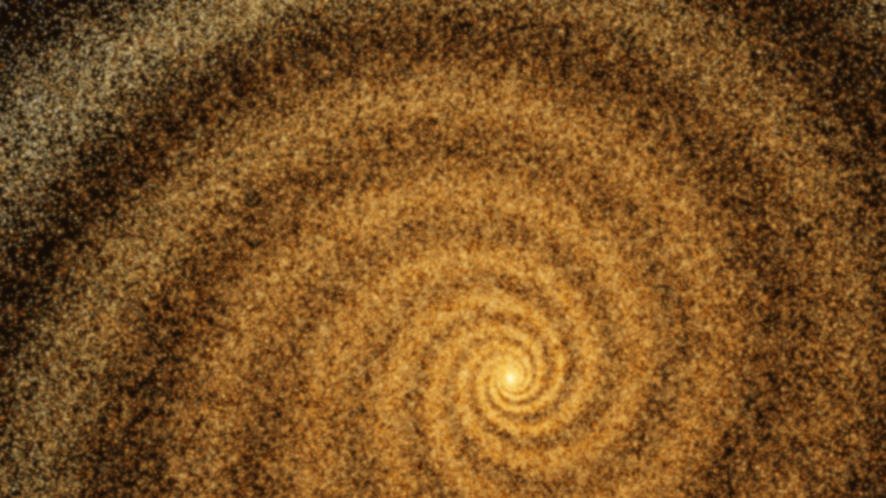

# Luxar

**High-performance n-dimensional scientific visualization.**

Luxar is a system for compiling and visualizing large-scale n-dimensional point clouds, lines, and Gaussian splats. Built for scientists and researchers who need to explore datasets with millions of elements in 3D, 4D, or higher dimensions.

[Quick Start](#quick-start) | [Gallery](#gallery) | [Documentation](#documentation) | [API Reference](#api-reference)

---

## Why Luxar?

Scientific visualization is often software-limited. Luxar changes this by separating data compilation from rendering:

```
┌─────────────────────┐         ┌──────────────────────┐
│   Python/NumPy      │         │   Web Browser        │
│   Scientific Data   │         │   GPU Rendering      │
│                     │         │                      │
│ ┌─────────────────┐ │         │ ┌──────────────────┐ │
│ │  Luxar Core     │ │  Zarr   │ │  Luxar Viewer    │ │
│ │  (Compiler)     ├─┼────────►┼─┤  (Renderer)      │ │
│ └─────────────────┘ │         │ └──────────────────┘ │
└─────────────────────┘         └──────────────────────┘
```

- **Python** compiles your data into optimized Zarr archives
- **WebGL** renders at GPU speeds in any browser
- **Result**: Performance limited only by your graphics card, not software

### Key Capabilities

| Feature | Description |
|---------|-------------|
| **n-Dimensional** | Full support for 3D, 4D, and beyond with intuitive slice navigation |
| **Massive Scale** | 100K to 10M+ primitives at interactive frame rates |
| **HDR Rendering** | 16-bit floating-point colors with bloom and tone mapping |
| **Streaming** | Progressive loading from local files or remote servers |
| **Gaussian Splatting** | Fit and visualize oriented Gaussians for volume reconstruction |
| **Line Geometry** | Render line segments with width tapering and color gradients |

---

## Quick Start

### Prerequisites

- Python 3.9+ (usually pre-installed on Linux/macOS)
- Modern browser with WebGL 2.0
- **Ubuntu/Debian only**: `sudo apt-get install -y pipx && pipx ensurepath`

### Install and Run Demo

```bash
git clone https://github.com/royerlab/luxar.git
cd luxar
make dev-setup  # Auto-installs Node.js, pnpm, Hatch (no sudo)
luxar demo      # Generates demo + opens browser with visualization
```

This generates a Lorenz attractor and opens the viewer:


### Create Your First Visualization

```python
import numpy as np
from luxar import LuxarZarrCompiler, Dimensions, Dimension

# Define coordinate system
dims = Dimensions([
    Dimension("x", unit="um", display=True),
    Dimension("y", unit="um", display=True),
    Dimension("z", unit="um", display=True),
])

# Create and save visualization
with LuxarZarrCompiler("my_data.zarr") as compiler:
    scene = compiler.create_scene(dimensions=dims)

    # Your data as NumPy arrays
    positions = np.random.randn(100_000, 3).astype(np.float32) * 50
    colors = np.random.rand(100_000, 3).astype(np.float32)

    scene.add_points("MyPoints", positions, colors=colors)

# View it
# Terminal 1: make viewer
# Terminal 2: luxar serve my_data.zarr
# Browser: http://localhost:5173/?src=http://localhost:8000
```

### Using the CLI

```bash
# Quick demo with viewer
luxar demo

# Serve your own data
luxar serve my_data.zarr --viewer --open

# Dataset information
luxar info my_data.zarr --stats

# Network simulation for performance testing
luxar serve my_data.zarr --profile 3g --viewer
```

---

## Gallery

Luxar includes demos showcasing different visualization techniques. Media are auto-generated using Playwright (run `make readme-images` and `make readme-videos`).

### In Action

| | | |
|:---:|:---:|:---:|
|  |  |  |
| **Lorenz Attractor** | **Spiral Galaxy** | **Rainbow Sphere** |

### Static Screenshots

| | |
|:---:|:---:|
|  |  |
| **Lorenz Attractor** - Chaotic dynamical system | **Spiral Galaxy** - Multi-armed barred spiral |

| | |
|:---:|:---:|
|  |  |
| **Mandelbulb** - 3D fractal with iteration coloring | **Zebrahub Multiome UMAP** - Single-cell embeddings |

| |
|:---:|
|  |
| **Rainbow Sphere** - HDR color gradient visualization |

### Running Demos

```bash
# Run all demos
make run-demos

# Or run individual demos
hatch run python packages/luxar/src/luxar/demos/demo_lorenz.py
hatch run python packages/luxar/src/luxar/demos/demo_mandelbulb.py
hatch run python packages/luxar/src/luxar/demos/demo_spiral_galaxy.py
hatch run python packages/luxar/src/luxar/demos/demo_zebrahub_multiome_peak_umap.py
hatch run python packages/luxar/src/luxar/demos/demo_rainbow_sphere.py
```

---

## Geometry Types

### Points

The primary geometry type for point cloud visualization.

```python
scene.add_points(
    "ParticleCloud",
    positions,           # (N, D) float32 - nD coordinates
    colors=colors,       # (N, 3) float32 - RGB (0-1, HDR supported)
    radii=radii,         # (N,) float32 - per-point size
    sharpness=sharpness, # (N,) float32 - edge falloff (0.5-10)
    opacity=0.8,         # Global opacity
    blending_mode="additive"  # "normal", "additive", "max"
)
```

### Lines

Connected line segments with per-vertex attributes.

```python
scene.add_lines(
    "Branches",
    positions,     # (N, 3) float32 - vertex positions
    segments,      # (M, 2) uint32 - start/end vertex indices
    colors=colors, # (N, 3) float32 - per-vertex colors
    widths=widths, # (N,) float32 - per-vertex width
)
```

### Gaussian Splats

Oriented Gaussian functions for volume reconstruction. Requires `pip install "luxar[gsplats]"`.

```python
from luxar.gsplats import fit_gaussian_splats

# Fit splats to your volume
result = fit_gaussian_splats(volume, n_iters=1000)

# Add to scene
scene.add_gsplats_from_data("Reconstruction", result)
```

See [Gaussian Splatting Guide](packages/luxar/src/luxar/gsplats/README.md) for detailed documentation.

---

## n-Dimensional Visualization

Luxar natively supports datasets with more than 3 dimensions.

### Defining Dimensions

```python
dims = Dimensions([
    # Displayed dimensions (shown in 3D viewer)
    Dimension("x", unit="um", range=(-100, 100), display=True),
    Dimension("y", unit="um", range=(-100, 100), display=True),
    Dimension("z", unit="um", range=(-50, 50), display=True),

    # Non-displayed dimensions (navigated via sliders)
    Dimension("time", unit="s", range=(0, 60), step=1.0, display=False),
    Dimension("channel", unit="", categories=["DAPI", "GFP", "mCherry"], display=False),
])
```

### How nD Slicing Works

Points in nD space are treated as **hyperspheres**. When viewing a 3D slice:

1. Points whose hypersphere intersects the current hyperplane are visible
2. Larger radius = visible across more dimension slices
3. Effective radius shrinks with distance from slice: `r_eff = sqrt(r² - d²)`

### Keyboard Navigation

| Key | Action |
|-----|--------|
| `1-9` | Select dimension to navigate |
| `[` / `]` | Step backward/forward in selected dimension |
| `N` | Toggle dimension panel |

---

## Viewer Controls

### Navigation Modes

| Key | Action |
|-----|--------|
| `V` | Toggle between Orbit and Fly modes |
| `F` | Recenter camera on scene |
| `Space` | Toggle fullscreen |

### Orbit Mode (default)

| Input | Action |
|-------|--------|
| Mouse drag | Rotate around scene |
| Scroll | Zoom |
| Right-click drag | Pan |
| Shift + scroll | Change field of view |

### Fly Mode

| Input | Action |
|-------|--------|
| `W/S` | Forward/backward |
| `A/D` | Strafe left/right |
| `Alt+W/S` | Up/down |
| Arrows | Look around |
| `I` | Toggle inertia |

### Interface Panels

| Key | Panel |
|-----|-------|
| `R` | Rendering controls (bloom, exposure, AA) |
| `N` | nD dimension sliders |
| `P` | Performance statistics |
| `H` | Help overlay |
| `O` | Dataset browser |
| `Ctrl+L` | Debug console |

---

## Transforms

Luxar provides a full transform system for hierarchical scene organization.

```python
from luxar import transforms

# Basic transforms
t = transforms.translate(10, 0, 0)
r = transforms.rotate_z(np.pi / 4)
s = transforms.scale(2, 2, 2)

# Compose (applied left-to-right)
combined = transforms.compose(t, r, s)

# Apply to groups
group = scene.add_group("Cluster", transform=transforms.to_list(combined))
scene.add_points("Points", positions, parent=group)

# Hierarchical transforms
parent = scene.add_group("Robot")
parent.transform = transforms.translate(100, 0, 0)

arm = parent.add_group("Arm")
arm.transform = transforms.rotate_y(45)  # Relative to parent
```

---

## Data Format

Luxar uses Zarr for chunked, compressed storage optimized for streaming.

```
scene.zarr/
├── .zattrs                 # Scene metadata (dimensions, version)
├── .zmetadata              # Consolidated metadata for fast loading
└── node_name/
    ├── .zattrs             # Node attributes (type, transform, rendering)
    ├── positions/          # (N, D) float32 coordinates
    ├── colors/             # (N, 3) float32 RGB values
    ├── radii/              # (N,) float32 point sizes
    └── chunk_bounds/       # Spatial index for efficient queries
```

### Performance Characteristics

| Scale | Memory | Load Time | Frame Rate |
|-------|--------|-----------|------------|
| 100K elements | ~5MB | <1s | 60 FPS |
| 1M elements | ~50MB | ~3s | 30-60 FPS |
| 10M elements | ~500MB | ~15s | 15-30 FPS |

### Spatial Indexing

Data is reordered using space-filling curves (Hilbert/Morton) for:
- **Spatial locality**: Nearby elements stored together
- **Efficient queries**: Only load chunks intersecting current view
- **Progressive loading**: Stream data as needed

See [Zarr Format Specification](docs/guides/user/LUXAR_ZARR_FORMAT.md) for complete details.

---

## Architecture

```
┌─────────────────────────────────────────────────────────────────────┐
│  Python Layer (luxar)                                               │
├─────────────────────────────────────────────────────────────────────┤
│  core/          Scene graph: Scene, Points, Lines, GSplats         │
│  io/            Zarr compilation with spatial ordering              │
│  encoding/      Semantic types, quantization, compression           │
│  validation/    Input validation and type checking                  │
│  gsplats/       Gaussian splatting fitting and I/O                  │
│  cli/           Command-line interface                              │
└──────────────────────────────┬──────────────────────────────────────┘
                               │ Zarr Archive
                               ▼
┌─────────────────────────────────────────────────────────────────────┐
│  TypeScript Layer (luxar-viewer)                                    │
├─────────────────────────────────────────────────────────────────────┤
│  data/          Zarr loading, spatial queries, caching              │
│  rendering/     WebGL materials, HDR pipeline, post-processing      │
│  scene/         THREE.js scene management                           │
│  controls/      Orbit/Fly navigation, keyboard input                │
│  ui/            Panels, sliders, debug console                      │
│  wasm/          Rust-compiled performance-critical functions        │
│  workers/       Background data processing                          │
└─────────────────────────────────────────────────────────────────────┘
```

---

## Development

### Setup

```bash
make dev-setup     # Complete environment (Node.js, pnpm, Hatch)
make check-deps    # Verify installation
```

### Commands

| Task | Command |
|------|---------|
| Run all tests | `make test-all` |
| Quality checks | `make check` |
| Format code | `make format-all` |
| Start viewer | `make viewer` |
| Build viewer | `make viewer-build` |
| Run examples | `make run-examples` |
| Generate README images | `make readme-images` |
| Generate README videos | `make readme-videos` |

### Python Development

```bash
hatch run test              # Run tests
hatch run test-cov          # With coverage
hatch run python script.py  # Run in environment
```

### TypeScript Development

```bash
cd packages/luxar-viewer
pnpm dev           # Dev server (port 5173)
pnpm build         # Production build
pnpm test --run    # Unit tests
pnpm test:e2e      # E2E tests (Playwright)
```

### WASM (Optional)

The viewer works without WASM, but Rust acceleration improves performance:

```bash
make setup-rust    # Install Rust + wasm-pack
make wasm-build    # Build WASM module
```

---

## API Reference

### Python API

```python
from luxar import LuxarZarrCompiler, Dimensions, Dimension, transforms

# Create compiler
with LuxarZarrCompiler("output.zarr") as compiler:
    scene = compiler.create_scene(dimensions=dims)

    # Add geometry
    scene.add_points(name, positions, colors=..., radii=..., ...)
    scene.add_lines(name, vertices, segments, colors=..., widths=...)
    scene.add_group(name, transform=..., opacity=..., parent=...)

    # Gaussian splatting (requires luxar[gsplats])
    scene.add_gsplats_from_data(name, gsplat_result)
    scene.add_gsplats_from_file(name, "file.gsplats.zarr")
```

### CLI Reference

```bash
luxar demo [OPTIONS]                    # Create demo visualization
luxar serve PATH [OPTIONS]              # Serve Zarr dataset
luxar info PATH [--stats]               # Dataset information
luxar profiles                          # List network simulation profiles
```

**Serve Options:**
- `--viewer` / `--no-viewer` - Launch viewer alongside server
- `--open` - Open browser automatically
- `--port PORT` - Data server port (default: 8000)
- `--viewer-port PORT` - Viewer port (default: 5173)
- `--profile NAME` - Network simulation profile (3g, 4g, satellite, etc.)
- `--bandwidth VALUE` - Custom bandwidth limit (e.g., "500kbps")
- `--latency VALUE` - Custom latency (e.g., "200ms")

---

## Documentation

| Document | Description |
|----------|-------------|
| [Python Package README](packages/luxar/README.md) | Full Python API documentation |
| [Viewer README](packages/luxar-viewer/README.md) | Viewer features and configuration |
| [Zarr Format Spec](docs/guides/user/LUXAR_ZARR_FORMAT.md) | Complete data format specification |
| [HDR Guide](docs/guides/user/HDR_GUIDE.md) | HDR color workflow |
| [Gaussian Splatting](packages/luxar/src/luxar/gsplats/README.md) | n-Dimensional Gaussian fitting |
| [Build System](docs/guides/developer/BUILD_SYSTEM_SPEC.md) | Development environment setup |
| [Contributing](CONTRIBUTING.md) | How to contribute |

---

## Troubleshooting

### Common Issues

**White screen in viewer**
- Check browser console for errors
- Verify Zarr dataset URL has no trailing slash
- Ensure CORS headers if serving cross-domain

**ImportError: No module named 'luxar'**
```bash
make dev-setup    # Set up environment
# Or: hatch shell  # Activate environment
```

**Poor rendering performance**
- Reduce element count (target <1M elements)
- Lower bloom quality in rendering panel
- Disable MSAA/SSAA, use FXAA instead

**nD navigation not working**
- Verify `scene_dimensions` defined in `.zattrs`
- Check dimension count matches position array shape
- Ensure non-displayed dimensions have valid `range` and `step`

### Browser Compatibility

| Browser | Status |
|---------|--------|
| Chrome 90+ | Fully supported |
| Firefox 88+ | Fully supported (recommended for large datasets) |
| Safari 14+ | Supported |
| Edge 90+ | Fully supported |

---

## Acknowledgments

Built with:
- [Three.js](https://threejs.org/) - WebGL rendering
- [Zarr](https://zarr.readthedocs.io/) / [Zarrita](https://github.com/manzt/zarrita.js) - Chunked array storage
- [NumPy](https://numpy.org/) - Numerical computing
- [FastAPI](https://fastapi.tiangolo.com/) - Data serving
- [Vite](https://vitejs.dev/) - Frontend tooling

---

## License

MIT License. See [LICENSE](LICENSE) for details.

---

## Citation

```bibtex
@software{luxar2024,
  title = {Luxar: High-Performance n-Dimensional Scientific Visualization},
  year = {2024},
  url = {https://github.com/royerlab/luxar}
}
```

---

<p align="center">
Built for the scientific visualization community.
<br>
<a href="https://github.com/royerlab/luxar/issues">Report Issues</a> |
<a href="https://github.com/royerlab/luxar/discussions">Discussions</a>
</p>
