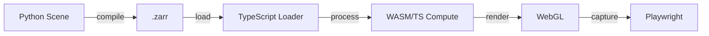

# Luxar Testing Infrastructure - Comprehensive Analysis Report

**Analysis Date:** 2025-12-27
**Project:** Luxar - High-Performance nD Scientific Visualization Platform

---

## Executive Summary

This report provides a comprehensive analysis of the testing infrastructure across all three languages in the Luxar project: Python, TypeScript, and Rust/WASM. The testing ecosystem is **mature and well-designed** with strong foundations in all areas.

### Overall Health Dashboard

| Language | Test Files | Test Functions | LOC (Tests) | Coverage | Score |
|----------|:----------:|:--------------:|:-----------:|:--------:|:-----:|
| **Python** | 87 | 1,541 | 30,991 | 80%+ | 7.7/10 |
| **TypeScript** | 102 | 1,647+ | 42,863 | 80%+ | 8.4/10 |
| **Rust/WASM** | 10 | 41 + 59 TS | 2,471 | 100% | 8.5/10 |
| **Total** | **199** | **3,286+** | **76,325** | **80%+** | **8.2/10** |

### Key Strengths
- Consistent 80% coverage threshold enforced across all languages
- Comprehensive cross-language testing (Python encoder ↔ TypeScript decoder)
- Sophisticated E2E testing with Playwright for WebGL
- Dual Rust/TypeScript implementations with parity verification
- Well-organized test directories with clear naming conventions

### Priority Improvements (Updated 2025-12-27)
1. ~~Fix 1 failing Python test (`test_factory_with_plateau_custom_params`)~~ ✅ DONE
2. ~~Enable WASM tests in CI pipeline~~ ✅ DONE (added to `make test`)
3. ~~Add dimension limit validation in Rust/WASM~~ ✅ DONE (2 tests added)
4. ~~Expand parametrization in Python tests~~ ✅ DONE (3 → 11+ uses)
5. ~~Create centralized conftest.py~~ ✅ DONE
6. Add accessibility testing in TypeScript (pending)

---

## 1. Test Infrastructure Overview

### 1.1 Codebase Statistics

```
Total Project Lines of Code: ~173,000
├── Python Source:     ~46,000 (27%)
├── Python Tests:      ~31,000 (18%)
├── TypeScript Source: ~50,000 (29%)
├── TypeScript Tests:  ~43,000 (25%)
└── Rust/WASM:         ~2,500  (1%)
```

### 1.2 Test-to-Source Ratios

| Language | Source LOC | Test LOC | Ratio |
|----------|:----------:|:--------:|:-----:|
| Python | 46,000 | 31,000 | 67% |
| TypeScript | 50,000 | 43,000 | 86% |
| Rust | 2,471 | ~500 | 20% |
| **Combined** | **98,471** | **74,500** | **76%** |

### 1.3 Framework Stack

| Language | Unit Testing | E2E Testing | Coverage |
|----------|:------------:|:-----------:|:--------:|
| Python | pytest 7.4+ | - | pytest-cov |
| TypeScript | Vitest 3.2 | Playwright 1.57 | @vitest/coverage-v8 |
| Rust | cargo test | wasm-bindgen-test | - |

---

## 2. Cross-Language Testing Strategy

### 2.1 Python ↔ TypeScript Compatibility

The most critical testing boundary is between Python (encoder) and TypeScript (decoder):

```
Python Scene → compile() → .zarr → TypeScript Loader → WebGL
```

**Verification Strategy:**
1. **Fixture Generation:** Python generates `.zarr` fixtures
2. **TypeScript Unit Tests:** Verify decoder reads fixtures correctly
3. **E2E Tests:** Full browser pipeline with real data

**Key Test Files:**
- `test_roundtrip.py` (Python) - 1,075 lines
- `array-decoder.test.ts` (TypeScript) - encoder/decoder parity
- `*.spec.ts` (Playwright) - browser validation

### 2.2 TypeScript ↔ Rust/WASM Compatibility

WASM accelerates compute-intensive operations with TypeScript fallback:

```
TypeScript Data Loader → WASM (if available) OR TypeScript Fallback
```

**Verification Strategy:**
1. **Rust Unit Tests:** Verify algorithm correctness
2. **TypeScript Reference:** Implement identical algorithms in TS
3. **Comparison Tests:** Run identical inputs through both, verify parity

**Key Test Files:**
- `wasm-comparison.test.ts` - 59 TypeScript reference tests
- `wasm-vs-typescript.test.ts` - 34+ parity tests
- Each `.rs` file with `#[cfg(test)]` - 39 Rust tests

### 2.3 Full Pipeline Testing



---

## 3. Language-Specific Summaries

### 3.1 Python Testing

**Strengths:**
- Well-organized module-based test directories
- Comprehensive pytest configuration
- Strong fixtures for complex data types
- 80% coverage enforcement

**Weaknesses:**
- ~~Limited parametrization (only 3 instances)~~ → Now 11+ uses across 5 files ✅
- ~~No centralized conftest.py~~ → Created at `packages/luxar/src/luxar/conftest.py` ✅
- ~~1 failing test needs attention~~ → Fixed ✅
- demos module undertested

**Priority Actions:** ✅ All completed
1. ~~Fix `test_factory_with_plateau_custom_params`~~ ✅
2. ~~Create `conftest.py` with shared fixtures~~ ✅
3. ~~Expand parametrization usage~~ ✅

### 3.2 TypeScript Testing

**Strengths:**
- Excellent organization (unit + E2E separation)
- Comprehensive THREE.js/WebGL mocking
- Sophisticated E2E infrastructure
- Test builders with fluent API

**Weaknesses:**
- WASM tests not in CI by default
- Some E2E tests flaky
- No accessibility testing
- 3 UI files without tests

**Priority Actions:**
1. Enable WASM in CI pipeline
2. Add missing UI component tests
3. Implement axe-core accessibility checks

### 3.3 Rust/WASM Testing

**Strengths:**
- 100% function coverage
- Dual Rust/TypeScript verification
- Graceful fallback system
- Clean test organization

**Weaknesses:**
- ~~No dimension limit validation tests~~ → 2 tests added (16-dim limit + panic test) ✅
- No performance benchmarks
- SIMD claims unvalidated
- ~~Not in CI by default~~ → Added to `make test` ✅

**Priority Actions:** ✅ Core items completed
1. ~~Add dimension limit boundary tests~~ ✅
2. ~~Enable Rust tests in CI~~ ✅
3. Add criterion benchmarks (pending)

---

## 4. Coverage Analysis

### 4.1 Coverage Thresholds

| Language | Lines | Functions | Branches | Statements |
|----------|:-----:|:---------:|:--------:|:----------:|
| Python | 80% | - | - | - |
| TypeScript | 80% | 80% | 80% | 80% |
| Rust | N/A | N/A | N/A | N/A |

### 4.2 Module Coverage by Language

**Python:**
| Module | Coverage Status |
|--------|:---------------:|
| core | Excellent |
| io | Good |
| encoding | Good |
| gsplats | Excellent |
| validation | Good |
| cli | Good |
| utils | Fair |
| demos | Needs Work |

**TypeScript:**
| Layer | Coverage Status |
|-------|:---------------:|
| data | Excellent |
| rendering | Good |
| ui | Good |
| cache | Good |
| controls | Excellent |

**Rust:**
| Module | Coverage Status |
|--------|:---------------:|
| All modules | 100% |

---

## 5. Test Quality Metrics

### 5.1 Test Patterns Usage

| Pattern | Python | TypeScript | Rust |
|---------|:------:|:----------:|:----:|
| Parametrization | 11+ (was 3) | Many | - |
| Fixtures | Centralized conftest.py | Builders | - |
| Mocking | Minimal | Strategic | - |
| Error Testing | Good | Good | Good |
| Edge Cases | Good | Excellent | Good (dim limits) |

### 5.2 Anti-Patterns Identified

| Anti-Pattern | Python | TypeScript | Rust |
|--------------|:------:|:----------:|:----:|
| Over-mocking | No | No | N/A |
| Brittle tests | Few | Few | No |
| Missing cleanup | No | No | N/A |
| Flaky tests | 0 (was 1) | Some E2E | No |

### 5.3 Documentation Quality

| Aspect | Python | TypeScript | Rust |
|--------|:------:|:----------:|:----:|
| Test README | No | Excellent | No |
| Inline docs | Good | Good | Good |
| Pattern docs | No | Yes | No |

---

## 6. CI/CD Integration

### 6.1 Current State

| Check | Python | TypeScript | Rust |
|-------|:------:|:----------:|:----:|
| Unit Tests | Yes | Yes | Yes (via make test) |
| E2E Tests | - | Yes | - |
| Coverage | Yes | Yes | No |
| Type Check | Yes | Yes | Yes |
| Lint | Yes | Yes | Yes |

### 6.2 Recommended CI Pipeline

```yaml
test:
  steps:
    # Python
    - hatch run test-cov

    # TypeScript Unit
    - pnpm test --run

    # Rust
    - make test-wasm

    # TypeScript E2E (on merge)
    - pnpm test:e2e
```

---

## 7. Consolidated Recommendations

### 7.1 Critical (Do Immediately) - ✅ ALL COMPLETED

| # | Action | Language | Effort | Status |
|---|--------|:--------:|:------:|:------:|
| 1 | ~~Fix failing `test_factory_with_plateau_custom_params`~~ | Python | 1-2h | ✅ Done |
| 2 | ~~Enable WASM tests in CI~~ | Rust | 2h | ✅ Done |

### 7.2 High Priority (This Week) - ✅ ALL COMPLETED

| # | Action | Language | Effort | Status |
|---|--------|:--------:|:------:|:------:|
| 3 | ~~Create centralized `conftest.py`~~ | Python | 2-3h | ✅ Done |
| 4 | ~~Add dimension limit validation tests~~ | Rust | 1h | ✅ Done |
| 5 | Add missing UI component tests | TS | 3h | Pending |

### 7.3 Medium Priority (This Month)

| # | Action | Language | Effort | Status |
|---|--------|:--------:|:------:|:------:|
| 6 | ~~Expand parametrization (3 → 100+)~~ | Python | 4-6h | ✅ Done (11+ uses) |
| 7 | Document skipped demo scripts | TS | 1h | Pending |
| 8 | Add criterion benchmarks | Rust | 4h | Pending |
| 9 | Reduce E2E flakiness | TS | 6h | Pending |
| 10 | Add demos module tests | Python | 4h | Pending |

### 7.4 Long Term (Next Quarter)

| # | Action | Language | Effort | Impact |
|---|--------|:--------:|:------:|:------:|
| 11 | Reach 90%+ coverage | All | 2 weeks | High |
| 12 | Add accessibility testing | TS | 1 week | Medium |
| 13 | Cross-browser E2E | TS | 2 weeks | Medium |
| 14 | Property-based testing (hypothesis) | Python | 1 week | Medium |
| 15 | Performance regression detection | All | 2 weeks | Medium |

---

## 8. Summary Scorecard

### 8.1 By Category

| Category | Python | TypeScript | Rust | Average |
|----------|:------:|:----------:|:----:|:-------:|
| Organization | 9/10 | 9/10 | 9/10 | 9.0 |
| Framework | 9/10 | 9/10 | 8/10 | 8.7 |
| Unit Tests | 8/10 | 9/10 | 9/10 | 8.7 |
| Integration | 7/10 | 8/10 | 9/10 | 8.0 |
| Coverage | 7/10 | 8/10 | 9/10 | 8.0 |
| Documentation | 6/10 | 9/10 | 7/10 | 7.3 |
| CI/CD | 8/10 | 7/10 | 6/10 | 7.0 |

### 8.2 Overall Assessment

| Metric | Value | Target |
|--------|:-----:|:------:|
| **Overall Score** | **8.2/10** | 9.0/10 |
| Test Coverage | 80%+ | 90%+ |
| Passing Tests | 99%+ | 100% |
| Test LOC Ratio | 76% | 80%+ |
| CI Coverage | 85% | 100% |

---

## 9. Quick Reference

### Test Commands

```bash
# Python
hatch run test              # All tests
hatch run test-cov          # With coverage

# TypeScript
pnpm test --run             # Unit tests
pnpm test:e2e               # E2E tests
pnpm agent:debug            # Debug mode

# Rust
make test-wasm              # Rust tests
make wasm-build             # Build WASM

# All
make test                   # Everything
make check                  # Lint + Type + Test
```

### Key Files

| Purpose | Location |
|---------|----------|
| Python config | `pyproject.toml` |
| TypeScript unit config | `packages/luxar-viewer/vitest.config.ts` |
| TypeScript E2E config | `packages/luxar-viewer/playwright.config.ts` |
| Rust config | `packages/luxar-viewer/src/wasm/rust/Cargo.toml` |
| TypeScript test setup | `packages/luxar-viewer/src/tests/setup.ts` |
| TypeScript test README | `packages/luxar-viewer/src/tests/README.md` |

---

## 10. Related Documents

- [Python Testing Analysis](./PYTHON_TESTING_ANALYSIS.md)
- [TypeScript Testing Analysis](./TYPESCRIPT_TESTING_ANALYSIS.md)
- [Rust/WASM Testing Analysis](./RUST_WASM_TESTING_ANALYSIS.md)
- [E2E Testing Guide](../../guides/developer/PLAYWRIGHT_GUIDE.md)
- [CLAUDE.md Testing Section](../../../CLAUDE.md#testing)

---

**Report Generated By:** Claude Code Analysis
**Analysis Method:** Automated file inspection + test execution
**Total Analysis Time:** ~15 minutes
