# Luxar Viewer - Architecture Diagrams

**Version**: 2.0.0
**Last Updated**: 2026-05-08

Visual reference for understanding the Luxar viewer architecture, data flow, and key algorithms.

The authoritative layer order lives in `.dependency-cruiser.cjs`:
`types → config → cache → rendering → data → scene → input → ui → core`,
with `utils`, `themes`, `wasm`, `workers`, `profiling`, and `controls`
as cross-cutting concerns importable from any layer.

---

## Table of Contents

1. [Data Flow Pipeline](#1-data-flow-pipeline)
2. [Component Dependency Graph](#2-component-dependency-graph)
3. [nD Slicing Visualization](#3-nd-slicing-visualization)
4. [Rendering Pipeline](#4-rendering-pipeline)
5. [Cache Architecture](#5-cache-architecture)
6. [Input Event Routing](#6-input-event-routing)

---

## 1. Data Flow Pipeline

### Overview: Python → Zarr → TypeScript → WebGL

The pipeline is split per geometry type (Points, Lines, GSplats,
Mesh), each with its own spatial-index loader — except Mesh, whose
loader is whole-node. The `SceneLoader` orchestrates them and a
`WorkerPool` offloads decode + projection.

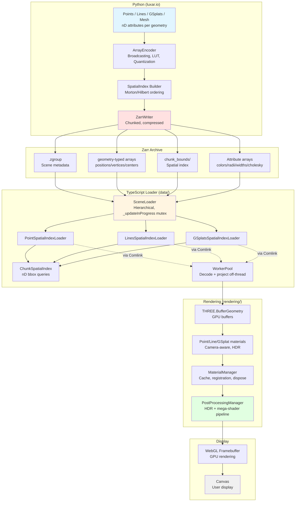

### Key Transformations

| Stage | Input | Output | Purpose |
|-------|-------|--------|---------|
| **Encoding** | Float32 arrays | uint8/uint16 + metadata | Compression (2-10x) |
| **Spatial Ordering** | Random order | Morton/Hilbert order | Locality optimization |
| **Chunking** | Full arrays | 10K-point chunks | Streaming support |
| **Indexing** | Point positions | Chunk bounding boxes | Fast queries |
| **Decoding** | Encoded chunks | Float32 arrays | Restore original values |
| **Projection** | nD positions | 3D display coords | Dimensionality reduction |
| **GPU Upload** | CPU arrays | GPU buffers | Hardware acceleration |
| **Shading** | Vertex positions | Pixel colors | Visual representation |

---

## 2. Component Dependency Graph

### Application Architecture

The dependency direction follows the layer order in
`.dependency-cruiser.cjs` strictly. Where the data-layer needs UI
behaviour (e.g. monitor events, dimension-slider construction), the
seam is inverted via a port: `SceneLoaderMonitorPort`,
`DimensionSlidersFactory`. The data layer knows the port; the UI
layer registers the implementation via `app.ts`.

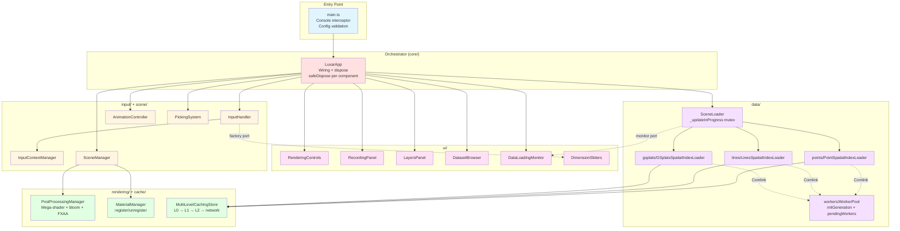

### Layer Order (`.dependency-cruiser.cjs`)

```
types → config → cache → rendering → data → scene → input → ui → core
```

Plus the cross-cutting layers — importable from any layer:
`utils`, `themes`, `wasm`, `workers`, `profiling`, `controls`.

**Inverted seams** (data does not depend on ui):
- `SceneLoaderMonitorPort` — data emits events through a port the UI
  registers against.
- `DimensionSlidersFactory` — `input/` constructs sliders via a
  factory provided by `ui/`.

**Principle**: imports flow left-to-right in the layer order; no
circular dependencies (rule severity `error`).

---

## 3. nD Slicing Visualization

### Hypersphere Intersection for nD Point Visibility

#### Concept: 4D Example

```
Imagine 4D space: (x, y, z, t)
Display dimensions: [x, y, z]  (3D visualization)
Slice dimension: [t]           (navigate through time)

Current slice position: t = 5.0
Slice tolerance (radius): r = 1.0

Question: Which 4D points are visible?
Answer: Points within hypersphere distance r from slice plane
```

#### Mathematical Formula

```
For point at position p = (p_x, p_y, p_z, p_t):

1. Compute distance in non-displayed dimensions:
   d_slice = |p_t - 5.0|  (distance from slice in time dimension)

2. Compute effective radius in display dimensions:
   r_effective = sqrt(r² - d_slice²)  (Pythagorean theorem in 4D)

3. Visibility test:
   if d_slice > r:
     Point INVISIBLE (outside slice tolerance)
   else:
     Point VISIBLE with radius = r_effective

4. Project to 3D:
   Display position = (p_x, p_y, p_z)
   Display radius = r_effective
```

#### Visual Representation

```
                t-axis (non-displayed, slice dimension)
                  │
         t=6.0 ───┤─── Slice boundary (top)
                  │
         t=5.0 ───●─── Slice position (current view)
                  │
         t=4.0 ───┤─── Slice boundary (bottom)
                  │
      (tolerance = 1.0)

Point A at t=4.5: Distance 0.5 < 1.0 → VISIBLE ✓
  r_effective = sqrt(1.0² - 0.5²) = sqrt(0.75) = 0.87

Point B at t=3.0: Distance 2.0 > 1.0 → INVISIBLE ✗
  (Too far from slice)

Point C at t=5.0: Distance 0.0 → VISIBLE with full radius ✓
  r_effective = sqrt(1.0² - 0²) = 1.0
```

#### Code Implementation

```typescript
function calculateEffectiveRadius(
  pointPosition: number[],    // nD position
  slicePosition: number[],    // Current slice in each dim
  displayDims: number[],      // Which dims are displayed [0,1,2]
  maxRadius: number           // Original point radius
): number {
  let squaredDistance = 0;

  // Sum squared distances in NON-displayed dimensions
  for (let d = 0; d < pointPosition.length; d++) {
    if (!displayDims.includes(d)) {
      const diff = pointPosition[d] - slicePosition[d];
      squaredDistance += diff * diff;
    }
  }

  // Pythagorean theorem in nD
  const radiusSquared = maxRadius * maxRadius;
  const effectiveRadiusSquared = radiusSquared - squaredDistance;

  if (effectiveRadiusSquared <= 0) {
    return 0; // Point outside slice → invisible
  }

  return Math.sqrt(effectiveRadiusSquared);
}
```

#### Example: 5D Dataset Navigation

```
Dataset: (Time, Z, Channel, Y, X)  [5D]
Display: [Y, X, Z]                 [3D visualization]
Navigate: Time and Channel         [Slice dimensions]

Current state:
- Time = 10 (frames)
- Channel = 1 (GFP)
- Camera shows Y, X, Z in 3D

Point visibility:
- Point at (t=10, z=5, c=1, y=10, x=20):
  → Distance in (t,c) = 0 → FULL radius → VISIBLE ✓

- Point at (t=12, z=5, c=1, y=10, x=20):
  → Distance in time = 2 frames
  → If radius < 2 → INVISIBLE ✗
  → If radius = 3 → Effective radius = sqrt(9-4) = 2.24 → VISIBLE ✓

- Point at (t=10, z=5, c=2, y=10, x=20):
  → Distance in channel = 1
  → Depends on radius...
```

---

## 4. Rendering Pipeline

### HDR Post-Processing Flow

Materials registered with `MaterialManager` implement
`CameraAwareMaterial`. On every camera change the manager fans
`updateCameraParams(fov, resolution, isOrtho, nearCull)` out to
every registered material — no scene traversal. Picking materials
register too and unregister (without disposal) on context-restore
so a context-loss cycle doesn't leak registrations.

```mermaid
graph LR
    subgraph "Scene Rendering"
        A[3D Geometry<br/>Points, Lines, GSplats, Mesh]
        B[Camera-aware Materials<br/>register w/ MaterialManager]
        C[Vertex Shader<br/>Position + size calc]
        D[Fragment Shader<br/>Gaussian / per-geometry<br/>HDR-correct output]
    end

    subgraph "HDR Buffer"
        E[HalfFloatType<br/>16-bit float<br/>Range: 0-65504]
    end

    subgraph "Post-Processing (mega-shader)"
        F[Bloom pre-pass<br/>threshold + mip pyramid]
        H[MegaShader fullscreen pass<br/>fused per-pixel effects]
        I0[Optional FXAA<br/>edge-detect on LDR]
    end

    subgraph "Display"
        I[sRGB Canvas<br/>8-bit output]
    end

    A --> B --> C --> D --> E
    E --> F --> H --> I0 --> I

    style E fill:#ffeeaa
    style H fill:#aaffee
    style I fill:#aaffaa
```

### Effect Ordering

Single fused fragment shader. The mega-shader runs the per-pixel
effects in canonical order:

```
ChromaticLensDistortion → Bloom (additive) → DetectorNoise →
ToneMapping (with EOG) → Vignette → sRGB encode
```

Bloom remains a separate pre-pass (neighbor reads needed for
threshold + downsample/upsample). FXAA remains a separate post-pass
(edge detection runs on the tone-mapped LDR output). SMAA, DoF, and
SSAO are intentionally absent: SMAA and DoF need additional passes,
and SSAO needs surface normals that Luxar's point, line, and gsplat
primitives do not provide.

---

## 5. Cache Architecture

### Multi-Level Caching System

The cascade is L0 → L1 → L2 → network. L0 caches **decompressed**
zarr chunks (avoids repeated Blosc decompression); L1 caches
**compressed** zarr bytes (zarrita's `AsyncReadable` view); L2 is
OPFS for cross-session persistence; L3 is the origin fetch.

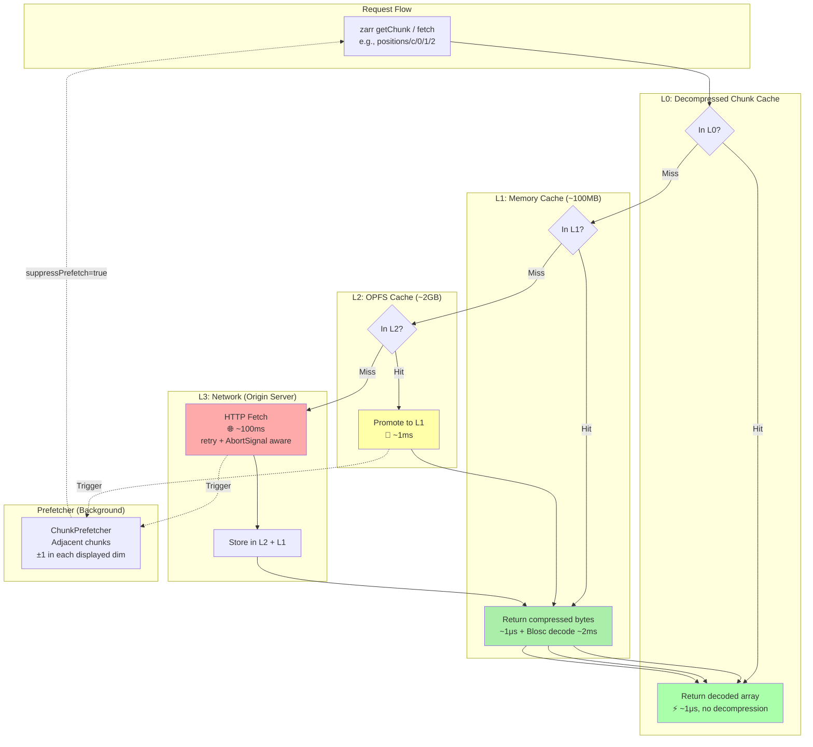

### Stats Surfaces

`MultiLevelCachingStore.getStats()` exposes per-tier counters
(L1 hits/misses/evictions, L2 reads/writes/misses, network bytes
and request count). The data-loading monitor's
`cache-metrics-aggregator` reads from an optional `L0Provider` for
L0 stats and from `cacheStatsProvider` for L1/L2/network, falling
back to per-loader metrics when no providers are wired.

### Cache Key Structure

```
Format: dataset_hash/bucket_hash/base64_filename

Example:
abc123/5f/cG9pbnRzL3Bvc2l0aW9ucy9jLzAvMS8y

Where:
- abc123: Content hash of dataset (from .zmetadata)
- 5f: Bucket (2-char hex, one of 256 buckets)
- cG9p...: Base64 of "points/positions/c/0/1/2"

Benefits:
- dataset_hash: Isolate different datasets
- bucket_hash: Distribute files across 256 directories (avoid FS limits)
- base64: Handle special characters in paths
```

---

## 6. Input Event Routing

### Context-Based Priority System

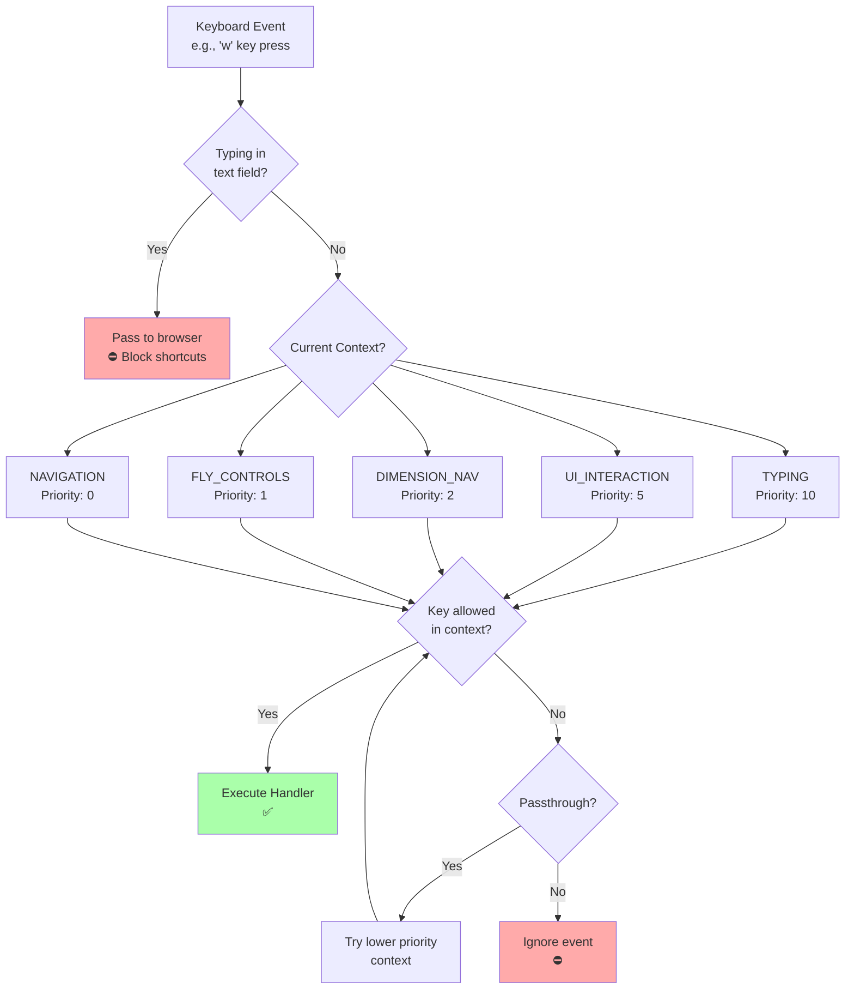

### Context Examples

| Key | NAVIGATION | FLY_CONTROLS | TYPING | Result |
|-----|------------|--------------|---------|--------|
| **W** | ❌ Blocked | ✅ Forward | ❌ Blocked | Depends on context |
| **F** | ✅ Toggle center | ✅ Toggle center | ❌ Blocked | Letter 'f' typed |
| **[** | ✅ Dim nav | ✅ Dim nav | ❌ Blocked | Navigate dimension |
| **Esc** | ✅ Reset | ✅ Exit fly | ✅ Unfocus + dispatch | Always handled |

**Escape-from-typing**: pressing **Esc** while in TYPING blurs the
focused element and re-routes the same event through the underlying
context, so a typing field can be exited without a separate
keystroke. The chain is `TYPING → UI_INTERACTION → DIMENSION_NAV →
NAVIGATION` (recursion depth-capped to prevent infinite passthrough
loops).

---

## 7. Initialization Sequence

### Application Startup Flow

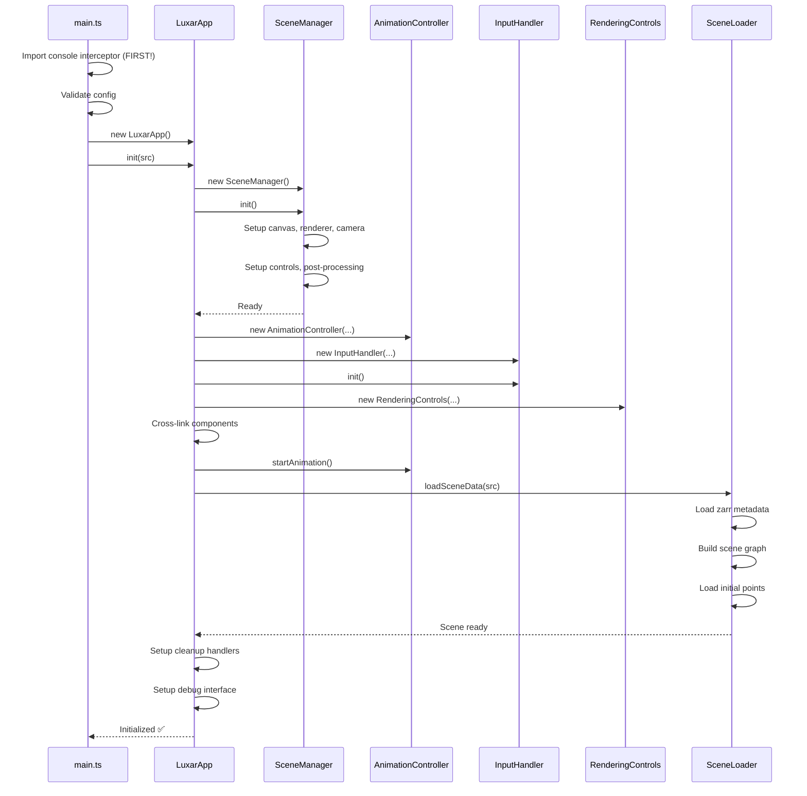

### Critical Order Requirements

1. **Console interceptor MUST be first import** (captures all output)
2. **SceneManager before AnimationController** (needs renderer/camera)
3. **AnimationController before data loading** (enables progress rendering)
4. **Cross-linking after all components created** (avoid undefined refs)
5. **Animation start before data load** (user sees progress)

---

## 8. Spatial Index Query Algorithm

### Chunk-Based nD Query

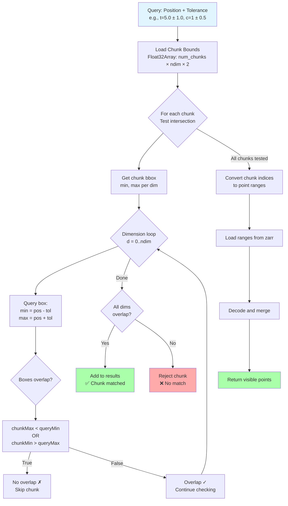

### Performance Characteristics

```
Given:
- N = total points (e.g., 10M)
- C = num chunks (e.g., 1,000)
- D = dimensions (e.g., 5D)
- M = matching chunks (e.g., 10)

Complexity:
- Query: O(C × D) = O(1,000 × 5) = ~5,000 comparisons
- Load: O(M × chunk_size) = O(10 × 10,000) = ~100K points
- vs Full Scan: O(N × D) = O(10M × 5) = ~50M comparisons

Speedup: 10,000x faster than full scan
Memory: O(C × D × 2) = ~40KB for index (vs 400MB for full data)
```

---

## 9. Material Management & Caching

### Material Lifecycle

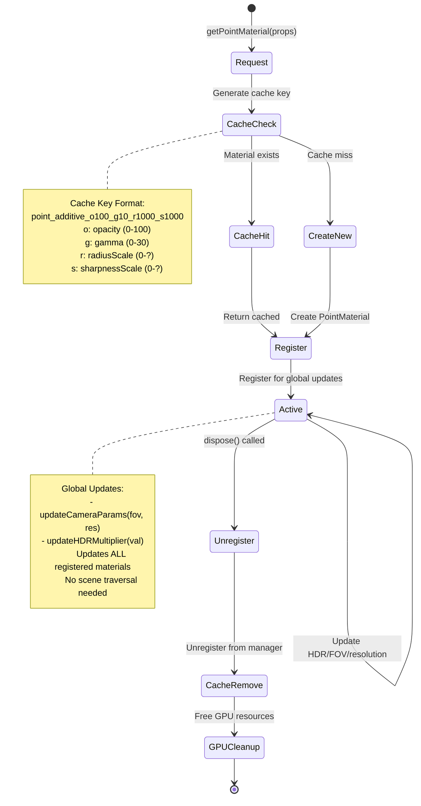

### Cache Benefits

**Without Caching**:
```typescript
// Creates new material every time (memory leak!)
for (let i = 0; i < 100; i++) {
  const material = new PointMaterial({ opacity: 1.0 });
  // 100 materials created, 99 are duplicates
}
```

**With Caching**:
```typescript
// Reuses same material (memory efficient)
for (let i = 0; i < 100; i++) {
  const material = materialManager.getPointMaterial({ opacity: 1.0 });
  // Only 1 material created, returned 100 times
}
```

---

## 10. Observable Pattern for nD Navigation

### SceneDimsManager → Components

```mermaid
graph TB
    subgraph "Central State (Singleton)"
        A[SceneDimsManager<br/>currentStep: number[]<br/>displayed: number[]]
    end

    subgraph "Observers"
        B[DimensionSliders<br/>Update slider positions]
        C[PointSpatialIndexLoader<br/>Re-query visible points]
        D[StatusDisplay<br/>Show current position]
    end

    subgraph "User Actions"
        E[Keyboard: Press ']'<br/>Move forward in dimension]
        F[Slider: Drag<br/>Set position directly]
    end

    E --> A
    F --> A
    A -.notify().-> B
    A -.notify().-> C
    A -.notify().-> D

    B -.UI update.-> B
    C -.Reload data.-> C
    D -.Update text.-> D

    style A fill:#ffe1e1
    style B fill:#e1f5ff
    style C fill:#fff5e1
    style D fill:#e1ffe1
```

### Code Pattern

```typescript
// Register observer
sceneDimsManager.addListener(() => {
  const dims = sceneDimsManager.getDims();
  updatePointsForNewSlice(dims.currentStep);
});

// Change dimension (triggers all observers)
sceneDimsManager.setDimensionValue(0, 5.2);
// → All listeners called automatically
// → Sliders update
// → Points reload
// → Display updates
```

---

## 11. Error Recovery Flow

### Graceful Degradation Strategy

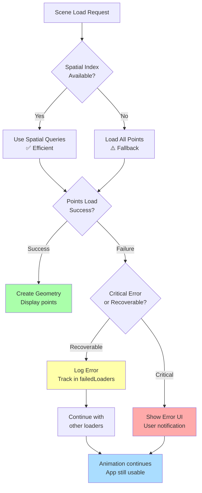

### Error Handling Principles

1. **Isolation**: Component failures don't crash app
2. **Tracking**: All errors logged and tracked
3. **User Communication**: Clear, actionable error messages
4. **Graceful Fallback**: Degrade to simpler behavior
5. **Recovery**: Allow retry without reload

**Example**:
```
Scenario: One point cloud fails to load in a multi-object scene

Instead of: ❌ Entire scene fails, black screen, app crashes
We do: ✅ Other objects load, error logged, user notified, retry possible
```

---

## 12. Memory Management Strategy

### Disposal Chain

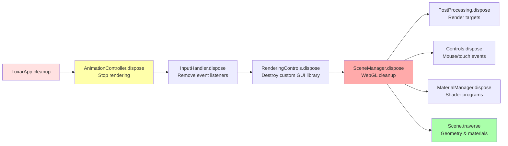

### Critical Cleanup Operations

**Why Manual Disposal is Required**:
- WebGL resources are NOT garbage collected automatically
- Textures, buffers, shaders stay in GPU memory
- Event listeners keep references alive
- Proper cleanup prevents memory leaks in long-running apps

**Cleanup Order** (Reverse of initialization):
1. Stop animation (prevents new work)
2. Remove event listeners (prevents callbacks)
3. Dispose UI components (free DOM)
4. Dispose WebGL resources (free GPU memory)
5. Traverse scene (geometry, materials)

---

## 13. World-Space Point Sizing

### Physical Size Calculation

```
Goal: Two points with radius r at distance 2r should just touch

Formula (implemented in vertex shader):

pixelSize = 2 × radius × resolution.y / (distance × tan(FOV/2))

Where:
- radius: Physical world-space radius
- resolution.y: Framebuffer height in pixels
- distance: Camera distance to point (view space)
- FOV/2: Half field of view angle (radians)
- tan(FOV/2): Pre-computed for performance

Why it works:
1. Angular size in radians: α = 2 × atan(radius / distance)
2. Pixels per radian: resolution.y / (2 × tan(FOV/2))
3. Combine: pixels = α × (resolution.y / (2 × tan(FOV/2)))
4. Simplify: pixels = 2 × radius × resolution.y / (distance × tan(FOV/2))
```

### Visual Proof

```
Side view (camera looking along Z-axis):

      Camera
        📷
         |\
         | \
    FOV  |  \
         |   \
         |    ● Point (radius r, distance d)
         |   /
         |  /
         | /
         |/

Angular size seen by camera: 2 × atan(r/d)
Screen pixels: angular_size × (screen_height / FOV_height)

For two points at distance 2r apart:
- Each has radius r
- They just touch (r + r = 2r separation)
- Physical accuracy maintained regardless of FOV or resolution
```

---

## 14. Event Flow Diagram

### User Interaction → Render

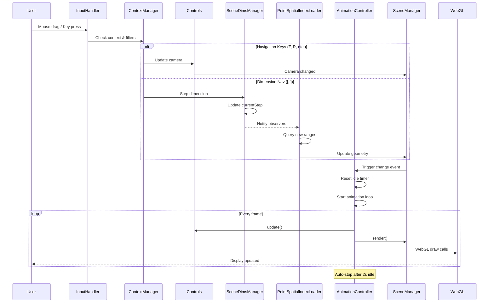

---

## 15. Package Interaction Map

### Cross-Package Dependencies

```
         types/        config/       utils/
           │              │            │
           └──────┬───────┴────────────┘
                  │
              cache/  ←─────┐
                  │         │
         ┌────────┴────┐    │
         │             │    │
    rendering/      data/ ──┘
         │             │
         └──────┬──────┘
                │
            controls/
                │
         ┌──────┴──────┐
         │             │
      scene/        input/
         │             │
         └──────┬──────┘
                │
              ui/
                │
             core/
                │
             main.ts

Legend:
  │ = depends on
  Solid boxes = no external deps
  Higher = more foundational
```

### Dependency Rules

**Allowed**:
- Lower level → Higher level ✅
- Same level (with caution) ⚠️

**Forbidden**:
- Higher level → Lower level ❌
- Circular dependencies ❌

**Example**:
- ✅ scene/ can import from rendering/ (lower level)
- ✅ core/ can import from scene/ (lower level)
- ❌ rendering/ cannot import from scene/ (higher level)
- ❌ data/ cannot import from ui/ (higher level)

---

## Usage

These diagrams are rendered automatically in:
- GitHub markdown viewers
- VS Code with Mermaid extension
- Documentation sites (Docusaurus, MkDocs with mermaid plugin)

**To view locally**:
```bash
# Install mermaid CLI
npm install -g @mermaid-js/mermaid-cli

# Generate PNG/SVG
mmdc -i ARCHITECTURE-DIAGRAMS.md -o diagrams.pdf
```

---

## Maintenance

**Update these diagrams when**:
- Adding new packages
- Changing initialization order
- Modifying data flow
- Changing architecture

**Keep aligned with**: each package's README.md
