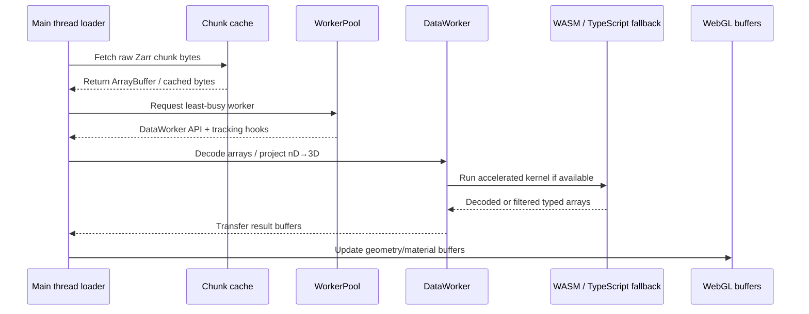

# luxar-viewer/src/workers

Multi-threaded worker pool for offloading CPU-intensive nD→3D projection (with built-in per-element visibility/culling), clipping, and array decoding from the main thread.

## Architecture

```
Main Thread (rendering, UI)
  │
  └─► WorkerPool (singleton, least-busy load balancing)
        ├── DataWorker 0  ──► WASM module instance
        ├── DataWorker 1  ──► WASM module instance
        └── DataWorker N  ──► WASM module instance
```

Communication between main thread and workers uses [Comlink](https://github.com/GoogleChromeLabs/comlink) for typed RPC.

## Data Flow



The main thread owns network I/O, cache coordination, spatial queries, and GPU
updates. Workers own CPU-heavy decoding, projection, and clipping kernels. Result
buffers are transferred back to the main thread to avoid copying where possible.

## Usage

```typescript
import { getWorkerPool, disposeWorkerPool } from './workers/worker-pool';

// Get singleton pool (constructed on first call; workers spawn on
// first `initialize()` — directly or indirectly via runWithTimeout).
const pool = getWorkerPool();
await pool.initialize();

// Recommended: route every call through `runWithTimeout()` so
// hung workers are detected via the per-call budget. The pool
// picks a worker via load-balanced selection, tracks the call,
// and applies the configured timeout.
const result = await pool.runWithTimeout('projectLinesTo3D', 'projection', (api) =>
  api.projectLinesTo3D(/* ... */)
);

// Clean up
disposeWorkerPool();
```

**Note**: `pool.getWorker()` and `pool.getWorkerWithTracking()`
also exist for advanced scenarios but bypass the per-call
timeout guard. Production hot paths should use `runWithTimeout`
unless they have their own timeout strategy.

## Worker Pool

### Configuration

- **Worker count**: Defaults to `navigator.hardwareConcurrency - 1` (reserves one core for main thread)
- **Minimum**: 1 worker
- **Fallback**: If `hardwareConcurrency` is unavailable, assumes 4 cores

### Load Balancing

The pool tracks `activeQueries` per worker and selects the worker with the fewest active tasks. Callers using `getWorkerWithTracking()` receive `markQueryStart`/`markQueryEnd` callbacks to keep the counters accurate.

### Initialization

- Warmed: scene loading calls `warmUpDataWorkerPool()` so startup overlaps metadata fetch; otherwise workers remain lazy until `initialize()`, `getWorker`, `getWorkerWithTracking`, or `runWithTimeout`
- Safe: promise deduplication ensures concurrent callers share a single initialization
- Incremental: `getWorker` / `getWorkerWithTracking` proceed after the first usable worker publishes, while `initialize()` retains its all-spawns-settled contract
- Resilient: partial worker failures do not block usable workers from publishing
- Generation-guarded: `dispose()` mid-init bumps a generation token and terminates pending workers, preventing a stale init from re-populating a disposed pool

## Data Worker API

Each worker loads a WASM module on `initialize()` and exposes these operations:

| Category       | Methods                                                                                                                      |
| -------------- | ---------------------------------------------------------------------------------------------------------------------------- |
| **Decoding**   | `decodeQuantized()`, `decodeLogScalar()`, `decodeGeologScalar()`, `decodePerChannel()`, `decodeLUT()`, `decodeBroadcasted()` |
| **Projection** | `projectLinesTo3D()`, `projectGSplatsTo3D()` (Points project on the main thread)                                             |

### What workers handle

- nD→3D projection with built-in per-element visibility/culling
  (Lines clip mask, GSplats attenuation)
- Array decoding (LUT, quantization, log-space)

### What stays on main thread

- Zarr chunk fetching (network I/O)
- GPU buffer updates (WebGL)
- UI rendering and interaction

## Fallback Behavior

If WASM is unavailable, each worker falls back to a pure TypeScript implementation of the same API (slower but functionally identical). See `src/wasm/` for details.

Independently of that, `pickBackend(ctx, ndim)` in `data-worker/state.ts` routes **every** operation with more than 16 dimensions to the TypeScript backend — the compiled WASM kernels use fixed-size 16-dim arrays and cannot go higher. For >16D data the TypeScript implementation is therefore the production path, not just a WASM-missing fallback.

## File Structure

```
workers/
├── color-utils.ts                              — Worker- and main-thread-shared
│                                                 color/scalar coercion
├── worker-pool.ts                              — Pool orchestrator: generation-
│                                                 guarded init, runWithTimeout,
│                                                 dispose. Class + re-exports
│                                                 from worker-pool/ subtree.
├── worker-pool/
│   ├── errors.ts                               — WorkerTimeoutError,
│   │                                            WorkerAbortError, TimeoutKind
│   ├── types.ts                                — WorkerInstance interface
│   ├── stats.ts                                — computeStats, computeQueueDepth
│   ├── lifecycle/
│   │   ├── worker-count.ts                     — hardwareConcurrency cap
│   │   ├── init-with-guard.ts                  — race init vs timeout+onerror
│   │   ├── error-handlers.ts                   — attachWorkerErrorHandlers +
│   │   │                                        evictFailedWorker
│   │   └── spawn-worker.ts                     — per-worker factory +
│   │                                            terminateAttemptWorkers
│   ├── selection/
│   │   ├── least-busy.ts                       — runWithTimeout selection
│   │   └── round-robin.ts                      — direct getWorker() rotation
│   └── timeout/
│       ├── with-timeout.ts                     — Promise.race + timer
│       ├── pick-timeout-ms.ts                  — kind → config knob
│       └── combine-signals.ts                  — AbortSignal.any + fallback
├── data-worker.ts                              — Worker entry (Vite ?worker
│                                                 target). Imports task helpers
│                                                 from data-worker/ and exposes
│                                                 the Comlink workerAPI.
└── data-worker/
    ├── state.ts                                — WasmCtx { wasm, tsFallback }
    │                                            + requireWasm/pickBackend
    │                                            helpers (ndim > 16 routes
    │                                            to the TS backend)
    ├── initialize.ts                           — WASM bootstrap
    ├── types.ts                                — ProjectionViewState
    │                                            (re-exports EffectiveRadiusConfig
    │                                            from types/points.ts)
    ├── validation.ts                           — JS→WASM boundary checks
    │                                            (worker-internal)
    ├── projection/
    │   ├── lines.ts                            — projectLinesTo3D
    │   ├── gsplats.ts                          — projectGSplatsTo3D
    │   ├── constants.ts                        — shared numeric thresholds
    │   │                                         (single source of truth)
    │   ├── hidden-dims.ts                      — hidden-dimension classification
    │   │                                         (extend_to_all / discrete /
    │   │                                         continuous)
    │   └── in-process.ts                       — main-thread dispatcher running
    │                                             the same kernels on a local
    │                                             WasmCtx (worker-less fallback)
    └── decode/
        ├── quantized.ts                        — uint8/uint16 → float32
        ├── log-scalar.ts                       — log-space dequantization
        ├── geolog-scalar.ts                    — geometric-log (reserved zero level)
        ├── perchannel.ts                       — per-column linear/log/signed-log/geolog
        ├── lut.ts                              — row + scalar LUT decode
        └── broadcasted.ts                      — single value → N×k array
├── sort-worker.ts                              — Depth-sort worker entry
│                                                 (Vite ?worker target, Comlink;
│                                                 depth-sorting Phase 2)
└── sort-worker/
    ├── state.ts                                — SortWorkerCtx { wasm, nodes }
    │                                             (per-node center registry)
    ├── initialize.ts                           — WASM bootstrap (mirrors
    │                                             data-worker/initialize.ts)
    └── sorting.ts                              — registerNode / sortNode /
                                                  releaseNode task bodies
                                                  (generation stale-drop guard)
```

### SortWorker (depth-sorting Phase 2)

A **single persistent** Comlink worker — deliberately NOT part of the
round-robin pool: each gsplat node's projected 3D centers are
TRANSFERRED into it once per non-noop commit (`registerNode`), so
camera-driven re-sorts never re-copy them. `sort(nodeId, generation,
modelView)` runs the WASM `sort_splats_by_depth` kernel (back-to-front
normalized-key counting sort, `wasm/rust/src/depth_sort.rs`) and
transfers the ordering back; requests whose `generation` no longer
matches the node's latest registration return `null` — a stale shorter
permutation applied to a grown buffer would be corrupt, not just
outdated. The main-thread side — lazy spawn, the one-in-flight-per-node
rule, applying orderings to `aSortedIndex`, node release and teardown,
and the Phase-3 per-frame camera-motion re-sort scheduler that drives
`sort()` as the camera orbits — lives in
`rendering/depth-sort-coordinator.ts`.

## Internal Layout

External callers only import from the package-root files
(`worker-pool.ts`, `color-utils.ts`, `data-worker.ts` / `sort-worker.ts`
via the Vite `?worker` URL). Everything under `worker-pool/`,
`data-worker/`, and `sort-worker/` is worker-internal: helpers grouped
by concern, each file owning a single piece of the pool's or the
worker's responsibility. The recursive layout follows the audience: the
more widely a file is imported, the shallower it lives.

Task functions under `data-worker/` take a shared `state: WasmCtx`
(defined in `data-worker/state.ts`) so they can read the WASM module
and grow the pooled visibility-mask scratch buffer without referencing
module-level globals.

## Public API

From `worker-pool.ts`:

- `getWorkerPool()` / `disposeWorkerPool()` — singleton accessor and teardown
- `warmUpDataWorkerPool()` — fire-and-forget early initialization when Web Workers are enabled and available
- `class WorkerPool` — pool manager (see `runWithTimeout`, `getWorkerWithTracking`, `setAbortSignal`, `reinitialize`, `getStats`, `getQueueDepth`)
- `setDataWorkerUrl(url)` — override the worker module URL (for embedders whose bundlers can't resolve Vite's `?worker` import)
- `class WorkerTimeoutError` / `class WorkerAbortError` — distinguish hung-worker eviction from caller-initiated cancellation
- `type TimeoutKind = 'projection' | 'decode'` — selects the per-call timeout from `config.dataLoading.performance`

From `data-worker.ts`:

- `type DataWorkerAPI` — Comlink-proxied surface (`workerAPI`)
- `type EffectiveRadiusConfig`, `type ProjectionViewState` — projection input shapes
  (`EffectiveRadiusConfig` is canonically defined in `types/points.ts`; re-exported here for worker-API self-documentation)

From `color-utils.ts`:

- `coerceColorsToFloat32` (also imported by `data/lines/projection.ts`)
- `coerceScalarsToFloat32`, `fillColorsWhite`

## Dependencies

- Internal: `../wasm` (compiled WASM + TypeScript fallback via `initWasm`), `../config` (worker count + timeout settings), `../utils/log`, `../config/constants` (`MAX_SUPPORTED_DIMS`)
- External: `comlink` (typed RPC + `transfer` for zero-copy result buffers)
