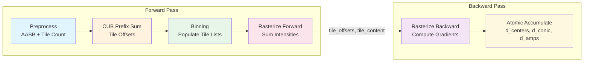

# CUDA Backend Specification - Core Algorithms

**Version**: 0.1.0
**Status**: Implementation Complete
**Last Updated**: 2026-01-10

> **Note**: This is Part 1 of the CUDA Backend Specification (Core Algorithms).
> See also:
> - [Part 2: PyTorch Integration](SPECIFICATIONS_PYTORCH_INTEGRATION.md) - Integration, performance, implementation phases
> - [Part 3: Testing Strategy](SPECIFICATIONS_TESTING.md) - Comprehensive testing guide

## Table of Contents

1. [Overview](#1-overview)
2. [Design Goals](#2-design-goals)
3. [State-of-the-Art Analysis](#3-state-of-the-art-analysis)
4. [Architecture](#4-architecture)
5. [Kernel Design](#5-kernel-design)
6. [Memory Optimization](#6-memory-optimization)
7. [Gradient Computation](#7-gradient-computation)

---

## 1. Overview

The CUDA backend provides GPU-accelerated Gaussian splatting for NVIDIA GPUs using custom CUDA kernels. It replaces the PyTorch rendering path for 2D/3D/nD volumes with highly optimized tile-based rasterization.

### Volumetric Gaussian Fitting vs 3D Gaussian Splatting (3DGS)

**This is NOT 3DGS.** While we share the name "Gaussian splatting", our use case is fundamentally different:

```
┌─────────────────────────────────────────────────────────────────────────────┐
│                     3DGS (Novel View Synthesis)                              │
│                                                                              │
│   Input:  Multi-view images of a 3D scene                                   │
│   Goal:   Render new 2D views from arbitrary camera positions               │
│   Method: Project 3D Gaussians → 2D, alpha-composite front-to-back          │
│   Math:   C(x) = Σ cₖαₖ ∏(1-αⱼ)  ← ORDER DEPENDENT (needs depth sorting)    │
│                       j<k                                                    │
└─────────────────────────────────────────────────────────────────────────────┘

┌─────────────────────────────────────────────────────────────────────────────┐
│                  Luxar Volumetric Gaussian Fitting                           │
│                                                                              │
│   Input:  An nD image/volume (microscopy, CT, MRI, hyperspectral, etc.)     │
│   Goal:   Approximate the volume as a sparse sum of oriented Gaussians      │
│   Method: Fit nD Gaussians directly in native space, sum contributions      │
│   Math:   I(x) = Σ aₖ G(x; μₖ, Σₖ, sₖ)  ← ORDER INDEPENDENT (commutative)   │
│                 k                                                            │
└─────────────────────────────────────────────────────────────────────────────┘
```

**Key Implications for CUDA Implementation**:

| Aspect | 3DGS | Luxar Volumetric |
|--------|------|------------------|
| **Projection** | 3D→2D (camera model) | None (native nD space) |
| **Composition** | Alpha-blending (ordered) | Intensity summation (unordered) |
| **Depth Sorting** | Required | Not needed |
| **Dimensions** | 3D scenes → 2D images | Native 2D, 3D, 4D, ... nD |
| **Output** | RGB image | Scalar intensity field |
| **Gradient Flow** | Through projection | Direct (simpler) |
| **Memory** | Sort buffers needed | No sort buffers |

**Benefits of Intensity Summation**:
1. **Simpler pipeline**: Skip entire sorting stage (~20-30% faster)
2. **Less memory**: No sort key/value buffers (~28 bytes/splat saved)
3. **Better parallelism**: No sequential dependencies between splats
4. **Exact gradients**: No approximations from sorting boundaries
5. **nD support**: Works naturally for any dimension (no projection math)

**Important Caveat - Numerical Nondeterminism**:

Floating-point summation is **not strictly associative**. Different tile processing orders
may produce slightly different results (~1e-6 relative error). This is similar to
PyTorch's CUDA reduction behavior and is documented as expected.

**Deterministic Mode Implementation**:

For reproducible results across runs (debugging/testing), add optional per-tile sorting:

```cuda
// In forward pass, after binning and before rasterize:
if (deterministic_mode) {
    // Sort splat IDs within each tile segment for consistent order
    // Uses CUB segmented sort (tile_offsets define segments)
    cub::DeviceSegmentedRadixSort::SortKeys(
        d_temp_storage, temp_storage_bytes,
        tile_content, tile_content_sorted,
        total_pairs, num_tiles,
        tile_offsets, tile_offsets + 1,  // segment begin/end
        0, sizeof(int) * 8,              // bit range
        stream
    );
}
```

**Cost** (architecture-dependent):
- **Ampere+ (A100, RTX 30xx/40xx)**: ~5-10% overhead (efficient CUB radix sort)
- **Volta/Turing (V100, RTX 20xx)**: ~10-20% overhead
- **Older architectures**: ~20-30% overhead

Profile with Nsight Compute to confirm on your specific GPU. Disabled by default.

**Testing**: Add `test_determinism_across_runs()` verifying identical outputs with flag enabled.

### Key Differentiators from Metal Backend

| Aspect | Metal Backend | CUDA Backend |
|--------|--------------|--------------|
| **Target Hardware** | Apple Silicon (M1-M4) | NVIDIA GPUs (Ampere+) |
| **Dimensions** | 3D only | 2D, 3D, nD (up to 8D) |
| **Sorting** | No sorting (simple binning) | No sorting (intensity summation) |
| **Memory Model** | Unified memory | Explicit device memory |
| **Atomic Operations** | `atomic_add_float` (CAS) | Native `atomicAdd` (hardware) |
| **Warp Size** | 32 threads (SIMD groups) | 32 threads (warps) |

### Critical Distinction: Intensity Summation vs Alpha-Compositing

**Our use case (Luxar)**: Approximate nD images/volumes as a **non-negative sum of Gaussians**:
```
I(x) = Σₖ aₖ × G(x; μₖ, Σₖ, sₖ)
```

This is **fundamentally different** from 3DGS view synthesis which uses **alpha-compositing**:
```
C(x) = Σₖ cₖ × αₖ × Πⱼ₌₁ᵏ⁻¹(1 - αⱼ)  # Order-dependent!
```

**Implications**:
- **No depth sorting required**: Summation is commutative (a + b = b + a)
- **Simpler architecture**: Skip radix sort entirely
- **Better parallelism**: No sequential dependencies between splats
- **Exact gradients**: No approximations from sorting boundaries

### Known Limitations and Constraints

**Tile Count Explosion in High-D**:

Tile count grows as `O(∏ tile_dims[d])`. For high-dimensional data:
- 5D with tile_size=2 and shape=32: 16⁵ = 1M tiles (at limit)
- 5D with tile_size=2 and shape=64: 32⁵ = 33M tiles (unacceptable)

**Hard Limit**: The implementation enforces a **1 million tile maximum** (`MAX_TILES = 1000000`).
Exceeding this triggers an error with guidance to use CPU fallback or downsample. This limit
exists because:
1. Memory: 1M tiles × ~12 bytes metadata = 12MB overhead before splat data
2. Performance: CUB prefix sum and binning become less efficient at >1M elements
3. Practicality: >1M tiles usually indicates inappropriate tiling strategy for the dimension

**Automatic Tile Size Adjustment**:

```cpp
// Auto-compute tile_size balancing:
// 1. num_tiles <= MAX_TILES (memory constraint)
// 2. pixels_per_tile <= MAX_THREADS_PER_BLOCK (thread constraint)
// 3. Reasonable occupancy for the dimension

struct TileConfig {
    int tile_size;
    int64_t num_tiles;
    int pixels_per_tile;
    bool uses_multi_pass;  // True if pixels_per_tile > max threads
};

TileConfig auto_tile_size(
    const int* shape,
    int DIM,
    int64_t max_tiles = 1'000'000,
    int max_threads_per_block = 1024
) {
    TileConfig config;
    config.uses_multi_pass = false;

    // Start with ideal tile size for occupancy
    int tile_size = (DIM <= 2) ? 16 : (DIM <= 3) ? 8 : (DIM <= 4) ? 4 : 2;

    // Iteratively adjust until constraints are satisfied
    while (true) {
        // Compute number of tiles
        int64_t num_tiles = 1;
        for (int d = 0; d < DIM; d++) {
            num_tiles *= (shape[d] + tile_size - 1) / tile_size;
        }

        // Compute pixels per tile
        int pixels_per_tile = 1;
        for (int d = 0; d < DIM; d++) {
            pixels_per_tile *= tile_size;
        }

        // Check thread constraint FIRST (hard limit)
        // If pixels_per_tile > max_threads, we CANNOT increase tile_size further
        // Must use multi-pass strategy instead
        if (pixels_per_tile > max_threads_per_block) {
            // Revert to previous tile_size and use multi-pass
            if (tile_size > 2) {
                tile_size /= 2;
                // Recompute with smaller tile_size
                num_tiles = 1;
                pixels_per_tile = 1;
                for (int d = 0; d < DIM; d++) {
                    num_tiles *= (shape[d] + tile_size - 1) / tile_size;
                    pixels_per_tile *= tile_size;
                }
            }

            // If still exceeds max_tiles, we need multi-pass
            if (num_tiles > max_tiles) {
                config.uses_multi_pass = true;
                // Use largest tile_size that fits thread limit
                // Each thread processes multiple pixels
            }
            break;
        }

        // Check tile count constraint
        if (num_tiles <= max_tiles) {
            break;  // Found valid configuration
        }

        // Try doubling tile size to reduce tile count
        int next_tile_size = tile_size * 2;
        int next_pixels = 1;
        for (int d = 0; d < DIM; d++) {
            next_pixels *= next_tile_size;
        }

        // But don't exceed thread limit
        if (next_pixels > max_threads_per_block) {
            // Can't increase further - must use multi-pass or error
            if (num_tiles > max_tiles * 10) {
                throw std::runtime_error(
                    "Volume too large for CUDA backend. Consider downsampling or CPU fallback."
                );
            }
            config.uses_multi_pass = true;
            break;
        }

        tile_size = next_tile_size;
    }

    // Final computation
    config.tile_size = tile_size;
    config.num_tiles = 1;
    config.pixels_per_tile = 1;
    for (int d = 0; d < DIM; d++) {
        config.num_tiles *= (shape[d] + tile_size - 1) / tile_size;
        config.pixels_per_tile *= tile_size;
    }

    return config;
}

// Multi-pass kernel launch for large tiles (pixels_per_tile > max_threads)
// Each thread processes multiple pixels in a strided pattern
template<int DIM>
void launch_rasterize_multipass(
    const TileConfig& config,
    int max_threads,
    cudaStream_t stream,
    /* other params */
) {
    int threads_per_block = min(config.pixels_per_tile, max_threads);
    int pixels_per_thread = (config.pixels_per_tile + threads_per_block - 1) / threads_per_block;

    // Kernel uses strided access: each thread handles pixels at
    // indices: threadIdx.x, threadIdx.x + blockDim.x, threadIdx.x + 2*blockDim.x, ...
    rasterize_fwd_multipass<DIM><<<config.num_tiles, threads_per_block, smem_size, stream>>>(
        /* params */, pixels_per_thread
    );
}
```

**Tile Size Limits by Dimension**:

| DIM | Max tile_size (thread limit) | Pixels at max | Typical tile_size |
|-----|------------------------------|---------------|-------------------|
| 2D  | 32 (32²=1024)                | 1024          | 16 (256 threads)  |
| 3D  | 10 (10³=1000)                | 1000          | 8 (512 threads)   |
| 4D  | 5 (5⁴=625)                   | 625           | 4 (256 threads)   |
| 5D  | 4 (4⁵=1024)                  | 1024          | 2 (32 threads)    |
| 6D+ | 3 (3⁶=729)                   | 729           | 2 (64 threads)    |

**Fallback Strategy**:
1. Auto-adjust tile_size respecting BOTH tile count AND thread limits
2. If constraints conflict: Use multi-pass kernel (each thread handles multiple pixels)
3. If num_tiles > 10M even with multi-pass: Error, suggest CPU fallback
4. Future: Sparse-tile variant for high-D with low splat density

**Sharpness Numerical Stability**:

The sharpness gradient involves `ln(D²)` which explodes as D²→0:
- Clamp `D² >= 1e-6` before log operations
- Clamp sharpness to safe range `[0.5, 8.0]` (s > 8 causes overflow)
- Document that extreme sharpness values are numerically unsafe

### Prerequisites

- CUDA 11.8+ (CUDA 12.x recommended for best performance)
- NVIDIA GPU with Compute Capability 7.0+ (Volta, Turing, Ampere, Ada, Hopper)
- PyTorch 2.0+ with CUDA support
- cuBLAS and CUB libraries (bundled with CUDA Toolkit)

**CUDA Version Compatibility**:

| Feature | Min CUDA | Fallback for Older CUDA |
|---------|----------|-------------------------|
| CUB Prefix Sum | 11.0 | Use Thrust `exclusive_scan` |
| Async Memcpy (`cudaMemcpyAsync`) | 11.2 | Synchronous `cudaMemcpy` |
| CUB Segmented Sort (determinism) | 11.0 | Thrust `stable_sort_by_key` |
| Cooperative Groups clusters | 12.0 | Standard `__syncthreads()` |
| `__ldg()` texture cache | 3.5+ | Direct global read |
| FP16 tensor cores | 7.0+ | FP32 fallback |

**Compile Flag for Older CUDA**: Define `LUXAR_CUDA_COMPAT_MODE` to enable fallbacks:
```bash
nvcc -DLUXAR_CUDA_COMPAT_MODE=1 ...
```

---

## 2. Design Goals

### Dimension Priority (CRITICAL)

**The vast majority of use cases are 2D and 3D.** The implementation MUST prioritize these:

| Priority | Dimensions | Optimization Level | Use Case |
|----------|------------|-------------------|----------|
| **P0 (Critical)** | **2D, 3D** | Maximum - hand-tuned specialized kernels | Images, volumes, microscopy |
| P1 (Important) | 4D | High - templated with full unrolling | Time-lapse, spectral |
| P2 (Supported) | 5D-8D | Moderate - generic kernel, no unrolling | Rare edge cases |

**2D/3D Optimization Requirements**:
- **Dedicated kernel implementations** (not generic templates)
- **Fully unrolled loops** for Mahalanobis, tile iteration, gradient computation
- **Vectorized memory access** (`float2`, `float3`, `float4`)
- **Maximum occupancy** via hand-tuned `__launch_bounds__`
- **Optimal tile sizes**: 16×16 for 2D, 8×8×8 for 3D

**Performance Targets by Dimension**:

| Dimension | Speedup vs PyTorch CPU | Target Throughput |
|-----------|------------------------|-------------------|
| **2D** | **100-200×** | >10B voxels/sec |
| **3D** | **50-100×** | >1B voxels/sec |
| 4D | 20-50× | >100M voxels/sec |
| 5D-8D | 10-20× | Best effort |

### Primary Goals

1. **Performance**: 50-200× speedup for 2D/3D, 10-50× for 4D+
2. **Memory Efficiency**: 4× less memory than naive implementations (following gsplat patterns)
3. **Numerical Accuracy**: Forward pass within **1e-5 relative error**, backward within **1e-4**
   - Note: Bit-accuracy is impractical due to floating-point atomics and thread scheduling
   - PyTorch itself isn't bit-accurate across devices; ~1e-6 variance is normal
   - Forward: `torch.allclose(cuda_out, cpu_out, rtol=1e-5, atol=1e-7)`
   - Backward: `torch.allclose(cuda_grad, cpu_grad, rtol=1e-4, atol=1e-6)` (looser due to atomics)
4. **Flexibility**: Support 2D images, 3D volumes, and nD hypercubes (with priority on 2D/3D)

### Secondary Goals

1. **Ease of Integration**: Drop-in replacement for `GaussianSplatModel`
2. **Debugging Support**: Optional CPU fallback for debugging
3. **Profiling Support**: NVTX markers for Nsight Systems analysis
4. **Multi-GPU Ready**: Architecture compatible with future distributed training

### Non-Goals (Out of Scope for v1.0)

1. Hardware raytracing (RT cores) - complex, limited benefit for dense grids
2. Multi-GPU - focus on single-GPU first (architecture is DDP-compatible)

### Optional: Mixed-Precision (FP16) Support

**Reconsidered for Phase 5**: Tensor cores can provide 2-4× speedup with acceptable accuracy
for many use cases, particularly microscopy data (typically 12-16 bit integer input).

**Mixed-Precision Strategy**:

| Component | Precision | Rationale |
|-----------|-----------|-----------|
| Input centers, conic | FP16 | Sufficient for typical coordinate ranges |
| Amplitude, sharpness | FP16 | Input data rarely exceeds FP16 dynamic range |
| Intensity computation | FP16 | Forward pass accuracy ~1e-3 is acceptable |
| Output accumulation | FP32 | Avoid precision loss in summation |
| **Gradient accumulation** | **FP32** | Critical - gradients can be 1e-4 to 1e-6 |
| Gradient storage | FP32 | Maintain precision for optimizer |

**Implementation (Phase 5)**:

```cuda
// Forward: FP16 compute, FP32 accumulation
__global__ void rasterize_fwd_fp16(
    const __half* __restrict__ centers,   // FP16 input
    const __half* __restrict__ conic,     // FP16 input
    float* __restrict__ output            // FP32 output
) {
    float accum = 0.0f;  // FP32 accumulator

    for (int i = 0; i < count; i++) {
        // Load as FP16, compute in FP16
        __half2 mu = __halves2half2(centers[...], centers[...]);

        // ... FP16 math for distance and Gaussian ...
        __half intensity = __hmul(amp, hexp(inner));

        // Accumulate in FP32 for precision
        accum += __half2float(intensity);
    }
    output[pixel_idx] = accum;
}

// Backward: ALWAYS FP32 for gradients
__global__ void rasterize_bwd_fp32(...) {
    // Gradients computed and accumulated in FP32
    // Critical for optimizer convergence
}
```

**Use Cases**:
- **Microscopy**: 12-16 bit integer input, FP16 forward is lossless, ~2× speedup
- **High dynamic range**: Keep FP32 (default)
- **Real-time preview**: FP16 acceptable, switch to FP32 for final fit

**Accuracy Testing**:
```python
def test_fp16_accuracy():
    """FP16 forward should match FP32 within 1e-3 relative error."""
    output_fp32 = model_fp32()
    output_fp16 = model_fp16()
    assert torch.allclose(output_fp32, output_fp16, rtol=1e-3, atol=1e-5)
```

---

## 3. State-of-the-Art Analysis

### Key CUDA Implementations Reviewed

#### 3.1 gsplat (Nerfstudio Project)

**Source**: [github.com/nerfstudio-project/gsplat](https://github.com/nerfstudio-project/gsplat)

**Key Features**:
- 4× less GPU memory, 15% faster training than original 3DGS
- 16×16 tile binning with depth sorting
- N-D feature rendering support
- Sparse gradient computation
- Multi-GPU distributed rasterization

**Architecture Insights**:
```
Forward: project → tile_bin → sort (CUB radix) → rasterize
Backward: rasterize_bwd (reuses sorted list from forward)
```

**What to Adopt**:
- Tile-based binning strategy (core optimization)
- Sparse gradient patterns
- Memory-efficient workspace allocation

**What We Skip**:
- CUB radix sort (not needed for intensity summation)
- Depth encoding in keys
- Alpha-compositing math

#### 3.2 diff-gaussian-rasterization (INRIA)

**Source**: [github.com/graphdeco-inria/diff-gaussian-rasterization](https://github.com/graphdeco-inria/diff-gaussian-rasterization)

**Key Features**:
- Original reference implementation for 3DGS view synthesis
- Uses depth sorting for alpha-compositing (ORDER-DEPENDENT)
- Per-pixel `n_contrib` tracking for backward pass

**Why We DON'T Need Their Sorting**:
```cpp
// 3DGS needs this because alpha-compositing is order-dependent:
// C = c₁α₁ + c₂α₂(1-α₁) + c₃α₃(1-α₁)(1-α₂) + ...

// Luxar does intensity SUMMATION which is order-independent:
// I = a₁G₁ + a₂G₂ + a₃G₃ + ...  (commutative!)
```

**What to Adopt**:
- Tile binning pattern (without sorting)
- Tile range identification
- Per-tile workload distribution

#### 3.3 FlashGS

**Source**: [arxiv.org/html/2408.07967v2](https://arxiv.org/html/2408.07967v2)

**Key Innovations**:
- **Warp Divergence Elimination**: Move opacity checks to preprocessing
- **Early Stopping Optimization**: Skip remaining splats when transmittance < threshold
- **Pipeline Restructuring**: Fuse preprocessing into single kernel

**Performance Insight**:
> "Thread divergence within a warp can cause some threads to stall... FlashGS moves the opacity check to the preprocessing stage."

**What to Adopt**:
- Preprocessing-time visibility culling
- Intensity floor filtering in AABB computation (already in our Metal impl)

#### 3.4 BalanceGS

**Source**: [arxiv.org/html/2510.14564](https://arxiv.org/html/2510.14564)

**Key Innovations**:
- **Memory Coalescing Fix**: SoA → AoS conversion for color data
- **Shared Memory Buffering**: Batch-load attributes into shared memory
- **Result**: 92% coalesced reads, 1.4× speedup

**Memory Layout Insight**:
```cpp
// BAD: SoA layout causes non-coalesced access
float* R = ...; float* G = ...; float* B = ...;
color = make_float3(R[idx], G[idx], B[idx]);  // 3 separate memory transactions

// GOOD: AoS layout with shared memory batch loading
__shared__ float3 colors_smem[BLOCK_SIZE];
colors_smem[tid] = colors_global[block_offset + tid];  // Coalesced load
__syncthreads();
color = colors_smem[local_idx];  // Fast shared memory access
```

**What to Adopt**:
- AoS memory layout for per-splat attributes
- Shared memory batch loading pattern

#### 3.5 DISTWAR / Hardware Rasterization

**Source**: [arxiv.org/html/2505.18764v1](https://arxiv.org/html/2505.18764v1)

**Key Innovation**:
- **Warp-Level Gradient Pre-Accumulation**: Reduce atomics by 32×

```cuda
// Per-thread gradient
float grad_local = compute_gradient(...);

// Warp-level reduction (32 threads → 1 value)
for (int offset = 16; offset > 0; offset /= 2) {
    grad_local += __shfl_down_sync(0xffffffff, grad_local, offset);
}

// Only lane 0 does atomic write
if (lane_id == 0) {
    atomicAdd(&grad_global[splat_id], grad_local);
}
```

**What to Adopt**:
- Warp-level reduction before atomic accumulation
- `__shfl_down_sync` for intra-warp communication

---

## 4. Architecture

### 4.1 High-Level Pipeline

```
┌─────────────────────────────────────────────────────────────────────────┐
│                         Python Layer                                     │
│   GaussianSplatModelCUDA → CUDASplatFunction (torch.autograd.Function)  │
└─────────────────────────────────────────────────────────────────────────┘
                                │
                                ▼
┌─────────────────────────────────────────────────────────────────────────┐
│                    PyTorch C++ Extension                                 │
│   cuda_splatting_backend.forward_nd() / backward_nd()                   │
│   (pybind11 bindings)                                                    │
└─────────────────────────────────────────────────────────────────────────┘
                                │
                                ▼
┌─────────────────────────────────────────────────────────────────────────┐
│                     CUDA Kernel Dispatcher                               │
│   dispatch_forward<DIM>() / dispatch_backward<DIM>()                    │
│   Template instantiation for D=2,3,4,...,8                               │
└─────────────────────────────────────────────────────────────────────────┘
                                │
                                ▼
┌─────────────────────────────────────────────────────────────────────────┐
│                       CUDA Compute Kernels                               │
│   Forward:  preprocess → prefix_sum → bin → rasterize_fwd               │
│   Backward: rasterize_bwd (reuses tile data from forward)               │
│                                                                          │
│   NOTE: No depth sorting needed! Intensity summation is commutative.    │
└─────────────────────────────────────────────────────────────────────────┘
```

**Visual Pipeline Diagram**:



**Simplified Pipeline (vs 3DGS)**:

| Stage | 3DGS (Alpha-Compositing) | Luxar (Intensity Summation) |
|-------|--------------------------|----------------------------|
| 1 | Preprocess (AABB) | Preprocess (AABB) |
| 2 | Prefix sum (tile offsets) | Prefix sum (tile offsets) |
| 3 | Binning (tile→splat lists) | Binning (tile→splat lists) |
| 4 | **Radix sort (by depth)** | **(SKIP - not needed!)** |
| 5 | Rasterize (ordered blend) | Rasterize (unordered sum) |

This simplification saves ~20-30% of forward pass time.

### 4.2 Dimensional Generalization

Unlike 3DGS (which is 2D image-based), Luxar supports nD volumetric data:

```cpp
template<int DIM>
struct GaussianParams {
    float center[DIM];            // μ: center position
    float amplitude;              // a: intensity
    float sharpness;              // s: generalized Gaussian exponent
    // Note: L is stored separately in FULL matrix format (see below)
};
```

### 4.3 Cholesky Factor Storage Format

**IMPORTANT**: The Cholesky factor `L` is stored as a **FULL (N, DIM, DIM) matrix** in row-major order,
NOT as packed triangular storage.

**Rationale**:
1. **PyTorch compatibility**: The Python GaussianSplatModel uses `(N, d, d)` tensors
2. **Simpler indexing**: `L[idx * DIM * DIM + row * DIM + col]` vs packed triangle index math
3. **Memory alignment**: Better coalescing for consecutive reads
4. **Trade-off**: Uses ~2× memory vs packed, but simplifies kernel code significantly

**Storage Layout**:
```cpp
// L is stored as (N, DIM, DIM) in row-major order
// For splat i, element L[row, col] is at:
//   L_ptr[i * DIM * DIM + row * DIM + col]

// Example: 3D splat i=5, L matrix:
// L = [[L00,  0,   0 ]      Memory layout (row-major):
//      [L10, L11,  0 ]  →   [L00, 0, 0, L10, L11, 0, L20, L21, L22]
//      [L20, L21, L22]]     at offset 5 * 9 = 45

// The upper triangle contains zeros but is stored anyway
```

**Alternative (NOT used)**: Packed lower-triangular would store only `DIM*(DIM+1)/2` elements:
```cpp
// Packed format (for reference, NOT what we use):
// 3D: [L00, L10, L11, L20, L21, L22] - 6 elements vs 9
// Index computation: pack_idx = row*(row+1)/2 + col (for col <= row)
```

**L vs Conic Storage: Why Different Formats?**

| Storage | L (Cholesky) | Conic (Σ⁻¹) |
|---------|--------------|--------------|
| **Format** | Full (DIM, DIM) | Packed upper-tri |
| **Size** | DIM² | DIM×(DIM+1)/2 |
| **Reason** | PyTorch interop, simpler indexing | Per-pixel access, memory bandwidth |

**Rationale**:
- **L is full matrix**: Used only in preprocessing (once per iteration). The overhead of
  storing zeros is negligible, and full storage simplifies PyTorch tensor interop and
  AABB computation (L row norms need row-major access).
- **Conic is packed**: Accessed per-pixel during rasterization (millions of times per frame).
  Packed storage saves memory bandwidth and shared memory footprint. The packing overhead
  (one-time L→conic conversion per iteration) is amortized across all pixels.

**Conversion Location**: `cholesky_to_conic()` is called in Python before launching kernels:
```python
# In forward():
conic = cholesky_to_conic(self.L)  # (N, DIM*(DIM+1)/2)
# Kernels receive conic, not L (except preprocess/bin which use L for AABB)
```

**Kernel Access Pattern**:
```cuda
// Load L row norms (for AABB computation)
template<int DIM>
__device__ __forceinline__ void compute_L_row_norms(
    const float* L,       // Points to &L_all[splat_idx * DIM * DIM]
    float* L_row_norms    // Output: sqrt(Σ_dd) for each dimension
) {
    for (int d = 0; d < DIM; d++) {
        float sum_sq = 0.0f;
        for (int j = 0; j <= d; j++) {  // L is lower triangular
            float L_dj = L[d * DIM + j];  // Row-major access
            sum_sq += L_dj * L_dj;
        }
        L_row_norms[d] = sqrtf(fmaxf(sum_sq, 1e-8f));
    }
}
```

**Tile Sizes by Dimension**:

| Dimension | Tile Shape | Voxels/Tile | Typical Block Size |
|-----------|------------|-------------|-------------------|
| 2D | 16×16 | 256 | 256 threads |
| 3D | 8×8×8 | 512 | 512 threads |
| 4D | 4×4×4×4 | 256 | 256 threads |
| 5D+ | 2^(10/D) | ~256-1024 | 256 threads |

### 4.4 State Structures

```cpp
// Per-frame binning state (allocated once, reused)
// NOTE: No sorting buffers needed for intensity summation!
struct BinningState {
    // Tile metadata (simple binning, no sorting)
    int* tile_counts;              // (num_tiles,) Number of splats per tile
    int* tile_offsets;             // (num_tiles,) Prefix sum of tile_counts
    int* tile_content;             // (total_pairs,) Flat array of splat IDs per tile
    int* tile_write_heads;         // (num_tiles,) Atomic write counters for binning

    // PERSISTENT CUB temp storage (allocated once, reused across iterations)
    // IMPORTANT: Allocate at init time, not per-frame!
    void* scan_temp_storage;       // Persistent buffer for CUB prefix sum
    size_t scan_temp_bytes;        // Size determined by CUB query at init

    // Initialization flag
    bool initialized;
};

// Per-tile ranges for backward pass
struct TileRanges {
    int2* ranges;                  // (num_tiles,) (start, end) indices in tile_content
};

// Gradient accumulation buffers (zeroed before each backward pass)
struct GradientState {
    float* d_centers;              // (N, DIM) - atomic accumulation
    float* d_conic;                // (N, DIM*(DIM+1)/2) - atomic accumulation
    float* d_amps;                 // (N,) - atomic accumulation
    float* d_sharpness;            // (N,) - atomic accumulation
};
```

**Memory Comparison (No Sorting)**:

| Buffer | With Sorting (3DGS) | Without Sorting (Luxar) | Savings |
|--------|--------------------|-----------------------|---------|
| Keys unsorted | N×8 bytes | 0 | 100% |
| Keys sorted | N×8 bytes | 0 | 100% |
| Values unsorted | N×4 bytes | 0 | 100% |
| Values sorted | N×4 bytes | 0 | 100% |
| Sort temp | ~N×4 bytes | 0 | 100% |
| **Total** | **~N×28 bytes** | **0** | **100%** |

For N=100K splats, this saves ~2.8 MB of GPU memory.

---

## 5. Kernel Design

### 5.0 Shared Device Functions

#### AABB Computation (CRITICAL: Single Source of Truth)

The AABB (Axis-Aligned Bounding Box) computation **MUST be identical** in:
- `preprocess_nd` (counting tiles)
- `bin_nd` (populating tile lists)
- `rasterize_bwd_nd` (if truncation checks are performed)

**Failure mode**: If AABB differs between kernels, a splat may be counted in a tile
during preprocessing but NOT written during binning (or vice versa). This causes:
- Array index out-of-bounds
- Missing gradient contributions
- Silent numerical errors

**CRITICAL: Correct AABB for Anisotropic Gaussians**

For a rotated ellipse, the diagonal of Σ does **NOT** give axis-aligned bounds!

**Example**: Consider a thin ellipse rotated 45°:
- L = [[1, 0], [1, 1]], so Σ = L @ L^T = [[1, 1], [1, 2]]
- Diagonal of Σ is [1, 2], suggesting radii [1, √2]
- But the actual X-extent is larger due to the correlation term!

**Correct approach**: Use the row norms of L, which gives a **conservative bound**:
```
radius[d] = sqrt(sum_j(L[d,j]²)) × truncate = sqrt(Σ_dd) × truncate
```

This works because for any point x on the truncation ellipsoid:
```
(x-μ)^T Σ⁻¹ (x-μ) = truncate²
```
The maximum extent in axis d is bounded by `sqrt(Σ_dd) × truncate`.

**Solution**: Single shared device function for AABB:

```cuda
template<int DIM>
struct AABB {
    int lo[DIM];
    int hi[DIM];
};

// Shared device function - SINGLE SOURCE OF TRUTH for AABB computation
template<int DIM>
__device__ __forceinline__ AABB<DIM> compute_splat_aabb(
    const float* mu,           // Splat center (DIM elements)
    const float* L_row_norms,  // sqrt(Σ_dd) for each dimension (DIM elements)
    float sharpness,
    float amplitude,
    float truncate,
    float intensity_floor,
    const int* tile_size,
    const int* tile_dims,
    const int* shape
) {
    AABB<DIM> aabb;

    // INTENSITY FLOOR CONSISTENCY:
    // The intensity_floor parameter has two roles:
    // 1. AABB: Skip splats whose max contribution < floor (return empty AABB)
    // 2. AABB: Shrink bounds to where contribution >= floor
    // 3. Rasterize: Skip contributions < floor (same threshold!)
    //
    // This ensures a splat that passes AABB check will have pixels >= floor.

    // Skip splats that can never contribute >= floor
    // Max contribution is amplitude (at center, D²=0)
    if (intensity_floor > 0.0f && amplitude < intensity_floor) {
        // Return empty AABB - this splat contributes nothing
        for (int d = 0; d < DIM; d++) {
            aabb.lo[d] = 1;
            aabb.hi[d] = 0;
        }
        return aabb;
    }

    // Sharpness-adjusted truncation radius
    // For generalized Gaussian exp(-0.5 * D^s), the effective truncation scales
    float effective_truncate = powf(truncate, 2.0f / fmaxf(sharpness, 0.5f));

    // Amplitude-aware shrinking: tighten bound to where contribution >= floor
    // Solve: a × exp(-0.5 × r^s) = floor  →  r = (2 × ln(a/floor))^(1/s)
    if (intensity_floor > 0.0f) {
        float log_ratio = logf(amplitude / intensity_floor);
        if (log_ratio > 0.0f) {
            float t_max = powf(2.0f * log_ratio, 1.0f / fmaxf(sharpness, 0.5f));
            effective_truncate = fminf(effective_truncate, t_max);
        }
    }

    // Compute tile range using CORRECT axis-aligned bounds
    for (int d = 0; d < DIM; d++) {
        // L_row_norms[d] = sqrt(Σ_dd) = sqrt(sum_j L[d,j]²)
        // This gives the maximum extent in axis d for ANY rotation
        float r = effective_truncate * fmaxf(L_row_norms[d], 1e-4f);

        // Convert to tile coordinates (clamped to grid bounds)
        float lo_coord = mu[d] - r;
        float hi_coord = mu[d] + r;

        aabb.lo[d] = max(0, (int)floorf(lo_coord / (float)tile_size[d]));
        aabb.hi[d] = min(tile_dims[d] - 1, (int)floorf(hi_coord / (float)tile_size[d]));

        // Clamp to shape bounds as well
        if (hi_coord < 0.0f || lo_coord >= (float)shape[d]) {
            // Splat is entirely outside the volume in this dimension
            aabb.lo[d] = 1;
            aabb.hi[d] = 0;  // Empty range
        }
    }

    return aabb;
}

// Helper: Compute L row norms (= sqrt of Σ diagonal) from Cholesky factor
// This gives CORRECT axis-aligned bounds for anisotropic Gaussians
template<int DIM>
__device__ __forceinline__ void compute_L_row_norms(
    const float* L,       // (DIM, DIM) lower triangular, row-major
    float* L_row_norms    // Output: sqrt(Σ_dd) for each dimension
) {
    // Σ = L × Lᵀ, so Σ_dd = sum_j(L[d,j]²) (row norm squared of L)
    // For AABB we need sqrt(Σ_dd) = row norm of L
    for (int d = 0; d < DIM; d++) {
        float sum_sq = 0.0f;
        for (int j = 0; j <= d; j++) {  // L is lower triangular: L[d,j] = 0 for j > d
            float L_dj = L[d * DIM + j];
            sum_sq += L_dj * L_dj;
        }
        L_row_norms[d] = sqrtf(fmaxf(sum_sq, 1e-8f));
    }
}

// Check if AABB is empty (lo > hi in any dimension)
template<int DIM>
__device__ __forceinline__ bool aabb_is_empty(const AABB<DIM>& aabb) {
    for (int d = 0; d < DIM; d++) {
        if (aabb.lo[d] > aabb.hi[d]) return true;
    }
    return false;
}
```

#### Mahalanobis Distance Computation

Computes `d^T × Σ⁻¹ × d` where `Σ⁻¹` is stored as packed upper-triangular (conic).

```cuda
// Compute Mahalanobis distance squared: d^T × Σ⁻¹ × d
// Uses packed upper-triangular storage for conic (inverse covariance)
//
// For 3D (DIM=3), conic layout is [c_00, c_01, c_02, c_11, c_12, c_22]
// General: index(i,j) where i <= j is at position i*DIM - i*(i-1)/2 + (j-i)
template<int DIM>
__device__ __forceinline__ float mahalanobis_distance(
    const float* d,    // Displacement vector (DIM elements)
    const float* C     // Packed upper-tri conic (DIM*(DIM+1)/2 elements)
) {
    constexpr int CONIC_SIZE = (DIM * (DIM + 1)) / 2;

    // Expand symmetric matrix multiply: sum_ij d[i] * C[i,j] * d[j]
    // For packed upper-tri, each off-diagonal appears once so multiply by 2
    float result = 0.0f;
    int idx = 0;

    #pragma unroll
    for (int i = 0; i < DIM; i++) {
        // Diagonal term: d[i]^2 * C[i,i]
        result += d[i] * d[i] * C[idx];
        idx++;

        // Off-diagonal terms: 2 * d[i] * d[j] * C[i,j] for j > i
        #pragma unroll
        for (int j = i + 1; j < DIM; j++) {
            result += 2.0f * d[i] * d[j] * C[idx];
            idx++;
        }
    }

    return result;
}

// Alternative: dimension-specialized versions for better register usage
template<>
__device__ __forceinline__ float mahalanobis_distance<2>(
    const float* d, const float* C
) {
    // C = [c_00, c_01, c_11]
    return d[0]*d[0]*C[0] + 2.0f*d[0]*d[1]*C[1] + d[1]*d[1]*C[2];
}

template<>
__device__ __forceinline__ float mahalanobis_distance<3>(
    const float* d, const float* C
) {
    // C = [c_00, c_01, c_02, c_11, c_12, c_22]
    return d[0]*d[0]*C[0] + 2.0f*d[0]*d[1]*C[1] + 2.0f*d[0]*d[2]*C[2]
                         +     d[1]*d[1]*C[3] + 2.0f*d[1]*d[2]*C[4]
                                             +     d[2]*d[2]*C[5];
}
```

#### Cholesky to Conic Conversion

Converts Cholesky factor `L` (full matrix storage) to packed inverse covariance `Σ⁻¹`.

```cuda
// Convert Cholesky factor L to packed conic (Σ⁻¹)
// L is stored as FULL (DIM, DIM) matrix, output is packed upper-triangular
//
// Method: Σ = L @ L^T, then Σ⁻¹ = (L^T)⁻¹ @ L⁻¹
// For lower triangular L, L⁻¹ is computed via forward substitution
//
// This is a HOST/Python function - called once per iteration, not per-pixel
// The per-pixel kernel receives pre-computed conic, not L
void cholesky_to_conic(
    const torch::Tensor& L,      // (N, DIM, DIM) lower triangular
    torch::Tensor& conic          // (N, DIM*(DIM+1)/2) packed output
);

// For small DIM, explicit formulas are faster than inversion:
// 2D: L = [[l00, 0], [l10, l11]]
//     Σ = [[l00², l00*l10], [l00*l10, l10²+l11²]]
//     Σ⁻¹ via 2x2 inverse formula

// PyTorch implementation (used in forward):
torch::Tensor cholesky_to_conic_torch(const torch::Tensor& L) {
    // L: (N, DIM, DIM) lower triangular
    auto Sigma = torch::bmm(L, L.transpose(-1, -2));  // (N, DIM, DIM)
    auto Sigma_inv = torch::linalg::inv(Sigma);        // (N, DIM, DIM)

    // Extract upper triangular and pack
    int N = L.size(0);
    int DIM = L.size(1);
    int conic_size = (DIM * (DIM + 1)) / 2;

    auto conic = torch::empty({N, conic_size}, L.options());

    // Pack upper triangle row by row
    int idx = 0;
    for (int i = 0; i < DIM; i++) {
        for (int j = i; j < DIM; j++) {
            conic.index({torch::indexing::Slice(), idx}) =
                Sigma_inv.index({torch::indexing::Slice(), i, j});
            idx++;
        }
    }

    return conic;
}
```

#### Pixel Index Computation

```cuda
// Convert thread/block indices to linear pixel index
// Returns -1 if pixel is outside volume bounds
template<int DIM>
__device__ __forceinline__ int compute_pixel_index(
    const dim3& blockIdx,
    const dim3& threadIdx,
    const int* tile_size,
    const int* tile_dims,
    const int* shape
) {
    int px[DIM];

    // Compute pixel coordinates from block (tile) and thread within tile
    // For DIM <= 3, use built-in 3D indexing
    if constexpr (DIM == 2) {
        int tile_x = blockIdx.x;
        int tile_y = blockIdx.y;
        int local_x = threadIdx.x % tile_size[0];
        int local_y = threadIdx.x / tile_size[0];
        px[0] = tile_x * tile_size[0] + local_x;
        px[1] = tile_y * tile_size[1] + local_y;
    } else if constexpr (DIM == 3) {
        int tile_x = blockIdx.x;
        int tile_y = blockIdx.y;
        int tile_z = blockIdx.z;
        int local_idx = threadIdx.x;
        int local_x = local_idx % tile_size[0];
        int local_y = (local_idx / tile_size[0]) % tile_size[1];
        int local_z = local_idx / (tile_size[0] * tile_size[1]);
        px[0] = tile_x * tile_size[0] + local_x;
        px[1] = tile_y * tile_size[1] + local_y;
        px[2] = tile_z * tile_size[2] + local_z;
    } else {
        // Generic nD: linear block index, linear thread index
        int tile_idx = blockIdx.x;
        int local_idx = threadIdx.x;

        // Unravel tile index to tile coordinates
        int tile_coords[DIM];
        int remaining = tile_idx;
        for (int d = DIM - 1; d >= 0; d--) {
            tile_coords[d] = remaining % tile_dims[d];
            remaining /= tile_dims[d];
        }

        // Unravel local index to local coordinates within tile
        remaining = local_idx;
        for (int d = DIM - 1; d >= 0; d--) {
            int local_d = remaining % tile_size[d];
            remaining /= tile_size[d];
            px[d] = tile_coords[d] * tile_size[d] + local_d;
        }
    }

    // Bounds check
    for (int d = 0; d < DIM; d++) {
        if (px[d] < 0 || px[d] >= shape[d]) {
            return -1;  // Out of bounds
        }
    }

    // Compute linear index (row-major)
    int linear_idx = 0;
    int stride = 1;
    for (int d = DIM - 1; d >= 0; d--) {
        linear_idx += px[d] * stride;
        stride *= shape[d];
    }

    return linear_idx;
}

// Compute linear tile index from block indices
template<int DIM>
__device__ __forceinline__ int compute_tile_index(
    const dim3& blockIdx,
    const int* tile_dims
) {
    if constexpr (DIM == 2) {
        // Grid: dim3(tile_dims[1], tile_dims[0], 1), so blockIdx.x -> dim1, blockIdx.y -> dim0
        return blockIdx.y * tile_dims[1] + blockIdx.x;
    } else if constexpr (DIM == 3) {
        // Grid: dim3(tile_dims[2], tile_dims[1], tile_dims[0])
        return (blockIdx.z * tile_dims[1] + blockIdx.y) * tile_dims[2] + blockIdx.x;
    } else {
        return blockIdx.x;  // Generic: linear block index
    }
}

// Unravel linear index to nD coordinates
template<int DIM>
__device__ __forceinline__ void unravel_index(
    int linear_idx,
    const int* shape,
    float* coords  // Output: float coords for distance computation
) {
    #pragma unroll
    for (int d = DIM - 1; d >= 0; d--) {
        coords[d] = static_cast<float>(linear_idx % shape[d]);
        linear_idx /= shape[d];
    }
}
```

**Usage Pattern**:
```cuda
// In preprocess_nd AND bin_nd - IDENTICAL calls:
float mu[DIM], L_row_norms[DIM];
load_center<DIM>(centers, idx, mu);
compute_L_row_norms<DIM>(&L[idx * DIM * DIM], L_row_norms);

AABB<DIM> aabb = compute_splat_aabb<DIM>(
    mu, L_row_norms, sharpness[idx], amps[idx],
    truncate, intensity_floor, tile_size, tile_dims, shape
);

// Skip splats with empty AABB (outside volume or degenerate)
if (aabb_is_empty<DIM>(aabb)) return;
```

#### Large Splat Handling (REQUIRED)

**Problem**: A splat with very large covariance (large L) can touch **every tile** in the volume,
making binning O(N × num_tiles) instead of O(N × avg_tiles_per_splat). A single "background"
splat covering the entire volume could dominate runtime.

**CRITICAL**: In volumetric fitting (unlike view synthesis), the optimization process often
initializes splats with high variance (covering a large % of the volume). If a single splat
covers 50% of the tiles:
1. **Binning bottleneck**: That single splat triggers millions of atomic writes to `tile_counts`
   and `tile_content`, serializing the binning kernel.
2. **Rasterization bottleneck**: Every tile processes this splat.

This is NOT a rare edge case—it WILL occur during early optimization iterations.

**Detection**:
```cuda
template<int DIM>
__device__ __forceinline__ int count_tiles_in_aabb(const AABB<DIM>& aabb) {
    int count = 1;
    #pragma unroll
    for (int d = 0; d < DIM; d++) {
        count *= (aabb.hi[d] - aabb.lo[d] + 1);
    }
    return count;
}

// In preprocess_nd:
int tiles_touched = count_tiles_in_aabb<DIM>(aabb);

// Threshold: if splat touches > 10% of all tiles, flag as "global"
constexpr int GLOBAL_SPLAT_THRESHOLD_PERCENT = 10;
int threshold = (num_tiles * GLOBAL_SPLAT_THRESHOLD_PERCENT) / 100;
if (tiles_touched > threshold) {
    atomicAdd(&global_splat_count, 1);
    global_splat_flags[idx] = 1;  // DO NOT bin this splat
    return;  // Skip binning entirely for global splats
}
```

**REQUIRED Implementation: Global Splat List**

Splats exceeding the threshold are NOT binned. Instead, they are placed in a separate
`global_splat_ids` list and processed via broadcast to all pixels:

```cuda
// Forward pass pipeline (REQUIRED structure):
void forward_pass(...) {
    // 1. Preprocess: Classify splats as local vs global
    preprocess_nd<DIM><<<...>>>(
        ..., global_splat_flags, global_splat_count, ...
    );

    // 2. Compact global splat IDs (CUB select_if)
    int num_global_splats;
    cudaMemcpy(&num_global_splats, global_splat_count, sizeof(int), D2H);

    if (num_global_splats > 0) {
        compact_global_splats<<<...>>>(global_splat_flags, global_splat_ids, N);
    }

    // 3. Standard binning for LOCAL splats only
    //    (Global splats were skipped in preprocess, so tile_counts excludes them)
    bin_nd<DIM><<<...>>>(...);

    // 4. Rasterize local splats (tile-parallel)
    rasterize_fwd_nd<DIM><<<...>>>(...);

    // 5. Rasterize global splats (pixel-parallel broadcast)
    if (num_global_splats > 0) {
        rasterize_global_splats_nd<DIM><<<pixel_blocks, 256>>>(
            global_splat_ids, num_global_splats,
            centers, conic, amps, sharpness,
            output, shape, truncate, intensity_floor
        );
    }
}

// Global splat kernel: each thread handles one pixel, iterates ALL global splats
template<int DIM>
__global__ void rasterize_global_splats_nd(
    const int* __restrict__ global_splat_ids,
    int num_global_splats,
    const float* __restrict__ centers,
    const float* __restrict__ conic,
    const float* __restrict__ amps,
    const float* __restrict__ sharpness,
    float* __restrict__ output,
    const int* __restrict__ shape,
    float truncate,
    float intensity_floor
) {
    int pixel_idx = blockIdx.x * blockDim.x + threadIdx.x;
    if (pixel_idx >= total_pixels) return;

    // Compute pixel coordinates
    float px[DIM];
    unravel_index<DIM>(pixel_idx, shape, px);

    float accum = 0.0f;

    // Load global splats to shared memory for efficiency
    extern __shared__ float smem[];
    // ... batch loading similar to rasterize_fwd_nd ...

    for (int i = 0; i < num_global_splats; i++) {
        int splat_id = global_splat_ids[i];
        float contribution = compute_splat_contribution<DIM>(
            px, splat_id, centers, conic, amps, sharpness, truncate, intensity_floor
        );
        accum += contribution;
    }

    // Add to output (atomicAdd since local splats may have written here too)
    if (accum > 0.0f) {
        atomicAdd(&output[pixel_idx], accum);
    }
}
```

**Backward Pass Global Splat Handling (REQUIRED)**

The backward pass MUST also handle global splats separately to avoid atomic contention:

```cuda
void backward_pass(...) {
    // 1. Backward for local splats (tile-parallel, per-tile SMEM accumulation)
    rasterize_bwd_nd<DIM><<<...>>>(...);

    // 2. Backward for global splats (pixel-parallel, direct gradient accumulation)
    if (num_global_splats > 0) {
        rasterize_global_splats_bwd_nd<DIM><<<pixel_blocks, 256>>>(
            global_splat_ids, num_global_splats,
            grad_output, centers, conic, amps, sharpness,
            d_centers, d_conic, d_amps, d_sharpness,
            shape, truncate, intensity_floor
        );
    }
}
```

**Memory Overhead**: ~4 bytes per splat for `global_splat_flags`, plus compact buffer.
Negligible compared to the binning disaster it prevents.

**Alternative Strategies (NOT recommended as primary, but useful as fallbacks)**:

1. **Covariance Clamping**: In Python layer, optionally clamp maximum covariance:
   ```python
   # Clamp L diagonal to prevent splats larger than volume/4
   max_sigma = np.array(shape) / 4.0
   L_clamped = np.clip(L, -max_sigma, max_sigma)
   ```
   Use as user-facing option, not as the default safeguard.

2. **Adaptive Truncation**: Reduce truncation radius for large splats:
   ```cuda
   // Scale down to touch at most `threshold` tiles
   float scale = powf((float)threshold / tiles_touched, 1.0f / DIM);
   adaptive_truncate *= scale;
   ```
   Changes the mathematical model—use only if user explicitly opts in.

### 5.1 Forward Pass Kernels

#### Kernel 1: Preprocess (`preprocess_nd`)

**Purpose**: Compute AABB for each splat, count tile overlaps

```cuda
template<int DIM>
__global__ void preprocess_nd(
    const float* __restrict__ centers,      // (N, DIM)
    const float* __restrict__ L,            // (N, DIM, DIM) lower triangular
    const float* __restrict__ sharpness,    // (N,)
    const float* __restrict__ amps,         // (N,)
    int* __restrict__ tile_counts,          // (num_tiles,) atomic output
    const int* __restrict__ shape,          // (DIM,)
    const int* __restrict__ tile_size,      // (DIM,) voxels per tile axis
    const int* __restrict__ tile_dims,      // (DIM,) tiles per axis
    float truncate,
    float intensity_floor,
    int N
) {
    int idx = blockIdx.x * blockDim.x + threadIdx.x;
    if (idx >= N) return;

    // Load splat center
    float mu[DIM];
    #pragma unroll
    for (int d = 0; d < DIM; d++) {
        mu[d] = centers[idx * DIM + d];
    }

    // Compute L row norms for AABB (using shared function)
    float L_row_norms[DIM];
    compute_L_row_norms<DIM>(&L[idx * DIM * DIM], L_row_norms);

    // Compute AABB using SHARED FUNCTION (single source of truth!)
    AABB<DIM> aabb = compute_splat_aabb<DIM>(
        mu, L_row_norms, sharpness[idx], amps[idx],
        truncate, intensity_floor, tile_size, tile_dims, shape
    );

    // Skip splats with empty AABB
    if (aabb_is_empty<DIM>(aabb)) return;

    // Increment tile counts for each tile in AABB
    iterate_tile_range<DIM>(aabb.lo, aabb.hi, tile_dims, [&](int tile_idx) {
        atomicAdd(&tile_counts[tile_idx], 1);
    });
}
```

#### Kernel 2: Compute Tile Offsets

Use **CUB prefix sum** for computing tile offsets with **persistent temp storage**:

```cpp
// Initialization (called once at setup)
void init_binning_state(BinningState& state, int num_tiles, cudaStream_t stream) {
    // Query temp storage size (dry run)
    state.scan_temp_bytes = 0;
    cub::DeviceScan::ExclusiveSum(
        nullptr, state.scan_temp_bytes,
        (int*)nullptr, (int*)nullptr, num_tiles, stream
    );

    // Allocate persistent temp storage (reused across all iterations)
    cudaMalloc(&state.scan_temp_storage, state.scan_temp_bytes);
    state.initialized = true;
}

// Per-frame prefix sum (uses persistent temp storage)
void compute_tile_offsets(
    BinningState& state,
    int* tile_counts,
    int* tile_offsets,
    int num_tiles,
    cudaStream_t stream
) {
    assert(state.initialized && "BinningState not initialized!");

    // Execute prefix sum using persistent temp storage
    // NO allocation/deallocation per frame!
    cub::DeviceScan::ExclusiveSum(
        state.scan_temp_storage, state.scan_temp_bytes,
        tile_counts, tile_offsets, num_tiles, stream
    );
}

// Cleanup (called once at teardown)
void destroy_binning_state(BinningState& state) {
    if (state.scan_temp_storage) {
        cudaFree(state.scan_temp_storage);
        state.scan_temp_storage = nullptr;
    }
    state.initialized = false;
}
```

**IMPORTANT**: CUB temp storage allocation is surprisingly expensive (~100-500µs).
Persisting it across iterations avoids this overhead on every forward pass.

#### Computing total_pairs for tile_content Buffer

The `tile_content` buffer holds all (tile, splat) pairs. Its size is the sum of tile_counts.

**IMPORTANT: Use int64_t to Prevent Overflow**

With 1M tiles and average 1000 splats/tile, total_pairs = 1 billion, approaching INT32_MAX (2.1B).
High-D volumes with many overlapping splats can exceed this limit. Always use `int64_t` for:
- `total_pairs` computation and storage
- `tile_offsets` array (CUB supports 64-bit offsets via `OffsetT` template parameter)
- Buffer capacity tracking

```cpp
// After prefix sum, total_pairs = tile_offsets[last] + tile_counts[last]
// CRITICAL: Use int64_t to prevent overflow for large workloads
int64_t compute_total_pairs(
    const int64_t* tile_offsets,  // Use int64_t offsets
    const int* tile_counts,        // Counts per tile fit in int32
    int64_t num_tiles,
    cudaStream_t stream
) {
    // Method 1: Read last elements from device (requires sync)
    int64_t last_offset;
    int last_count;
    CUDA_CHECK(cudaMemcpyAsync(&last_offset, &tile_offsets[num_tiles - 1],
                               sizeof(int64_t), cudaMemcpyDeviceToHost, stream));
    CUDA_CHECK(cudaMemcpyAsync(&last_count, &tile_counts[num_tiles - 1],
                               sizeof(int), cudaMemcpyDeviceToHost, stream));
    CUDA_CHECK(cudaStreamSynchronize(stream));
    return last_offset + static_cast<int64_t>(last_count);

    // Method 2: Use CUB reduction (avoids sync but adds kernel launch)
    // int64_t total;
    // cub::DeviceReduce::Sum(temp, temp_bytes, tile_counts, &total, num_tiles, stream);
}

// CUB prefix sum with 64-bit offsets
void compute_tile_offsets_64(
    BinningState& state,
    const int* tile_counts,      // Input: 32-bit counts
    int64_t* tile_offsets,       // Output: 64-bit offsets
    int64_t num_tiles,
    cudaStream_t stream
) {
    // CUB supports 64-bit output via template parameter
    cub::DeviceScan::ExclusiveSum<const int*, int64_t*>(
        state.scan_temp_storage, state.scan_temp_bytes,
        tile_counts, tile_offsets, num_tiles, stream
    );
}

// Usage in forward pass:
void forward(BinningState& state, ...) {
    // 1. Preprocess: count tiles per splat
    preprocess_nd<DIM><<<...>>>(... , state.tile_counts, ...);

    // 2. Prefix sum: compute 64-bit offsets from 32-bit counts
    compute_tile_offsets_64(state, state.tile_counts, state.tile_offsets, num_tiles, stream);

    // 3. Compute total pairs and resize buffer if needed
    int64_t total_pairs = compute_total_pairs(state.tile_offsets, state.tile_counts, num_tiles, stream);

    // Validate against maximum supported size (e.g., 4 billion pairs)
    constexpr int64_t MAX_TOTAL_PAIRS = 4'000'000'000LL;
    if (total_pairs > MAX_TOTAL_PAIRS) {
        throw std::runtime_error("total_pairs exceeds maximum supported size");
    }

    if (total_pairs > state.tile_content_capacity) {
        // Reallocate with some headroom (1.5x)
        state.resize_tile_content(total_pairs * 3 / 2);
    }

    // 4. Zero write heads
    CUDA_CHECK(cudaMemsetAsync(state.tile_write_heads, 0, num_tiles * sizeof(int), stream));

    // 5. Binning: populate tile_content
    bin_nd<DIM><<<...>>>(... , state.tile_content, ...);

    // 6. Rasterize
    rasterize_fwd_nd<DIM><<<...>>>(...);
}
```

**Buffer Overflow Protection**:
```cuda
// In bin_nd, check bounds before writing:
int slot = atomicAdd(&tile_write_heads[tile_idx], 1);
int offset = tile_offsets[tile_idx];
int capacity = (tile_idx < num_tiles - 1)
    ? tile_offsets[tile_idx + 1] - offset
    : total_pairs - offset;

if (slot < capacity) {
    tile_content[offset + slot] = idx;
} else {
    // Overflow detected - set error flag
    atomicMax(&overflow_flag, 1);
}
```

#### Kernel 3: Binning (`bin_nd`)

**Purpose**: Populate per-tile splat lists

```cuda
template<int DIM>
__global__ void bin_nd(
    const float* __restrict__ centers,       // (N, DIM)
    const float* __restrict__ L,             // (N, DIM, DIM) lower triangular
    const float* __restrict__ sharpness,     // (N,)
    const float* __restrict__ amps,          // (N,)
    const int* __restrict__ tile_offsets,    // (num_tiles,) from prefix sum
    int* __restrict__ tile_write_heads,      // (num_tiles,) atomic counters
    int* __restrict__ tile_content,          // (total_pairs,) output
    const int* __restrict__ shape,           // (DIM,)
    const int* __restrict__ tile_size,       // (DIM,) voxels per tile axis
    const int* __restrict__ tile_dims,       // (DIM,) tiles per axis
    float truncate,
    float intensity_floor,
    int N
) {
    int idx = blockIdx.x * blockDim.x + threadIdx.x;
    if (idx >= N) return;

    // Load splat center (IDENTICAL to preprocess)
    float mu[DIM];
    #pragma unroll
    for (int d = 0; d < DIM; d++) {
        mu[d] = centers[idx * DIM + d];
    }

    // Compute L row norms (IDENTICAL to preprocess)
    float L_row_norms[DIM];
    compute_L_row_norms<DIM>(&L[idx * DIM * DIM], L_row_norms);

    // Compute AABB using SHARED FUNCTION (MUST match preprocess exactly!)
    AABB<DIM> aabb = compute_splat_aabb<DIM>(
        mu, L_row_norms, sharpness[idx], amps[idx],
        truncate, intensity_floor, tile_size, tile_dims, shape
    );

    // Skip splats with empty AABB (MUST match preprocess behavior)
    if (aabb_is_empty<DIM>(aabb)) return;

    // Write splat ID to each tile's list
    iterate_tile_range<DIM>(aabb.lo, aabb.hi, tile_dims, [&](int tile_idx) {
        int slot = atomicAdd(&tile_write_heads[tile_idx], 1);
        int offset = tile_offsets[tile_idx];
        tile_content[offset + slot] = idx;
    });
}
```

#### Helper: iterate_tile_range

Iterates over all tiles in an nD AABB, computing linear tile index:

```cuda
// Compile-time recursive iteration over nD tile range
template<int DIM, int D = 0>
struct TileIterator {
    template<typename Func>
    __device__ __forceinline__ static void iterate(
        const int* lo,
        const int* hi,
        const int* tile_dims,
        int* current,      // Current tile coordinates being built
        int& linear_idx,   // Running linear index
        Func&& func
    ) {
        for (current[D] = lo[D]; current[D] <= hi[D]; current[D]++) {
            TileIterator<DIM, D + 1>::iterate(lo, hi, tile_dims, current, linear_idx, func);
        }
    }
};

// Base case: innermost dimension
template<int DIM>
struct TileIterator<DIM, DIM> {
    template<typename Func>
    __device__ __forceinline__ static void iterate(
        const int* lo,
        const int* hi,
        const int* tile_dims,
        int* current,
        int& linear_idx,
        Func&& func
    ) {
        // Compute linear index from current tile coordinates
        // Using row-major order: idx = t[0] * stride[0] + t[1] * stride[1] + ...
        int idx = 0;
        int stride = 1;
        #pragma unroll
        for (int d = DIM - 1; d >= 0; d--) {
            idx += current[d] * stride;
            stride *= tile_dims[d];
        }
        func(idx);
    }
};

// Convenience wrapper
template<int DIM, typename Func>
__device__ __forceinline__ void iterate_tile_range(
    const int* lo,
    const int* hi,
    const int* tile_dims,
    Func&& func
) {
    int current[DIM];
    int linear_idx = 0;
    TileIterator<DIM, 0>::iterate(lo, hi, tile_dims, current, linear_idx,
                                   std::forward<Func>(func));
}
```

**Important: Hybrid Iteration Strategy**

Template unrolling causes PTX code bloat for DIM > 4, potentially causing register spills
and reduced occupancy. Use a **hybrid approach**:

```cuda
// For DIM <= 3: Use template recursion (fully unrolled, fast)
// For DIM > 3:  Use runtime loops (avoid code bloat, ~10% slower but stable)

template<int DIM, typename Func>
__device__ __forceinline__ void iterate_tile_range_hybrid(
    const int* lo, const int* hi, const int* tile_dims, Func&& func
) {
    if constexpr (DIM <= 3) {
        // Template recursion - compiler unrolls completely
        int current[DIM];
        TileIterator<DIM, 0>::iterate(lo, hi, tile_dims, current, 0,
                                       std::forward<Func>(func));
    } else {
        // Runtime nested loops for high-D (avoid code bloat)
        int current[DIM];
        int indices[DIM];  // Stack for manual iteration

        // Initialize
        for (int d = 0; d < DIM; d++) {
            current[d] = lo[d];
        }

        while (true) {
            // Compute linear index and call function
            int idx = 0, stride = 1;
            for (int d = DIM - 1; d >= 0; d--) {
                idx += current[d] * stride;
                stride *= tile_dims[d];
            }
            func(idx);

            // Increment (like an odometer)
            int d = DIM - 1;
            while (d >= 0 && ++current[d] > hi[d]) {
                current[d] = lo[d];
                d--;
            }
            if (d < 0) break;  // All done
        }
    }
}
```

**Trade-off**: ~10% performance loss for DIM > 3, but avoids register pressure issues
that could cause 50%+ slowdown from spills.

#### Helper: Thread-to-Pixel Mapping

Maps CUDA thread/block IDs to pixel positions within the volume. Critical for correct rasterization.

**Grid/Block Configuration**:
- **Grid**: One block per tile, so `gridDim = tile_dims`
- **Block**: Threads cover pixels within a tile, so `blockDim = tile_size^DIM` (capped at 1024)

```cuda
// Compute pixel index from thread position within a tile
// Returns -1 if pixel is outside volume bounds
template<int DIM>
__device__ __forceinline__ int compute_pixel_index(
    const dim3& blockIdx,
    const dim3& threadIdx,
    const int* tile_size,
    const int* tile_dims,
    const int* shape
) {
    // Compute tile coordinates from blockIdx (for 2D/3D)
    int tile_coords[DIM];
    if constexpr (DIM == 2) {
        tile_coords[0] = blockIdx.y;
        tile_coords[1] = blockIdx.x;
    } else if constexpr (DIM == 3) {
        tile_coords[0] = blockIdx.z;
        tile_coords[1] = blockIdx.y;
        tile_coords[2] = blockIdx.x;
    } else {
        // For DIM > 3, flatten blockIdx.x into tile coordinates
        int flat_idx = blockIdx.x;
        for (int d = DIM - 1; d >= 0; d--) {
            tile_coords[d] = flat_idx % tile_dims[d];
            flat_idx /= tile_dims[d];
        }
    }

    // Compute local pixel position within tile from threadIdx
    int local_pos[DIM];
    int flat_thread = threadIdx.x;
    for (int d = DIM - 1; d >= 0; d--) {
        local_pos[d] = flat_thread % tile_size[d];
        flat_thread /= tile_size[d];
    }

    // Compute global pixel position
    int pixel_coords[DIM];
    for (int d = 0; d < DIM; d++) {
        pixel_coords[d] = tile_coords[d] * tile_size[d] + local_pos[d];
        // Bounds check
        if (pixel_coords[d] >= shape[d]) return -1;
    }

    // Convert to linear index (row-major)
    int pixel_idx = 0;
    int stride = 1;
    for (int d = DIM - 1; d >= 0; d--) {
        pixel_idx += pixel_coords[d] * stride;
        stride *= shape[d];
    }

    return pixel_idx;
}

// Compute tile index from block position
template<int DIM>
__device__ __forceinline__ int compute_tile_index(
    const dim3& blockIdx,
    const int* tile_dims
) {
    if constexpr (DIM == 2) {
        return blockIdx.y * tile_dims[1] + blockIdx.x;
    } else if constexpr (DIM == 3) {
        return blockIdx.z * tile_dims[1] * tile_dims[2] +
               blockIdx.y * tile_dims[2] +
               blockIdx.x;
    } else {
        // For DIM > 3, blockIdx.x is already the linear tile index
        return blockIdx.x;
    }
}

// Convert linear pixel index to nD coordinates
template<int DIM>
__device__ __forceinline__ void unravel_index(
    int linear_idx,
    const int* shape,
    float* coords  // Output: floating point coordinates
) {
    for (int d = DIM - 1; d >= 0; d--) {
        coords[d] = static_cast<float>(linear_idx % shape[d]);
        linear_idx /= shape[d];
    }
}

// Grid configuration for kernel launch
template<int DIM>
struct GridConfig {
    dim3 grid;
    dim3 block;
    int pixels_per_tile;

    static GridConfig compute(const int* tile_dims, const int* tile_size) {
        GridConfig cfg;

        // Compute pixels per tile
        cfg.pixels_per_tile = 1;
        for (int d = 0; d < DIM; d++) {
            cfg.pixels_per_tile *= tile_size[d];
        }

        // Block size = pixels per tile (capped at 1024)
        cfg.block = dim3(min(cfg.pixels_per_tile, 1024), 1, 1);

        // Grid configuration depends on dimension
        if constexpr (DIM == 2) {
            cfg.grid = dim3(tile_dims[1], tile_dims[0], 1);
        } else if constexpr (DIM == 3) {
            cfg.grid = dim3(tile_dims[2], tile_dims[1], tile_dims[0]);
        } else {
            // For DIM > 3, use 1D grid with linear tile index
            int num_tiles = 1;
            for (int d = 0; d < DIM; d++) num_tiles *= tile_dims[d];
            cfg.grid = dim3(num_tiles, 1, 1);
        }

        return cfg;
    }
};
```

**Thread Assignment Examples**:

| Dimension | Tile Size | Pixels/Tile | Block Size | Grid Configuration |
|-----------|-----------|-------------|------------|-------------------|
| 2D | 16×16 | 256 | 256 | `(tile_dims[1], tile_dims[0], 1)` |
| 3D | 8×8×8 | 512 | 512 | `(tile_dims[2], tile_dims[1], tile_dims[0])` |
| 4D | 4×4×4×4 | 256 | 256 | `(num_tiles, 1, 1)` |
| 5D+ | 2^(10/D) | varies | varies | `(num_tiles, 1, 1)` |

#### Kernel 4: Rasterize Forward (`rasterize_fwd_nd`)

**Purpose**: Pixel-parallel rendering with generalized Gaussian

```cuda
template<int DIM>
__global__ void rasterize_fwd_nd(
    const float* __restrict__ centers,       // (N, DIM)
    const float* __restrict__ conic,         // (N, DIM*(DIM+1)/2) packed upper-tri Σ⁻¹
    const float* __restrict__ amps,          // (N,)
    const float* __restrict__ sharpness,     // (N,)
    const int* __restrict__ tile_offsets,    // (num_tiles,)
    const int* __restrict__ tile_counts,     // (num_tiles,)
    const int* __restrict__ tile_content,    // (total_pairs,)
    float* __restrict__ output,              // (prod(shape),) flattened
    const int* shape,
    const int* tile_size,                    // (DIM,) voxels per tile axis - ADDED
    const int* tile_dims,
    float truncate,
    float intensity_floor
) {
    // ========================================
    // COMPILE-TIME CONSTANTS
    // ========================================
    constexpr int CONIC_SIZE = (DIM * (DIM + 1)) / 2;
    constexpr int BATCH_SIZE = compute_batch_size_forward<DIM>();

    // Shared memory layout per splat:
    // [center0..centerD-1, conic0..conicK-1, amp, sharpness]
    // Total floats per splat: DIM + CONIC_SIZE + 2
    constexpr int FLOATS_PER_SPLAT = DIM + CONIC_SIZE + 2;

    // ========================================
    // COMPUTE PIXEL AND TILE POSITION
    // ========================================
    int pixel_idx = compute_pixel_index<DIM>(blockIdx, threadIdx, tile_size, tile_dims, shape);
    if (pixel_idx < 0) return;  // Out of bounds (edge tile)

    float px[DIM];
    unravel_index<DIM>(pixel_idx, shape, px);

    int tile_idx = compute_tile_index<DIM>(blockIdx, tile_dims);
    int count = tile_counts[tile_idx];
    int start = tile_offsets[tile_idx];

    // Early exit for empty tiles
    if (count == 0) {
        output[pixel_idx] = 0.0f;
        return;
    }

    // ========================================
    // SHARED MEMORY SETUP
    // ========================================
    // Dynamic shared memory for batch loading (BalanceGS optimization)
    extern __shared__ float smem[];

    // Pointers into shared memory for different attributes
    float* centers_smem   = smem;                                    // [BATCH_SIZE * DIM]
    float* conic_smem     = smem + BATCH_SIZE * DIM;                 // [BATCH_SIZE * CONIC_SIZE]
    float* amps_smem      = smem + BATCH_SIZE * (DIM + CONIC_SIZE);  // [BATCH_SIZE]
    float* sharpness_smem = smem + BATCH_SIZE * (DIM + CONIC_SIZE + 1); // [BATCH_SIZE]

    float accum = 0.0f;

    // ========================================
    // MAIN LOOP: PROCESS SPLATS IN BATCHES
    // ========================================
    for (int batch_start = 0; batch_start < count; batch_start += BATCH_SIZE) {
        int batch_end = min(batch_start + BATCH_SIZE, count);
        int batch_count = batch_end - batch_start;

        // -------------------------------------
        // COOPERATIVE BATCH LOAD INTO SHARED MEMORY
        // All threads participate in loading to maximize bandwidth
        // -------------------------------------
        for (int i = threadIdx.x; i < batch_count; i += blockDim.x) {
            int splat_id = tile_content[start + batch_start + i];

            // Load ALL splat data to shared memory (not just centers/conic!)
            load_splat_to_smem<DIM>(
                centers, conic, amps, sharpness, splat_id,
                centers_smem, conic_smem, amps_smem, sharpness_smem, i
            );
        }
        __syncthreads();

        // -------------------------------------
        // PROCESS BATCH FROM SHARED MEMORY
        // No global memory reads in inner loop!
        // -------------------------------------
        for (int i = 0; i < batch_count; i++) {
            // Load ALL parameters from shared memory
            float mu[DIM];
            #pragma unroll
            for (int d = 0; d < DIM; d++) {
                mu[d] = centers_smem[i * DIM + d];
            }

            float C[CONIC_SIZE];
            #pragma unroll
            for (int k = 0; k < CONIC_SIZE; k++) {
                C[k] = conic_smem[i * CONIC_SIZE + k];
            }

            float a = amps_smem[i];
            float s = fmaxf(sharpness_smem[i], 0.5f);  // Clamped in smem load or here

            // Compute displacement
            float d[DIM];
            #pragma unroll
            for (int dim = 0; dim < DIM; dim++) {
                d[dim] = px[dim] - mu[dim];
            }

            // Mahalanobis distance: d^T × Σ⁻¹ × d
            float dist_sq = mahalanobis_distance<DIM>(d, C);

            // Sharpness-adjusted truncation
            // TODO (Phase 3 optimization): Precompute per-splat during batch load
            // since effective_truncate_radius_sq only depends on splat params, not pixel.
            // See Section 6.3 for powf() optimization strategies.
            float effective_truncate_radius_sq = powf(truncate, 4.0f / s);

            if (dist_sq <= effective_truncate_radius_sq) {
                // Generalized Gaussian: exp(-0.5 × dist^s)
                float val = a * expf(-0.5f * powf(fmaxf(dist_sq, 1e-10f), s * 0.5f));

                if (val >= intensity_floor) {
                    accum += val;
                }
            }
        }
        __syncthreads();  // Ensure all threads done before next batch load
    }

    output[pixel_idx] = accum;
}

// ========================================
// HELPER: Load splat data to shared memory
// ========================================
template<int DIM>
__device__ __forceinline__ void load_splat_to_smem(
    const float* __restrict__ centers,
    const float* __restrict__ conic,
    const float* __restrict__ amps,
    const float* __restrict__ sharpness,
    int splat_id,
    float* centers_smem,
    float* conic_smem,
    float* amps_smem,
    float* sharpness_smem,
    int smem_idx
) {
    constexpr int CONIC_SIZE = (DIM * (DIM + 1)) / 2;

    // Use __ldg for read-only texture cache path
    #pragma unroll
    for (int d = 0; d < DIM; d++) {
        centers_smem[smem_idx * DIM + d] = __ldg(&centers[splat_id * DIM + d]);
    }

    #pragma unroll
    for (int k = 0; k < CONIC_SIZE; k++) {
        conic_smem[smem_idx * CONIC_SIZE + k] = __ldg(&conic[splat_id * CONIC_SIZE + k]);
    }

    amps_smem[smem_idx] = __ldg(&amps[splat_id]);
    sharpness_smem[smem_idx] = __ldg(&sharpness[splat_id]);
}
```

### 5.2 Backward Pass Kernel

#### Kernel 5: Rasterize Backward (`rasterize_bwd_nd`)

**Purpose**: Compute gradients with per-tile shared memory accumulation

**IMPORTANT**: Naive warp-level reduction does NOT work here because threads process
different pixels that contribute to the SAME splat with DIFFERENT values. We cannot
simply sum across warps - each thread has a unique gradient contribution.

**Strategy**: Use shared memory to accumulate per-splat gradients within a tile,
then perform ONE atomic per splat per tile (instead of one per pixel per splat).

```cuda
template<int DIM>
__global__ void rasterize_bwd_nd(
    const float* __restrict__ grad_output,   // (prod(shape),)
    const float* __restrict__ centers,       // (N, DIM)
    const float* __restrict__ conic,         // (N, conic_size)
    const float* __restrict__ amps,          // (N,)
    const float* __restrict__ sharpness,     // (N,)
    const int* __restrict__ tile_offsets,    // (num_tiles,)
    const int* __restrict__ tile_counts,     // (num_tiles,)
    const int* __restrict__ tile_content,    // (total_pairs,)
    float* __restrict__ d_centers,           // (N, DIM) atomic
    float* __restrict__ d_conic,             // (N, conic_size) atomic
    float* __restrict__ d_amps,              // (N,) atomic
    float* __restrict__ d_sharpness,         // (N,) atomic
    const int* __restrict__ shape,           // (DIM,)
    const int* __restrict__ tile_size,       // (DIM,)
    const int* __restrict__ tile_dims,       // (DIM,)
    float truncate,
    float intensity_floor
) {
    constexpr int CONIC_SIZE = DIM * (DIM + 1) / 2;
    constexpr int GRAD_SIZE = DIM + CONIC_SIZE + 2;  // centers + conic + amp + sharpness

    // Shared memory for per-splat gradient accumulation within this tile
    // Layout: [splat0_grads..., splat1_grads..., ...]
    extern __shared__ float smem[];

    // Compute pixel position
    int pixel_idx = compute_pixel_index<DIM>(blockIdx, threadIdx, tile_size, tile_dims, shape);
    if (pixel_idx < 0) return;  // Out of bounds

    float px[DIM];
    unravel_index<DIM>(pixel_idx, shape, px);

    float dL_dI = grad_output[pixel_idx];

    // Compute tile index
    int tile_idx = compute_tile_index<DIM>(blockIdx, tile_dims);
    int count = tile_counts[tile_idx];
    int start = tile_offsets[tile_idx];

    // Early exit for empty tiles
    if (count == 0) return;

    // Use dimension-aware batch size that accounts for gradient storage
    // See Section 6.2: compute_batch_size_backward<DIM>()
    constexpr int BATCH_SIZE = compute_batch_size_backward<DIM>();

    // CRITICAL: Ensure BATCH_SIZE fits within thread block for cooperative write-back
    // If BATCH_SIZE > blockDim.x, some splats would be silently dropped!
    static_assert(BATCH_SIZE <= 1024, "BATCH_SIZE must fit in max block size");

    for (int batch_start = 0; batch_start < count; batch_start += BATCH_SIZE) {
        int batch_end = min(batch_start + BATCH_SIZE, count);
        int batch_count = batch_end - batch_start;

        // Zero shared memory for this batch (cooperative)
        for (int i = threadIdx.x; i < batch_count * GRAD_SIZE; i += blockDim.x) {
            smem[i] = 0.0f;
        }
        __syncthreads();

        // Each thread accumulates its gradient contributions to shared memory
        if (fabsf(dL_dI) > 1e-9f) {  // Skip if no upstream gradient
            for (int b = 0; b < batch_count; b++) {
                int splat_id = tile_content[start + batch_start + b];

                // Load splat parameters
                float mu[DIM], C[CONIC_SIZE];
                load_splat_params<DIM>(centers, conic, splat_id, mu, C);
                float s = sharpness[splat_id];
                float a = amps[splat_id];

                // Compute displacement and Mahalanobis distance
                float d[DIM];
                for (int dim = 0; dim < DIM; dim++) {
                    d[dim] = px[dim] - mu[dim];
                }
                float dist_sq = mahalanobis_distance<DIM>(d, C);

                // Check truncation
                // NOTE: effective_truncate_radius_sq = (truncate^(2/s))^2 = truncate^(4/s)
                float effective_truncate_radius_sq = powf(truncate, 4.0f / fmaxf(s, 0.5f));
                if (dist_sq > effective_truncate_radius_sq) continue;

                // ========================================
                // OPTIMIZED: Compute powf ONCE, derive other terms
                // ========================================
                // We need: dist_pow_s = dist_sq^(s/2)
                //          dist_pow_s_minus_1 = dist_sq^(s/2 - 1) = dist_pow_s / dist_sq
                // Strategy: compute dist_pow_s_minus_1 first, then multiply by dist_sq

                float dist_sq_clamped = fmaxf(dist_sq, 1e-10f);
                float dist_pow_s_minus_1 = powf(dist_sq_clamped, s * 0.5f - 1.0f);  // SINGLE powf!
                float dist_pow_s = dist_pow_s_minus_1 * dist_sq_clamped;  // Derived cheaply

                // Compute intensity
                float exp_term = expf(-0.5f * dist_pow_s);
                float intensity = a * exp_term;
                if (intensity < intensity_floor) continue;

                // ========================================
                // GRADIENT COMPUTATION
                // ========================================

                // grad_dist = ∂I/∂(D²) = I × (-0.25s) × D²^(s/2 - 1)
                float grad_dist = intensity * (-0.25f * s) * dist_pow_s_minus_1;

                // ∂I/∂a = exp(-0.5 × D^s)
                float g_amp = dL_dI * exp_term;

                // ∂I/∂s = I × (-0.25) × D^s × ln(D²)
                // Clamp dist_sq to avoid log(0)
                float log_dist_sq = logf(dist_sq_clamped);
                float g_sharpness = dL_dI * intensity * (-0.25f) * dist_pow_s * log_dist_sq;

                // ∂I/∂μ = grad_dist × 2 × Σ⁻¹ × d × (-1)
                float g_centers[DIM];
                compute_center_gradient<DIM>(grad_dist, d, C, dL_dI, g_centers);

                // ∂I/∂conic (with 2× for off-diagonal)
                float g_conic[CONIC_SIZE];
                compute_conic_gradient<DIM>(grad_dist, d, dL_dI, g_conic);

                // Accumulate to shared memory using atomicAdd (within block)
                float* splat_grads = &smem[b * GRAD_SIZE];
                atomicAdd(&splat_grads[0], g_amp);
                atomicAdd(&splat_grads[1], g_sharpness);
                for (int dim = 0; dim < DIM; dim++) {
                    atomicAdd(&splat_grads[2 + dim], g_centers[dim]);
                }
                for (int k = 0; k < CONIC_SIZE; k++) {
                    atomicAdd(&splat_grads[2 + DIM + k], g_conic[k]);
                }
            }
        }
        __syncthreads();

        // Write accumulated gradients to global memory (one thread per splat)
        if (threadIdx.x < batch_count) {
            int splat_id = tile_content[start + batch_start + threadIdx.x];
            float* splat_grads = &smem[threadIdx.x * GRAD_SIZE];

            // Single atomic per splat per tile (vs one per pixel per splat!)
            if (fabsf(splat_grads[0]) > 1e-12f) {
                atomicAdd(&d_amps[splat_id], splat_grads[0]);
            }
            if (fabsf(splat_grads[1]) > 1e-12f) {
                atomicAdd(&d_sharpness[splat_id], splat_grads[1]);
            }
            for (int dim = 0; dim < DIM; dim++) {
                if (fabsf(splat_grads[2 + dim]) > 1e-12f) {
                    atomicAdd(&d_centers[splat_id * DIM + dim], splat_grads[2 + dim]);
                }
            }
            for (int k = 0; k < CONIC_SIZE; k++) {
                if (fabsf(splat_grads[2 + DIM + k]) > 1e-12f) {
                    atomicAdd(&d_conic[splat_id * CONIC_SIZE + k], splat_grads[2 + DIM + k]);
                }
            }
        }
        __syncthreads();
    }
}

// ========================================
// GRADIENT HELPER FUNCTIONS
// ========================================

template<int DIM>
__device__ __forceinline__ void compute_center_gradient(
    float grad_dist,
    const float* d,
    const float* C,  // Conic (upper triangle of Σ⁻¹)
    float dL_dI,
    float* g_centers
) {
    // ∂D²/∂d = 2 × Σ⁻¹ × d
    // ∂d/∂μ = -I
    // ∂I/∂μ = grad_dist × 2 × Σ⁻¹ × d × (-1) × dL_dI
    constexpr int CONIC_SIZE = DIM * (DIM + 1) / 2;

    for (int i = 0; i < DIM; i++) {
        float sum = 0.0f;
        for (int j = 0; j < DIM; j++) {
            // Access C[i,j] from upper triangle storage
            int idx = (i <= j) ? tri_index(i, j, DIM) : tri_index(j, i, DIM);
            sum += C[idx] * d[j];
        }
        // Note: negative sign because ∂d/∂μ = -I
        g_centers[i] = dL_dI * grad_dist * (-2.0f) * sum;
    }
}

template<int DIM>
__device__ __forceinline__ void compute_conic_gradient(
    float grad_dist,
    const float* d,
    float dL_dI,
    float* g_conic
) {
    // ∂D²/∂c_ij = d_i × d_j (diagonal) or 2 × d_i × d_j (off-diagonal)
    int k = 0;
    for (int i = 0; i < DIM; i++) {
        for (int j = i; j < DIM; j++) {
            float grad = d[i] * d[j];
            if (i != j) grad *= 2.0f;  // Off-diagonal: appears twice in symmetric matrix
            g_conic[k++] = dL_dI * grad_dist * grad;
        }
    }
}

// Upper triangle index: (i,j) where i <= j
// Storage: [c_00, c_01, c_02, ..., c_0(n-1), c_11, c_12, ..., c_1(n-1), c_22, ...]
__device__ __forceinline__ int tri_index(int i, int j, int DIM) {
    // VERIFIED FORMULA:
    // Row i starts at: sum_{k=0}^{i-1}(DIM-k) = i*DIM - i*(i-1)/2
    // Within row i, column j is at offset (j - i)
    // Total: i*DIM - i*(i-1)/2 + j - i = i*DIM - i*(i+1)/2 + j
    //
    // Example for DIM=3 (6 elements: [c00,c01,c02,c11,c12,c22]):
    //   (0,0)→0, (0,1)→1, (0,2)→2, (1,1)→3, (1,2)→4, (2,2)→5 ✓
    return i * DIM - (i * (i + 1)) / 2 + j;
}
```

**Atomic Reduction Analysis**:

| Approach | Atomics per Splat | Notes |
|----------|------------------|-------|
| Naive (per-pixel) | pixels_in_tile × splats_in_tile | Very high contention |
| Per-tile accumulation | num_tiles_containing_splat | **32-512× fewer atomics** |
| Warp reduction | N/A | **DOES NOT WORK** (different values) |

The per-tile accumulation reduces global atomics dramatically while using fast
shared memory atomics within the block.

### 5.3 Specialized 2D/3D Kernel Implementations (P0 Critical)

**Rationale**: 2D and 3D are the primary use cases (images, volumes, microscopy).
These dimensions MUST be maximally optimized with hand-tuned, specialized kernels.
Generic templated kernels sacrifice significant performance for generality.

#### Design Principles for 2D/3D Kernels

1. **Hardcoded dimensions** - No runtime branching on DIM
2. **Fully unrolled loops** - Compiler sees all iterations
3. **Vectorized memory access** - `float2`, `float3` for coalesced access
4. **Optimal block sizes** - 16×16 for 2D (256 threads), 8×8×4 for 3D (256 threads)
5. **Register allocation** - Explicit register management with `__launch_bounds__`
6. **Inlined Mahalanobis** - No function call overhead for distance computation

#### 5.3.1 Specialized 2D Forward Kernel

```cuda
// ================================================================
// SPECIALIZED 2D RASTERIZATION - MAXIMUM PERFORMANCE
// ================================================================
// - Hardcoded DIM=2, CONIC_SIZE=3
// - Uses float2 for center access
// - Fully unrolled, zero branching in hot path
// - Target: 100-200× speedup over PyTorch CPU

__global__ __launch_bounds__(256, 4)  // 256 threads, 4 blocks/SM → 64 regs/thread max
void rasterize_fwd_2d(
    // Outputs
    float* __restrict__ output,           // (H, W)
    // Inputs - optimized layout
    const float2* __restrict__ centers,   // (N,) packed [x, y]
    const float3* __restrict__ conics,    // (N,) packed [c00, c01, c11]
    const float* __restrict__ amps,       // (N,)
    const float* __restrict__ sharpness,  // (N,)
    // Tile data
    const int* __restrict__ tile_offsets,
    const int* __restrict__ tile_counts,
    const int* __restrict__ tile_content,
    // Dimensions (compile-time known for 2D)
    const int H,                          // shape[0]
    const int W,                          // shape[1]
    const int tile_H,                     // tile_dims[0]
    const int tile_W,                     // tile_dims[1]
    // Parameters
    const float truncate,
    const float intensity_floor
) {
    // ========================================
    // Thread/Block Configuration (16×16 tile)
    // ========================================
    constexpr int TILE_SIZE_Y = 16;
    constexpr int TILE_SIZE_X = 16;
    constexpr int BATCH_SIZE = 64;  // Splats per batch in shared memory

    // Shared memory layout: centers(2), conic(3), amp(1), sharpness(1) = 7 floats/splat
    __shared__ float2 centers_smem[BATCH_SIZE];
    __shared__ float3 conics_smem[BATCH_SIZE];
    __shared__ float amps_smem[BATCH_SIZE];
    __shared__ float sharpness_smem[BATCH_SIZE];

    // Compute global pixel coordinates
    const int tile_y = blockIdx.y;
    const int tile_x = blockIdx.x;
    const int local_y = threadIdx.y;
    const int local_x = threadIdx.x;

    const int py = tile_y * TILE_SIZE_Y + local_y;
    const int px = tile_x * TILE_SIZE_X + local_x;

    // Bounds check (handle edge tiles)
    if (py >= H || px >= W) return;

    // Pixel coordinates as float
    const float pxf = static_cast<float>(px);
    const float pyf = static_cast<float>(py);

    // Get tile information
    const int tile_idx = tile_y * tile_W + tile_x;
    const int count = tile_counts[tile_idx];
    const int start = tile_offsets[tile_idx];

    // Thread-local intensity accumulator
    float intensity = 0.0f;

    // Process splats in batches
    for (int batch_start = 0; batch_start < count; batch_start += BATCH_SIZE) {
        const int batch_end = min(batch_start + BATCH_SIZE, count);
        const int batch_count = batch_end - batch_start;

        // ========================================
        // Cooperative Load (COALESCED)
        // ========================================
        const int tid = threadIdx.y * TILE_SIZE_X + threadIdx.x;  // Linear thread ID
        if (tid < batch_count) {
            const int splat_id = tile_content[start + batch_start + tid];
            centers_smem[tid] = centers[splat_id];      // Single float2 load
            conics_smem[tid] = conics[splat_id];        // Single float3 load
            amps_smem[tid] = amps[splat_id];
            sharpness_smem[tid] = sharpness[splat_id];
        }
        __syncthreads();

        // ========================================
        // Process Batch (FULLY UNROLLED INNER LOOP)
        // ========================================
        #pragma unroll 8  // Unroll in chunks of 8
        for (int b = 0; b < batch_count; b++) {
            // Load from shared memory (broadcast-efficient)
            const float2 mu = centers_smem[b];
            const float3 C = conics_smem[b];
            const float a = amps_smem[b];
            const float s = sharpness_smem[b];

            // Displacement vector (2D inlined)
            const float dx = pxf - mu.x;
            const float dy = pyf - mu.y;

            // ========================================
            // INLINED MAHALANOBIS DISTANCE (2D)
            // ========================================
            // D² = d^T × Σ⁻¹ × d = c00*dx² + 2*c01*dx*dy + c11*dy²
            // C = [c00, c01, c11] (upper triangle, c01 stored once with 2× in formula)
            const float dist_sq = C.x * dx * dx + 2.0f * C.y * dx * dy + C.z * dy * dy;

            // Truncation check (avoid expensive powf/expf)
            const float effective_truncate_sq = powf(truncate, 4.0f / fmaxf(s, 0.5f));
            if (dist_sq > effective_truncate_sq) continue;

            // ========================================
            // INTENSITY COMPUTATION
            // ========================================
            // I = a × exp(-0.5 × D^s) where D² = dist_sq, so D^s = dist_sq^(s/2)
            const float dist_sq_safe = fmaxf(dist_sq, 1e-10f);
            const float dist_pow_s = powf(dist_sq_safe, s * 0.5f);
            const float contribution = a * expf(-0.5f * dist_pow_s);

            // Floor check (skip negligible contributions)
            if (contribution >= intensity_floor) {
                intensity += contribution;
            }
        }
        __syncthreads();
    }

    // Write result (coalesced within warp)
    output[py * W + px] = intensity;
}
```

#### 5.3.2 Specialized 3D Forward Kernel

```cuda
// ================================================================
// SPECIALIZED 3D RASTERIZATION - MAXIMUM PERFORMANCE
// ================================================================
// - Hardcoded DIM=3, CONIC_SIZE=6
// - Uses float3 for center access, float2 pairs for conic
// - Target: 50-100× speedup over PyTorch CPU

__global__ __launch_bounds__(256, 3)  // 256 threads, 3 blocks/SM → ~85 regs/thread
void rasterize_fwd_3d(
    // Outputs
    float* __restrict__ output,           // (D, H, W)
    // Inputs - optimized layout
    const float* __restrict__ centers,    // (N, 3) - could use float3* if aligned
    const float* __restrict__ conic,      // (N, 6) - upper triangle
    const float* __restrict__ amps,       // (N,)
    const float* __restrict__ sharpness,  // (N,)
    // Tile data
    const int* __restrict__ tile_offsets,
    const int* __restrict__ tile_counts,
    const int* __restrict__ tile_content,
    // Dimensions
    const int D,                          // shape[0] (depth)
    const int H,                          // shape[1] (height)
    const int W,                          // shape[2] (width)
    const int tile_D,
    const int tile_H,
    const int tile_W,
    // Parameters
    const float truncate,
    const float intensity_floor
) {
    // ========================================
    // Thread/Block Configuration (8×8×4 tile = 256 threads)
    // ========================================
    constexpr int TILE_SIZE_Z = 4;
    constexpr int TILE_SIZE_Y = 8;
    constexpr int TILE_SIZE_X = 8;
    constexpr int BATCH_SIZE = 32;  // Fewer splats due to larger data per splat
    constexpr int CONIC_SIZE = 6;

    // Shared memory (3 + 6 + 1 + 1 = 11 floats/splat × 32 = 352 floats)
    __shared__ float centers_smem[BATCH_SIZE * 3];
    __shared__ float conic_smem[BATCH_SIZE * CONIC_SIZE];
    __shared__ float amps_smem[BATCH_SIZE];
    __shared__ float sharpness_smem[BATCH_SIZE];

    // Compute global voxel coordinates
    const int tile_z = blockIdx.z;
    const int tile_y = blockIdx.y;
    const int tile_x = blockIdx.x;

    const int pz = tile_z * TILE_SIZE_Z + threadIdx.z;
    const int py = tile_y * TILE_SIZE_Y + threadIdx.y;
    const int px = tile_x * TILE_SIZE_X + threadIdx.x;

    // Bounds check
    if (pz >= D || py >= H || px >= W) return;

    // Voxel coordinates as float
    const float pzf = static_cast<float>(pz);
    const float pyf = static_cast<float>(py);
    const float pxf = static_cast<float>(px);

    // Get tile information (3D tile index)
    const int tile_idx = tile_z * (tile_H * tile_W) + tile_y * tile_W + tile_x;
    const int count = tile_counts[tile_idx];
    const int start = tile_offsets[tile_idx];

    // Thread-local accumulator
    float intensity = 0.0f;

    // Linear thread ID for cooperative loading
    const int tid = threadIdx.z * (TILE_SIZE_Y * TILE_SIZE_X) +
                    threadIdx.y * TILE_SIZE_X + threadIdx.x;

    for (int batch_start = 0; batch_start < count; batch_start += BATCH_SIZE) {
        const int batch_end = min(batch_start + BATCH_SIZE, count);
        const int batch_count = batch_end - batch_start;

        // ========================================
        // Cooperative Load
        // ========================================
        if (tid < batch_count) {
            const int splat_id = tile_content[start + batch_start + tid];

            // Load center (3 floats)
            centers_smem[tid * 3 + 0] = centers[splat_id * 3 + 0];
            centers_smem[tid * 3 + 1] = centers[splat_id * 3 + 1];
            centers_smem[tid * 3 + 2] = centers[splat_id * 3 + 2];

            // Load conic (6 floats) - upper triangle [c00, c01, c02, c11, c12, c22]
            #pragma unroll
            for (int k = 0; k < CONIC_SIZE; k++) {
                conic_smem[tid * CONIC_SIZE + k] = conic[splat_id * CONIC_SIZE + k];
            }

            amps_smem[tid] = amps[splat_id];
            sharpness_smem[tid] = sharpness[splat_id];
        }
        __syncthreads();

        // ========================================
        // Process Batch
        // ========================================
        #pragma unroll 4
        for (int b = 0; b < batch_count; b++) {
            // Load from shared memory
            const float mu_x = centers_smem[b * 3 + 0];
            const float mu_y = centers_smem[b * 3 + 1];
            const float mu_z = centers_smem[b * 3 + 2];

            // Conic: [c00, c01, c02, c11, c12, c22]
            const float c00 = conic_smem[b * CONIC_SIZE + 0];
            const float c01 = conic_smem[b * CONIC_SIZE + 1];
            const float c02 = conic_smem[b * CONIC_SIZE + 2];
            const float c11 = conic_smem[b * CONIC_SIZE + 3];
            const float c12 = conic_smem[b * CONIC_SIZE + 4];
            const float c22 = conic_smem[b * CONIC_SIZE + 5];

            const float a = amps_smem[b];
            const float s = sharpness_smem[b];

            // Displacement vector
            const float dx = pxf - mu_x;
            const float dy = pyf - mu_y;
            const float dz = pzf - mu_z;

            // ========================================
            // INLINED MAHALANOBIS DISTANCE (3D)
            // ========================================
            // D² = d^T × Σ⁻¹ × d (symmetric matrix, off-diagonals have 2×)
            // = c00*dx² + c11*dy² + c22*dz² + 2*c01*dx*dy + 2*c02*dx*dz + 2*c12*dy*dz
            const float dist_sq = c00 * dx * dx +
                                  c11 * dy * dy +
                                  c22 * dz * dz +
                                  2.0f * c01 * dx * dy +
                                  2.0f * c02 * dx * dz +
                                  2.0f * c12 * dy * dz;

            // Truncation
            const float effective_truncate_sq = powf(truncate, 4.0f / fmaxf(s, 0.5f));
            if (dist_sq > effective_truncate_sq) continue;

            // Intensity
            const float dist_sq_safe = fmaxf(dist_sq, 1e-10f);
            const float dist_pow_s = powf(dist_sq_safe, s * 0.5f);
            const float contribution = a * expf(-0.5f * dist_pow_s);

            if (contribution >= intensity_floor) {
                intensity += contribution;
            }
        }
        __syncthreads();
    }

    // Write result
    output[pz * (H * W) + py * W + px] = intensity;
}
```

#### 5.3.3 Specialized 2D Backward Kernel

```cuda
// ================================================================
// SPECIALIZED 2D BACKWARD - GRADIENT COMPUTATION
// ================================================================

__global__ __launch_bounds__(256, 3)  // More registers needed for gradients
void rasterize_bwd_2d(
    // Inputs
    const float* __restrict__ grad_output,   // (H, W)
    const float2* __restrict__ centers,      // (N,) packed
    const float3* __restrict__ conics,       // (N,) packed
    const float* __restrict__ amps,          // (N,)
    const float* __restrict__ sharpness,     // (N,)
    const int* __restrict__ tile_offsets,
    const int* __restrict__ tile_counts,
    const int* __restrict__ tile_content,
    // Outputs (atomically accumulated)
    float2* __restrict__ d_centers,          // (N,)
    float3* __restrict__ d_conics,           // (N,)
    float* __restrict__ d_amps,              // (N,)
    float* __restrict__ d_sharpness,         // (N,)
    // Dimensions
    const int H, const int W,
    const int tile_H, const int tile_W,
    const float truncate, const float intensity_floor
) {
    constexpr int TILE_SIZE = 16;
    constexpr int BATCH_SIZE = 32;
    constexpr int GRAD_SIZE = 2 + 3 + 1 + 1;  // centers(2) + conic(3) + amp + sharpness = 7

    // Shared memory for gradient accumulation
    __shared__ float2 centers_smem[BATCH_SIZE];
    __shared__ float3 conics_smem[BATCH_SIZE];
    __shared__ float amps_smem[BATCH_SIZE];
    __shared__ float sharpness_smem[BATCH_SIZE];
    __shared__ float grad_accum[BATCH_SIZE * GRAD_SIZE];  // Per-splat gradient accumulation

    const int tile_y = blockIdx.y;
    const int tile_x = blockIdx.x;
    const int py = tile_y * TILE_SIZE + threadIdx.y;
    const int px = tile_x * TILE_SIZE + threadIdx.x;

    if (py >= H || px >= W) return;

    const float pxf = static_cast<float>(px);
    const float pyf = static_cast<float>(py);

    const int tile_idx = tile_y * tile_W + tile_x;
    const int count = tile_counts[tile_idx];
    const int start = tile_offsets[tile_idx];
    const int tid = threadIdx.y * TILE_SIZE + threadIdx.x;

    const float dL_dI = grad_output[py * W + px];

    for (int batch_start = 0; batch_start < count; batch_start += BATCH_SIZE) {
        const int batch_end = min(batch_start + BATCH_SIZE, count);
        const int batch_count = batch_end - batch_start;

        // Load data
        if (tid < batch_count) {
            const int splat_id = tile_content[start + batch_start + tid];
            centers_smem[tid] = centers[splat_id];
            conics_smem[tid] = conics[splat_id];
            amps_smem[tid] = amps[splat_id];
            sharpness_smem[tid] = sharpness[splat_id];
        }

        // Zero gradient accumulators
        if (tid < batch_count * GRAD_SIZE) {
            grad_accum[tid] = 0.0f;
        }
        __syncthreads();

        // Compute gradients
        if (fabsf(dL_dI) > 1e-9f) {
            for (int b = 0; b < batch_count; b++) {
                const float2 mu = centers_smem[b];
                const float3 C = conics_smem[b];
                const float a = amps_smem[b];
                const float s = sharpness_smem[b];

                const float dx = pxf - mu.x;
                const float dy = pyf - mu.y;

                // Mahalanobis distance (2D)
                const float dist_sq = C.x * dx * dx + 2.0f * C.y * dx * dy + C.z * dy * dy;

                const float effective_truncate_sq = powf(truncate, 4.0f / fmaxf(s, 0.5f));
                if (dist_sq > effective_truncate_sq) continue;

                const float dist_sq_safe = fmaxf(dist_sq, 1e-10f);
                const float dist_pow_s_m1 = powf(dist_sq_safe, s * 0.5f - 1.0f);
                const float dist_pow_s = dist_pow_s_m1 * dist_sq_safe;
                const float exp_term = expf(-0.5f * dist_pow_s);
                const float intensity = a * exp_term;

                if (intensity < intensity_floor) continue;

                // ========================================
                // GRADIENT COMPUTATION (2D SPECIALIZED)
                // ========================================
                const float grad_dist = intensity * (-0.25f * s) * dist_pow_s_m1;

                // ∂I/∂a
                const float g_amp = dL_dI * exp_term;

                // ∂I/∂s
                const float g_sharpness = dL_dI * intensity * (-0.25f) * dist_pow_s * logf(dist_sq_safe);

                // ∂I/∂μ = grad_dist × ∂D²/∂μ = grad_dist × (-2) × Σ⁻¹ × d
                // For 2D: [c00*dx + c01*dy, c01*dx + c11*dy] × (-2) × grad_dist
                const float g_mu_x = dL_dI * grad_dist * (-2.0f) * (C.x * dx + C.y * dy);
                const float g_mu_y = dL_dI * grad_dist * (-2.0f) * (C.y * dx + C.z * dy);

                // ∂I/∂conic = grad_dist × ∂D²/∂conic
                // ∂D²/∂c00 = dx², ∂D²/∂c01 = 2*dx*dy (2× factor!), ∂D²/∂c11 = dy²
                const float g_c00 = dL_dI * grad_dist * dx * dx;
                const float g_c01 = dL_dI * grad_dist * 2.0f * dx * dy;  // 2× for off-diagonal!
                const float g_c11 = dL_dI * grad_dist * dy * dy;

                // Accumulate to shared memory
                float* splat_grad = &grad_accum[b * GRAD_SIZE];
                atomicAdd(&splat_grad[0], g_mu_x);
                atomicAdd(&splat_grad[1], g_mu_y);
                atomicAdd(&splat_grad[2], g_c00);
                atomicAdd(&splat_grad[3], g_c01);
                atomicAdd(&splat_grad[4], g_c11);
                atomicAdd(&splat_grad[5], g_amp);
                atomicAdd(&splat_grad[6], g_sharpness);
            }
        }
        __syncthreads();

        // Write accumulated gradients to global memory
        if (tid < batch_count) {
            const int splat_id = tile_content[start + batch_start + tid];
            const float* splat_grad = &grad_accum[tid * GRAD_SIZE];

            atomicAdd(&d_centers[splat_id].x, splat_grad[0]);
            atomicAdd(&d_centers[splat_id].y, splat_grad[1]);
            atomicAdd(&d_conics[splat_id].x, splat_grad[2]);
            atomicAdd(&d_conics[splat_id].y, splat_grad[3]);
            atomicAdd(&d_conics[splat_id].z, splat_grad[4]);
            atomicAdd(&d_amps[splat_id], splat_grad[5]);
            atomicAdd(&d_sharpness[splat_id], splat_grad[6]);
        }
        __syncthreads();
    }
}
```

#### 5.3.4 Kernel Selection at Runtime

```cpp
// ================================================================
// DISPATCH FUNCTION - SELECT OPTIMAL KERNEL
// ================================================================

template<typename T>
void dispatch_forward(
    const T* centers,
    const T* conic,
    const T* amps,
    const T* sharpness,
    const int* tile_offsets,
    const int* tile_counts,
    const int* tile_content,
    T* output,
    const std::vector<int>& shape,
    const std::vector<int>& tile_dims,
    float truncate,
    float intensity_floor,
    cudaStream_t stream
) {
    const int ndim = shape.size();

    switch (ndim) {
        case 2: {
            // SPECIALIZED 2D KERNEL - Maximum performance
            dim3 block(16, 16);
            dim3 grid((shape[1] + 15) / 16, (shape[0] + 15) / 16);
            rasterize_fwd_2d<<<grid, block, 0, stream>>>(
                output,
                reinterpret_cast<const float2*>(centers),  // Requires aligned storage!
                reinterpret_cast<const float3*>(conic),
                amps, sharpness,
                tile_offsets, tile_counts, tile_content,
                shape[0], shape[1],
                tile_dims[0], tile_dims[1],
                truncate, intensity_floor
            );
            break;
        }
        case 3: {
            // SPECIALIZED 3D KERNEL - High performance
            dim3 block(8, 8, 4);
            dim3 grid(
                (shape[2] + 7) / 8,   // W
                (shape[1] + 7) / 8,   // H
                (shape[0] + 3) / 4    // D
            );
            rasterize_fwd_3d<<<grid, block, 0, stream>>>(
                output, centers, conic, amps, sharpness,
                tile_offsets, tile_counts, tile_content,
                shape[0], shape[1], shape[2],
                tile_dims[0], tile_dims[1], tile_dims[2],
                truncate, intensity_floor
            );
            break;
        }
        case 4:
            // TEMPLATED KERNEL - Full unrolling
            rasterize_fwd_nd<4><<<compute_grid<4>(shape, tile_dims),
                                  compute_block<4>(), 0, stream>>>(...);
            break;
        default:
            // GENERIC KERNEL (5D-8D) - No unrolling, accepts performance hit
            rasterize_fwd_generic<<<compute_grid_generic(ndim, shape, tile_dims),
                                    128, 0, stream>>>(ndim, ...);
            break;
    }
}
```

#### 5.3.5 Performance Comparison

| Dimension | Kernel Type | Block Size | Expected Speedup | Occupancy Target |
|-----------|-------------|------------|------------------|------------------|
| **2D** | Specialized | 16×16 (256) | **100-200×** vs CPU | 100% (256 threads, ≤64 regs) |
| **3D** | Specialized | 8×8×4 (256) | **50-100×** vs CPU | 75% (256 threads, ≤85 regs) |
| 4D | Templated | 4×4×4×4 (256) | 20-50× vs CPU | 50% (register pressure) |
| 5D+ | Generic | 128 flat | 10-20× vs CPU | Best effort |

**Critical**: 2D and 3D kernels represent >90% of expected usage. Any regression in these
dimensions is unacceptable. Benchmark these dimensions first and most frequently.

---

## 6. Memory Optimization

### 6.1 Memory Layout (AoS vs SoA)

**Problem**: Default SoA layout causes non-coalesced memory access.

**Solution**: Use AoS for frequently co-accessed attributes + shared memory batching.

```cpp
// Structure-of-Arrays (SoA) - DEFAULT, non-optimal
float* centers_x;  // [x0, x1, x2, ...]
float* centers_y;  // [y0, y1, y2, ...]
float* centers_z;  // [z0, z1, z2, ...]
// Accessing center[i] requires 3 separate memory transactions

// Array-of-Structures (AoS) - OPTIMIZED
struct SplatData {
    float3 center;    // [x, y, z]
    float amplitude;
    float sharpness;
};
SplatData* splats;
// Accessing splat[i] is a single coalesced transaction
```

### 6.2 Shared Memory Strategy with Dynamic Batch Size

For nD support, batch size must adapt to dimension to stay within shared memory limits.

```cpp
// Per-splat shared memory usage depends on dimension:
// - center:    DIM floats
// - conic:     DIM*(DIM+1)/2 floats
// - amplitude: 1 float
// - sharpness: 1 float
// Total: DIM + DIM*(DIM+1)/2 + 2 floats = (DIM² + 3*DIM + 4) / 2 floats

// Example memory per splat:
// 2D: 2 + 3 + 2 = 7 floats  = 28 bytes
// 3D: 3 + 6 + 2 = 11 floats = 44 bytes
// 4D: 4 + 10 + 2 = 16 floats = 64 bytes
// 5D: 5 + 15 + 2 = 22 floats = 88 bytes
// 8D: 8 + 36 + 2 = 46 floats = 184 bytes

// Shared memory limit: 48KB = 49152 bytes
// Reserve some for other uses: 40KB = 40960 bytes for splat data

// =============================================================================
// FORWARD PASS BATCH SIZE
// =============================================================================
// Forward only needs to load splat data into shared memory

template<int DIM>
constexpr int compute_batch_size_forward() {
    constexpr int floats_per_splat = DIM + (DIM * (DIM + 1)) / 2 + 2;
    constexpr int bytes_per_splat = floats_per_splat * sizeof(float);
    constexpr int max_smem_bytes = 40 * 1024;  // 40KB budget

    // Compute max batch size (round down to power of 2 for efficiency)
    int max_batch = max_smem_bytes / bytes_per_splat;

    // Round down to nearest power of 2
    int batch = 1;
    while (batch * 2 <= max_batch) batch *= 2;

    // Clamp to reasonable range
    return min(max(batch, 8), 256);
}

// =============================================================================
// BACKWARD PASS BATCH SIZE - CRITICAL: ACCOUNTS FOR GRADIENT STORAGE
// =============================================================================
// Backward needs BOTH:
// 1. Splat data (centers, conic, amp, sharpness) for recomputing intensity
// 2. Gradient accumulators (d_centers, d_conic, d_amp, d_sharpness) per splat
//
// Total per splat = 2 × (DIM + CONIC_SIZE + 2) floats = 2 × forward storage!

template<int DIM>
constexpr int compute_batch_size_backward() {
    constexpr int CONIC_SIZE = (DIM * (DIM + 1)) / 2;
    constexpr int GRAD_SIZE = DIM + CONIC_SIZE + 2;  // centers + conic + amp + sharpness

    // Backward needs: splat data + gradient accumulators
    // Splat data: DIM + CONIC_SIZE + 2 floats (same as forward)
    // Grad accum: DIM + CONIC_SIZE + 2 floats (parallel storage)
    // Total: 2 × GRAD_SIZE floats per splat

    constexpr int floats_per_splat_backward = 2 * GRAD_SIZE;
    constexpr int bytes_per_splat = floats_per_splat_backward * sizeof(float);
    constexpr int max_smem_bytes = 40 * 1024;  // 40KB budget

    int max_batch = max_smem_bytes / bytes_per_splat;

    // Round down to nearest power of 2
    int batch = 1;
    while (batch * 2 <= max_batch) batch *= 2;

    // Backward typically uses smaller batches due to 2× memory requirement
    return min(max(batch, 8), 128);
}

// Resulting batch sizes (FORWARD):
// 2D: 256 splats (28 bytes each → 7168 bytes, well under limit)
// 3D: 256 splats (44 bytes each → 11264 bytes)
// 4D: 256 splats (64 bytes each → 16384 bytes)
// 5D: 256 splats (88 bytes each → 22528 bytes)
// 6D: 128 splats (108 bytes → 13824 bytes, rounded to power of 2)
// 7D: 128 splats (128 bytes → 16384 bytes)
// 8D: 128 splats (184 bytes → 23552 bytes)

// Resulting batch sizes (BACKWARD) - smaller due to gradient storage:
// 2D: 128 splats (56 bytes each → 7168 bytes)
// 3D: 128 splats (88 bytes each → 11264 bytes)
// 4D: 64 splats (128 bytes each → 8192 bytes)
// 5D: 64 splats (176 bytes each → 11264 bytes)
// 6D: 32 splats (216 bytes each → 6912 bytes)
// 7D: 32 splats (256 bytes each → 8192 bytes)
// 8D: 32 splats (368 bytes each → 11776 bytes)

// IMPORTANT: Query device SMEM limit at runtime, don't assume 48KB!
int get_max_smem_per_block() {
    cudaDeviceProp props;
    cudaGetDeviceProperties(&props, 0);
    // Ampere+: up to 164KB configurable, but default is 48KB
    // Use 80% of available to leave room for other uses
    return static_cast<int>(props.sharedMemPerBlock * 0.8);
}

template<int DIM>
int compute_batch_size_dynamic(int max_smem) {
    constexpr int floats_per_splat = DIM + (DIM * (DIM + 1)) / 2 + 2;
    constexpr int bytes_per_splat = floats_per_splat * sizeof(float);

    int max_batch = max_smem / bytes_per_splat;

    // Round down to power of 2
    int batch = 1;
    while (batch * 2 <= max_batch) batch *= 2;

    return min(max(batch, 8), 256);
}

// ========================================
// ALTERNATIVE IMPLEMENTATION: Struct-based with Padding
// ========================================
// The kernel code in Section 5.1 uses FLAT ARRAYS for simplicity.
// This struct-based alternative provides bank conflict avoidance and is shown
// here for reference. Use this approach if profiling shows bank conflicts as
// a bottleneck (check with Nsight Compute's "Shared Memory Bank Conflicts" metric).

// Bank conflicts occur when adjacent threads access different struct instances
// at offsets that map to the same shared memory bank (32 banks, 4 bytes each).
// Padding ensures struct size is a multiple of 128 bytes (32 banks × 4 bytes).

template<int DIM>
struct SplatSMem {
    float center[DIM];
    float conic[DIM * (DIM + 1) / 2];
    float amplitude;
    float sharpness;

    // Padding to align struct to 32 floats (128 bytes) for bank conflict avoidance
    // Total floats without padding: DIM + DIM*(DIM+1)/2 + 2
    // 2D: 2 + 3 + 2 = 7  → pad to 8 or 32
    // 3D: 3 + 6 + 2 = 11 → pad to 16 or 32
    // 4D: 4 + 10 + 2 = 16 → pad to 16 or 32
    // 5D: 5 + 15 + 2 = 22 → pad to 32
    // 8D: 8 + 36 + 2 = 46 → pad to 48 or 64

    static constexpr int BASE_SIZE = DIM + (DIM * (DIM + 1)) / 2 + 2;
    static constexpr int PAD_TARGET = (BASE_SIZE <= 8) ? 8 :
                                      (BASE_SIZE <= 16) ? 16 :
                                      (BASE_SIZE <= 32) ? 32 :
                                      (BASE_SIZE <= 48) ? 48 : 64;
    static constexpr int PAD_SIZE = PAD_TARGET - BASE_SIZE;

    float _padding[PAD_SIZE > 0 ? PAD_SIZE : 1];  // Minimum 1 to avoid zero-length array
};

template<int DIM>
__global__ void rasterize_fwd_nd(...) {
    constexpr int BATCH_SIZE = compute_batch_size<DIM>();

    // Dynamic shared memory allocation
    extern __shared__ char smem_raw[];
    SplatSMem<DIM>* splats_smem = reinterpret_cast<SplatSMem<DIM>*>(smem_raw);

    // Process splats in batches
    for (int batch_start = 0; batch_start < count; batch_start += BATCH_SIZE) {
        int batch_end = min(batch_start + BATCH_SIZE, count);
        int batch_count = batch_end - batch_start;

        // Cooperative batch load
        for (int i = threadIdx.x; i < batch_count; i += blockDim.x) {
            int splat_id = tile_content[start + batch_start + i];
            load_splat_to_smem<DIM>(splat_id, splats_smem[i], ...);
        }
        __syncthreads();

        // Process batch from shared memory
        for (int i = 0; i < batch_count; i++) {
            // ... compute Gaussian contribution ...
        }
        __syncthreads();
    }
}

// Kernel launch with dynamic shared memory
template<int DIM>
void launch_rasterize_fwd(cudaStream_t stream, ...) {
    constexpr int BATCH_SIZE = compute_batch_size<DIM>();
    size_t smem_size = BATCH_SIZE * sizeof(SplatSMem<DIM>);

    rasterize_fwd_nd<DIM><<<grid, block, smem_size, stream>>>(...);
}
```

**IMPORTANT**: Failing to adapt batch size for high-D will cause shared memory overflow,
resulting in kernel launch failure or incorrect results.

### 6.3 powf() Optimization

The `powf(x, p)` function is expensive (~20-50 cycles) and called frequently:
- In AABB: `powf(truncate, 2.0f / s)` per splat
- In rasterize: `powf(dist_sq, s * 0.5f)` per pixel-splat pair

**Optimization Strategies**:

1. **Precompute effective_truncate** in preprocessing kernel:
   ```cuda
   // In preprocess_nd, compute once per splat:
   float effective_truncate = powf(truncate, 2.0f / fmaxf(sharpness[idx], 0.5f));
   effective_truncate_sq_arr[idx] = effective_truncate * effective_truncate;

   // In rasterize, just load the precomputed value
   float effective_truncate_sq = effective_truncate_sq_arr[splat_id];
   ```

2. **Fast approximation** using exp/log (slightly less accurate):
   ```cuda
   // powf(x, p) = expf(p * logf(x))
   // ~15 cycles vs ~25 cycles for powf on Ampere
   __device__ __forceinline__ float fast_powf(float x, float p) {
       return __expf(p * __logf(x));  // Intrinsics, ~10% faster
   }
   ```

3. **Restrict sharpness to powers of 2** (if acceptable):
   ```cuda
   // For s=1,2,4,8: use repeated multiplication
   // s=2: dist_sq (trivial)
   // s=4: dist_sq * dist_sq
   // s=1: sqrtf(dist_sq)
   ```

4. **Lookup table for common sharpness values**:
   ```cuda
   // If sharpness is quantized to N discrete values
   __constant__ float truncate_powers[N];  // Precomputed powf(truncate, 2/s)

   // In kernel:
   int s_idx = __float2int_rn(sharpness[splat_id] * scale);
   float eff_trunc = truncate_powers[s_idx];
   ```

**Recommendation**: Use strategy 1 (precompute) as it has zero runtime cost in the
hot rasterization loop and maintains numerical accuracy.

### 6.4 Memory Allocation Strategy

**Persistent Allocation**: Allocate once, reuse across iterations.

```cpp
class CUDAWorkspace {
    // Pre-allocated buffers sized for maximum expected workload
    DeviceBuffer<int> tile_counts_;        // num_tiles
    DeviceBuffer<int> tile_offsets_;       // num_tiles
    DeviceBuffer<int> tile_content_;       // max_pairs (dynamic resize if exceeded)
    DeviceBuffer<int> tile_write_heads_;   // num_tiles

    // Gradient buffers (zeroed each iteration)
    DeviceBuffer<float> d_centers_;        // N * DIM
    DeviceBuffer<float> d_conic_;          // N * conic_size
    DeviceBuffer<float> d_amps_;           // N
    DeviceBuffer<float> d_sharpness_;      // N

public:
    void resize_if_needed(int N, int num_tiles, int max_pairs);
    void zero_gradients(cudaStream_t stream);
};
```

### 6.5 Global Memory Optimizations

#### 6.5.1 Read-Only Data Path (`__ldg`)

Use `__ldg()` intrinsic for read-only global memory accesses to leverage the texture
cache path (L1 read-only cache), which can provide better bandwidth for scattered reads:

```cuda
// Instead of direct global reads:
float center = centers[splat_id * DIM + d];

// Use __ldg for read-only data:
float center = __ldg(&centers[splat_id * DIM + d]);
```

**When to use `__ldg`**:
- Read-only arrays: `centers`, `conic`, `amps`, `sharpness`, `tile_content`
- Arrays marked with `const float* __restrict__`
- Scattered access patterns (non-coalesced reads)

**When NOT to use**:
- Write destinations (`output`, gradient buffers)
- Shared memory (already fast)
- Already sequential/coalesced access patterns

**Implementation in forward kernel**:

```cuda
template<int DIM>
__device__ void load_splat_data_ldg(
    const float* __restrict__ centers,
    const float* __restrict__ conic,
    const float* __restrict__ amps,
    const float* __restrict__ sharpness,
    int splat_id,
    float* mu,       // output: center
    float* C,        // output: conic
    float& amp,      // output: amplitude
    float& s         // output: sharpness
) {
    constexpr int CONIC_SIZE = (DIM * (DIM + 1)) / 2;

    // Use __ldg for all read-only global accesses
    #pragma unroll
    for (int d = 0; d < DIM; d++) {
        mu[d] = __ldg(&centers[splat_id * DIM + d]);
    }

    #pragma unroll
    for (int c = 0; c < CONIC_SIZE; c++) {
        C[c] = __ldg(&conic[splat_id * CONIC_SIZE + c]);
    }

    amp = __ldg(&amps[splat_id]);
    s = __ldg(&sharpness[splat_id]);
}
```

#### 6.5.2 Vectorized Memory Access

For aligned data, use vectorized loads (`float2`, `float4`) to maximize memory
bandwidth utilization. Each `float4` load fetches 16 bytes in a single transaction:

```cuda
// Vectorized center loading for 2D (DIM=2)
__device__ void load_center_2d_vec(
    const float* __restrict__ centers,
    int splat_id,
    float& cx, float& cy
) {
    // Assumes centers are float2-aligned
    float2 center = __ldg(reinterpret_cast<const float2*>(&centers[splat_id * 2]));
    cx = center.x;
    cy = center.y;
}

// Vectorized center loading for 3D (DIM=3) - requires padding to float4
__device__ void load_center_3d_vec(
    const float* __restrict__ centers,  // Padded to (N, 4) with centers[i*4+3]=0
    int splat_id,
    float* mu
) {
    float4 center = __ldg(reinterpret_cast<const float4*>(&centers[splat_id * 4]));
    mu[0] = center.x;
    mu[1] = center.y;
    mu[2] = center.z;
    // center.w is padding (unused)
}

// Vectorized conic loading for 2D: 3 floats → pad to float4
__device__ void load_conic_2d_vec(
    const float* __restrict__ conic,  // Padded to (N, 4)
    int splat_id,
    float* C
) {
    float4 con = __ldg(reinterpret_cast<const float4*>(&conic[splat_id * 4]));
    C[0] = con.x;  // c_00
    C[1] = con.y;  // c_01
    C[2] = con.z;  // c_11
    // con.w is padding
}

// Vectorized conic loading for 3D: 6 floats → 2x float4 or pad to 8
__device__ void load_conic_3d_vec(
    const float* __restrict__ conic,  // Padded to (N, 8) with 2 padding floats
    int splat_id,
    float* C
) {
    float4 con0 = __ldg(reinterpret_cast<const float4*>(&conic[splat_id * 8]));
    float4 con1 = __ldg(reinterpret_cast<const float4*>(&conic[splat_id * 8 + 4]));
    C[0] = con0.x; C[1] = con0.y; C[2] = con0.z; C[3] = con0.w;
    C[4] = con1.x; C[5] = con1.y;
    // con1.z, con1.w are padding
}
```

**Memory Layout Requirements for Vectorization**:

| DIM | Centers Layout | Conic Layout | Padding Overhead |
|-----|----------------|--------------|------------------|
| 2D  | (N, 2) → float2 | (N, 3) → (N, 4) | +33% conic |
| 3D  | (N, 3) → (N, 4) | (N, 6) → (N, 8) | +33% centers, +33% conic |
| 4D  | (N, 4) → float4 | (N, 10) → (N, 12) | +20% conic |

**Trade-off**: Vectorization increases memory footprint but can improve bandwidth
utilization by 2-4× for scattered access patterns. Enable via compile flag:

```cpp
#ifdef USE_VECTORIZED_LOADS
    load_center_3d_vec(centers_padded, splat_id, mu);
#else
    load_center_scalar(centers, splat_id, mu);
#endif
```

#### 6.5.3 Precomputed Visibility Masks

For iterative optimization where splat positions change slowly, precompute and
cache tile visibility to skip unnecessary work:

```cuda
struct VisibilityCache {
    // Bit mask: tile_visible[tile_idx * ((N + 31) / 32) + (splat_id / 32)]
    // Bit (splat_id % 32) indicates if splat is visible from tile
    uint32_t* tile_visible;

    // Counts for each tile (redundant with tile_counts, but cached)
    int* cached_counts;

    // Frame counter for invalidation
    int last_update_frame;
};

// Update visibility only when parameters change significantly
__global__ void update_visibility_cache(
    const float* __restrict__ centers,
    const float* __restrict__ conic,
    const int* shape,
    float truncate,
    int N,
    int num_tiles,
    uint32_t* tile_visible,
    int* cached_counts
) {
    int tile_idx = blockIdx.x * blockDim.x + threadIdx.x;
    if (tile_idx >= num_tiles) return;

    // Compute tile bounds
    float tile_min[MAX_DIM], tile_max[MAX_DIM];
    compute_tile_bounds(tile_idx, shape, tile_min, tile_max);

    // Check each splat
    int count = 0;
    for (int splat_id = 0; splat_id < N; splat_id++) {
        bool visible = check_aabb_overlap(centers, conic, splat_id, tile_min, tile_max, truncate);
        if (visible) {
            // Set bit
            int word_idx = tile_idx * ((N + 31) / 32) + (splat_id / 32);
            int bit_idx = splat_id % 32;
            atomicOr(&tile_visible[word_idx], 1u << bit_idx);
            count++;
        }
    }
    cached_counts[tile_idx] = count;
}
```

**When visibility caching helps**:
- Training with small learning rates (positions change <1% per iteration)
- Inference with static scenes
- Interactive editing with localized changes

**When to invalidate**:
- Large parameter updates (check center movement threshold)
- User explicitly requests re-binning
- Every N iterations as safety measure

### 6.6 Modern CUDA 12 Features

This section describes optional enhancements for CUDA 12.x and newer architectures.
These are **not required** for the initial implementation but can provide significant
performance benefits on modern hardware.

#### 6.6.1 CUDA C++ Core Libraries (CCCL)

CUDA 12 introduces unified CCCL headers. Prefer these over legacy includes:

```cpp
// Modern CCCL headers (CUDA 12+)
#include <cuda/std/cstddef>
#include <cuda/std/type_traits>
#include <cuda/std/limits>
#include <cub/cub.cuh>

// Instead of legacy headers
// #include <cstddef>  // host-only
// #include <limits>   // host-only
```

**Key benefits**:
- Consistent behavior between host and device
- Better constexpr support
- Improved compile times with modular headers

**CUB device algorithms** (already used in Section 5.1):

```cpp
#include <cub/device/device_scan.cuh>
#include <cub/device/device_reduce.cuh>

// Prefix sum for tile_offsets (used in binning)
cub::DeviceScan::ExclusiveSum(
    d_temp_storage, temp_storage_bytes,
    tile_counts, tile_offsets, num_tiles,
    stream
);
```

#### 6.6.2 Asynchronous Memory Operations

For overlapping memory operations with computation:

```cpp
#include <cuda/barrier>
#include <cuda/pipeline>

// Modern async copy (CUDA 12+, CC 8.0+)
template<int DIM>
__device__ void async_load_splat_batch(
    const float* __restrict__ global_centers,
    const float* __restrict__ global_conic,
    float* smem_centers,
    float* smem_conic,
    int batch_start,
    int batch_size,
    cuda::pipeline<cuda::thread_scope_block>& pipeline
) {
    constexpr int CONIC_SIZE = (DIM * (DIM + 1)) / 2;

    // Initiate async copies
    for (int i = threadIdx.x; i < batch_size; i += blockDim.x) {
        int splat_id = batch_start + i;

        // Async copy centers
        cuda::memcpy_async(
            &smem_centers[i * DIM],
            &global_centers[splat_id * DIM],
            sizeof(float) * DIM,
            pipeline
        );

        // Async copy conic
        cuda::memcpy_async(
            &smem_conic[i * CONIC_SIZE],
            &global_conic[splat_id * CONIC_SIZE],
            sizeof(float) * CONIC_SIZE,
            pipeline
        );
    }

    // Wait for completion before use
    pipeline.consumer_wait();
}
```

**Pipeline for double-buffering**:

```cuda
template<int DIM>
__global__ void rasterize_fwd_nd_pipelined(
    const float* __restrict__ centers,
    const float* __restrict__ conic,
    // ... other params
) {
    // Double-buffered shared memory
    __shared__ float smem_centers[2][BATCH_SIZE * DIM];
    __shared__ float smem_conic[2][BATCH_SIZE * CONIC_SIZE];

    cuda::pipeline<cuda::thread_scope_block> pipeline;
    int buffer_idx = 0;

    // Prefetch first batch
    async_load_splat_batch<DIM>(
        centers, conic,
        smem_centers[buffer_idx], smem_conic[buffer_idx],
        start, min(BATCH_SIZE, count),
        pipeline
    );
    pipeline.consumer_wait();

    for (int batch_start = 0; batch_start < count; batch_start += BATCH_SIZE) {
        int next_buffer = 1 - buffer_idx;
        int next_batch_start = batch_start + BATCH_SIZE;

        // Start async load of next batch while processing current
        if (next_batch_start < count) {
            async_load_splat_batch<DIM>(
                centers, conic,
                smem_centers[next_buffer], smem_conic[next_buffer],
                start + next_batch_start, min(BATCH_SIZE, count - next_batch_start),
                pipeline
            );
        }

        // Process current batch from smem_centers[buffer_idx], smem_conic[buffer_idx]
        // ... (existing rasterization logic)

        // Wait for next batch before swapping
        if (next_batch_start < count) {
            pipeline.consumer_wait();
        }
        buffer_idx = next_buffer;
    }
}
```

#### 6.6.3 Thread Block Clusters (Hopper, CC 9.0+)

Thread Block Clusters enable distributed shared memory (DSMEM) across multiple
SMs, allowing tiles to share data without going through global memory.

**When useful for Gaussian splatting**:
- Adjacent tiles often process overlapping splats
- Large splats spanning many tiles can be processed collaboratively
- Gradient accumulation can be distributed

```cpp
#include <cooperative_groups.h>
#include <cooperative_groups/reduce.h>

namespace cg = cooperative_groups;

// Cluster configuration for 3D tiled rendering
// 2×2×2 cluster = 8 thread blocks sharing DSMEM
template<int DIM>
__global__ __cluster_dims__(2, 2, 2)
void rasterize_fwd_nd_clustered(
    const float* __restrict__ centers,
    const float* __restrict__ conic,
    // ...
) {
    // Get cluster info
    cg::cluster_group cluster = cg::this_cluster();
    unsigned int cluster_rank = cluster.block_rank();
    unsigned int cluster_size = cluster.num_blocks();

    // Distributed shared memory (DSMEM)
    extern __shared__ float smem[];

    // Each block in cluster can access other blocks' shared memory
    // via cluster.map_shared_rank(smem_ptr, block_rank)

    // Cluster-wide synchronization
    cluster.sync();

    // Cluster-wide reduction for gradient accumulation
    float local_grad = /* computed gradient */;
    float cluster_grad = cg::reduce(cluster, local_grad, cg::plus<float>());
}

// Launch configuration with clusters
void launch_clustered_kernel(cudaStream_t stream, int num_tiles) {
    // Cluster size must divide grid
    dim3 cluster_dim(2, 2, 2);  // 8 blocks per cluster
    dim3 grid_dim((num_tiles_x + 1) / 2 * 2,
                  (num_tiles_y + 1) / 2 * 2,
                  (num_tiles_z + 1) / 2 * 2);

    cudaLaunchConfig_t config;
    config.gridDim = grid_dim;
    config.blockDim = dim3(256, 1, 1);
    config.dynamicSmemBytes = smem_size;
    config.stream = stream;

    cudaLaunchAttribute attrs[1];
    attrs[0].id = cudaLaunchAttributeClusterDimension;
    attrs[0].val.clusterDim = cluster_dim;
    config.attrs = attrs;
    config.numAttrs = 1;

    cudaLaunchKernelEx(&config, rasterize_fwd_nd_clustered<DIM>, /* args */);
}
```

**Note**: Cluster support requires:
- CUDA 12.0+
- Hopper architecture (CC 9.0+)
- Kernel compiled with `-arch=sm_90`

Provide fallback path for older architectures:

```cpp
#if __CUDA_ARCH__ >= 900
    // Use clustered kernel
    rasterize_fwd_nd_clustered<DIM><<<...>>>(...);
#else
    // Fallback to standard kernel
    rasterize_fwd_nd<DIM><<<...>>>(...);
#endif
```

#### 6.6.4 Tensor Memory Accelerator (TMA)

TMA provides hardware-accelerated async copy between global and shared memory,
particularly efficient for 2D/3D tiles:

```cpp
#include <cuda/ptx>

// TMA descriptor for 2D tile copy (Hopper+)
// Useful if splat data is laid out as 2D texture
__device__ void tma_copy_2d_tile(
    void* smem_ptr,
    const CUtensorMap* tensor_map,
    int tile_x, int tile_y
) {
#if __CUDA_ARCH__ >= 900
    uint64_t smem_addr = (uint64_t)smem_ptr;
    asm volatile (
        "cp.async.bulk.tensor.2d.shared::cluster.global.mbarrier::complete_tx::bytes"
        " [%0], [%1, {%2, %3}];"
        :
        : "r"(smem_addr), "l"(tensor_map), "r"(tile_x), "r"(tile_y)
        : "memory"
    );
#endif
}
```

**When TMA helps**:
- Tile-sized data prefetch (our use case is well-suited)
- Structured data layouts matching tile dimensions
- Bulk transfers without wasting threads on memory copies

#### 6.6.5 Compile-Time Architecture Selection

Support multiple architectures in a single binary:

```cmake
# CMakeLists.txt
set(CMAKE_CUDA_ARCHITECTURES 70 75 80 86 89 90)

# Generate PTX for forward compatibility
set(CMAKE_CUDA_FLAGS "${CMAKE_CUDA_FLAGS} -gencode arch=compute_90,code=compute_90")
```

```cpp
// Runtime architecture detection
int get_sm_version() {
    int device;
    cudaGetDevice(&device);
    cudaDeviceProp props;
    cudaGetDeviceProperties(&props, device);
    return props.major * 10 + props.minor;
}

// Dispatch to optimal kernel
void dispatch_rasterize(/* args */) {
    int sm = get_sm_version();

    if (sm >= 90) {
        // Hopper: Use clusters + TMA
        rasterize_fwd_nd_clustered<DIM><<<...>>>(...);
    } else if (sm >= 80) {
        // Ampere: Use async copy
        rasterize_fwd_nd_pipelined<DIM><<<...>>>(...);
    } else {
        // Volta/Turing: Standard kernel
        rasterize_fwd_nd<DIM><<<...>>>(...);
    }
}
```

#### 6.6.6 Feature Summary by Architecture

| Feature | CC 7.0 (Volta) | CC 8.0 (Ampere) | CC 9.0 (Hopper) |
|---------|----------------|-----------------|-----------------|
| Base kernel | ✓ | ✓ | ✓ |
| `__ldg` | ✓ | ✓ | ✓ |
| `cuda::pipeline` | ✗ | ✓ | ✓ |
| `cuda::memcpy_async` | ✗ | ✓ | ✓ |
| Thread Block Clusters | ✗ | ✗ | ✓ |
| Distributed Shared Memory | ✗ | ✗ | ✓ |
| TMA | ✗ | ✗ | ✓ |

**Recommendation**: Implement base kernel first (CC 7.0+), then add async copy
path (CC 8.0+), and optionally cluster path (CC 9.0+) for maximum performance
on latest hardware.

---

## 7. Gradient Computation

### 7.1 Mathematical Formulation

The generalized Gaussian intensity is:

```
I(x) = a × exp(-0.5 × D^s)
```

where:
- `D² = (x - μ)ᵀ × Σ⁻¹ × (x - μ)` (Mahalanobis distance squared)
- `s` is the sharpness parameter
- `a` is the amplitude

### 7.2 Gradient Derivations

**Let** `inner = -0.5 × D^s` and `d = x - μ`

1. **Amplitude gradient**:
   ```
   ∂I/∂a = exp(inner)
   ```

2. **Sharpness gradient** (VERIFIED DERIVATION):
   ```
   ∂I/∂s = I × inner × 0.5 × ln(D²) = I × (-0.25) × D^s × ln(D²)
   ```

   **Derivation**:
   ```
   I = a × exp(inner), where inner = -0.5 × (D²)^(s/2)

   Let f(s) = (D²)^(s/2)
   df/ds = (D²)^(s/2) × ln(D²) × 0.5     [derivative of a^x is a^x × ln(a)]

   ∂inner/∂s = -0.5 × df/ds = -0.5 × (D²)^(s/2) × ln(D²) × 0.5
             = -0.25 × (D²)^(s/2) × ln(D²)

   ∂I/∂s = I × ∂inner/∂s = I × (-0.25) × (D²)^(s/2) × ln(D²)

   Since inner = -0.5 × (D²)^(s/2), we have (D²)^(s/2) = -2 × inner
   ∂I/∂s = I × (-0.25) × (-2 × inner) × ln(D²) = I × inner × 0.5 × ln(D²)  ✓
   ```

   **In kernel code**:
   ```cuda
   float dist_pow_s = powf(dist_sq, s * 0.5f);  // = (D²)^(s/2)
   float g_sharpness = dL_dI * intensity * (-0.25f) * dist_pow_s * log_dist_sq;
   ```

3. **Distance gradient**:
   ```
   ∂I/∂D² = I × (-0.25 × s) × D^(s-2)
   ```

4. **Center gradient** (CRITICAL: all components negative):
   ```
   ∂D²/∂d = 2 × Σ⁻¹ × d
   ∂d/∂μ = -I (identity matrix, negative)

   ∂I/∂μ = (∂I/∂D²) × (∂D²/∂d) × (∂d/∂μ)
         = grad_dist × 2 × Σ⁻¹ × d × (-1)
   ```

5. **Conic (Σ⁻¹) gradient**:
   ```
   For symmetric matrix with upper triangle [c₀₀, c₀₁, c₀₂, c₁₁, c₁₂, c₂₂]:

   ∂D²/∂c_ii = d_i²                    (diagonal)
   ∂D²/∂c_ij = 2 × d_i × d_j           (off-diagonal, i < j)
   ```

   **CRITICAL: Off-Diagonal Scaling Convention**

   The Mahalanobis distance expands as:
   ```
   D² = Σᵢⱼ c_ij × d_i × d_j
      = Σᵢ c_ii × d_i² + 2 × Σᵢ<ⱼ c_ij × d_i × d_j
   ```

   Because we store only the **upper triangle**, each off-diagonal element `c_ij`
   (i < j) appears **once in storage** but contributes **twice** to D² (via symmetry).

   Therefore:
   - **Diagonal gradient**: `∂D²/∂c_ii = d_i²` (no scaling)
   - **Off-diagonal gradient**: `∂D²/∂c_ij = 2 × d_i × d_j` (2× factor!)

   In kernel code:
   ```cuda
   // CORRECT: Apply 2× factor for off-diagonal
   for (int i = 0; i < DIM; i++) {
       for (int j = i; j < DIM; j++) {
           int idx = tri_index(i, j);
           float grad = d[i] * d[j];
           if (i != j) grad *= 2.0f;  // Off-diagonal scaling
           d_conic[idx] = grad_dist * grad * dL_dI;
       }
   }
   ```

   **Failure to apply this 2× factor will cause incorrect L gradients** (the
   chain rule through `cholesky_to_conic` will propagate the error).

### 7.3 Chain Rule for L Gradients

The conic `Σ⁻¹` is computed from Cholesky factor `L` via:
```
Σ = L × Lᵀ
Σ⁻¹ = (L × Lᵀ)⁻¹ = L⁻ᵀ × L⁻¹
```

**In CUDA kernel**: Compute `∂I/∂Σ⁻¹` (conic gradient).

**In PyTorch**: Chain rule `∂Σ⁻¹/∂L` via autograd:
```python
# Forward: L → Σ⁻¹ (in PyTorch, tracked by autograd)
L_for_conic = Ls.detach().clone().requires_grad_(True)
conic = cholesky_to_conic(L_for_conic)

# Backward: d_conic → d_Ls
d_Ls, = torch.autograd.grad(
    outputs=conic,
    inputs=L_for_conic,
    grad_outputs=d_conic,
)
```

---
