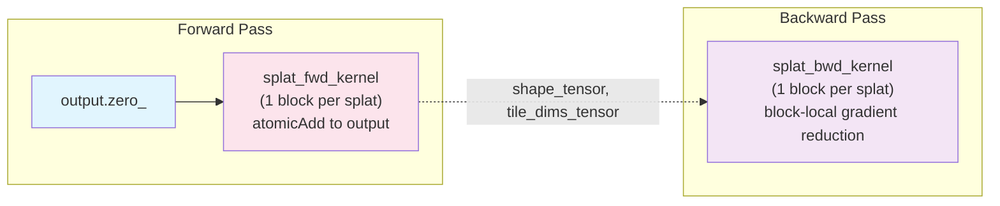

# CUDA Backend Specification - Core Algorithms

**Version**: 0.1.0
**Status**: Implementation Complete
**Last Updated**: 2026-03-31

> **Note**: This is Part 1 of the CUDA Backend Specification (Core Algorithms).
> See also:
> - [Part 2: PyTorch Integration](SPECIFICATIONS_PYTORCH_INTEGRATION.md) - Integration, performance, implementation phases
> - [Part 3: Testing Strategy](SPECIFICATIONS_TESTING.md) - Comprehensive testing guide

## Table of Contents

1. [Overview](#1-overview)
2. [Design Goals](#2-design-goals)
3. [State-of-the-Art Analysis](#3-state-of-the-art-analysis)
4. [Architecture](#4-architecture)
5. [Kernel Design](#5-kernel-design)
6. [Memory Optimization](#6-memory-optimization)
7. [Gradient Computation](#7-gradient-computation)

---

## 1. Overview

The CUDA backend provides GPU-accelerated Gaussian splatting for NVIDIA GPUs using custom CUDA kernels. It replaces the PyTorch rendering path for 2D/3D/nD volumes with a splat-centric rasterization architecture (previously tile-based; see `OPTIMIZATION_REPORT.md`).

### Volumetric Gaussian Fitting vs 3D Gaussian Splatting (3DGS)

**This is NOT 3DGS.** While we share the name "Gaussian splatting", our use case is fundamentally different:

```
┌─────────────────────────────────────────────────────────────────────────────┐
│                     3DGS (Novel View Synthesis)                              │
│                                                                              │
│   Input:  Multi-view images of a 3D scene                                   │
│   Goal:   Render new 2D views from arbitrary camera positions               │
│   Method: Project 3D Gaussians → 2D, alpha-composite front-to-back          │
│   Math:   C(x) = Σ cₖαₖ ∏(1-αⱼ)  ← ORDER DEPENDENT (needs depth sorting)    │
│                       j<k                                                    │
└─────────────────────────────────────────────────────────────────────────────┘

┌─────────────────────────────────────────────────────────────────────────────┐
│                  Luxar Volumetric Gaussian Fitting                           │
│                                                                              │
│   Input:  An nD image/volume (microscopy, CT, MRI, hyperspectral, etc.)     │
│   Goal:   Approximate the volume as a sparse sum of oriented Gaussians      │
│   Method: Fit nD Gaussians directly in native space, sum contributions      │
│   Math:   I(x) = Σ aₖ G(x; μₖ, Σₖ, sₖ)  ← ORDER INDEPENDENT (commutative)   │
│                 k                                                            │
└─────────────────────────────────────────────────────────────────────────────┘
```

**Key Implications for CUDA Implementation**:

| Aspect | 3DGS | Luxar Volumetric |
|--------|------|------------------|
| **Projection** | 3D→2D (camera model) | None (native nD space) |
| **Composition** | Alpha-blending (ordered) | Intensity summation (unordered) |
| **Depth Sorting** | Required | Not needed |
| **Dimensions** | 3D scenes → 2D images | Native 2D, 3D, 4D, ... nD |
| **Output** | RGB image | Scalar intensity field |
| **Gradient Flow** | Through projection | Direct (simpler) |
| **Memory** | Sort buffers needed | No sort buffers |

**Benefits of Intensity Summation**:
1. **Simpler pipeline**: Skip entire sorting stage (~20-30% faster)
2. **Less memory**: No sort key/value buffers (~28 bytes/splat saved)
3. **Better parallelism**: No sequential dependencies between splats
4. **Exact gradients**: No approximations from sorting boundaries
5. **nD support**: Works naturally for any dimension (no projection math)

**Important Caveat - Numerical Nondeterminism**:

Floating-point summation is **not strictly associative**. Different tile processing orders
may produce slightly different results (~1e-6 relative error). This is similar to
PyTorch's CUDA reduction behavior and is documented as expected.

**Deterministic Mode Implementation**:

For reproducible results across runs (debugging/testing), add optional per-tile sorting:

```cuda
// In forward pass, after binning and before rasterize:
if (deterministic_mode) {
    // Sort splat IDs within each tile segment for consistent order
    // Uses CUB segmented sort (tile_offsets define segments)
    cub::DeviceSegmentedRadixSort::SortKeys(
        d_temp_storage, temp_storage_bytes,
        tile_content, tile_content_sorted,
        total_pairs, num_tiles,
        tile_offsets, tile_offsets + 1,  // segment begin/end
        0, sizeof(int) * 8,              // bit range
        stream
    );
}
```

**Cost** (architecture-dependent):
- **Ampere+ (A100, RTX 30xx/40xx)**: ~5-10% overhead (efficient CUB radix sort)
- **Volta/Turing (V100, RTX 20xx)**: ~10-20% overhead
- **Older architectures**: ~20-30% overhead

Profile with Nsight Compute to confirm on your specific GPU. Disabled by default.

**Testing**: Add `test_determinism_across_runs()` verifying identical outputs with flag enabled.

### Key Differentiators from Metal Backend

| Aspect | Metal Backend | CUDA Backend |
|--------|--------------|--------------|
| **Target Hardware** | Apple Silicon (M1-M4) | NVIDIA GPUs (Ampere+) |
| **Dimensions** | 3D only | 2D, 3D, nD (up to 8D) |
| **Sorting** | No sorting (simple binning) | No sorting (intensity summation) |
| **Memory Model** | Unified memory | Explicit device memory |
| **Atomic Operations** | `atomic_add_float` (CAS) | Native `atomicAdd` (hardware) |
| **Warp Size** | 32 threads (SIMD groups) | 32 threads (warps) |

### Critical Distinction: Intensity Summation vs Alpha-Compositing

**Our use case (Luxar)**: Approximate nD images/volumes as a **non-negative sum of Gaussians**:
```
I(x) = Σₖ aₖ × G(x; μₖ, Σₖ, sₖ)
```

This is **fundamentally different** from 3DGS view synthesis which uses **alpha-compositing**:
```
C(x) = Σₖ cₖ × αₖ × Πⱼ₌₁ᵏ⁻¹(1 - αⱼ)  # Order-dependent!
```

**Implications**:
- **No depth sorting required**: Summation is commutative (a + b = b + a)
- **Simpler architecture**: Skip radix sort entirely
- **Better parallelism**: No sequential dependencies between splats
- **Exact gradients**: No approximations from sorting boundaries

### Known Limitations and Constraints

**Tile Count Explosion in High-D**:

Tile count grows as `O(∏ tile_dims[d])`. For high-dimensional data:
- 5D with tile_size=2 and shape=32: 16⁵ = 1M tiles (at limit)
- 5D with tile_size=2 and shape=64: 32⁵ = 33M tiles (unacceptable)

**Hard Limit**: The implementation enforces a **1 million tile maximum** (`MAX_TILES = 1000000`).
Exceeding this triggers an error with guidance to use CPU fallback or downsample. This limit
exists because:
1. Memory: 1M tiles × ~12 bytes metadata = 12MB overhead before splat data
2. Performance: CUB prefix sum and binning become less efficient at >1M elements
3. Practicality: >1M tiles usually indicates inappropriate tiling strategy for the dimension

**Automatic Tile Size Adjustment**:

```cpp
// Auto-compute tile_size balancing:
// 1. num_tiles <= MAX_TILES (memory constraint)
// 2. pixels_per_tile <= MAX_THREADS_PER_BLOCK (thread constraint)
// 3. Reasonable occupancy for the dimension

struct TileConfig {
    int tile_size;
    int64_t num_tiles;
    int pixels_per_tile;
    bool uses_multi_pass;  // True if pixels_per_tile > max threads
};

TileConfig auto_tile_size(
    const int* shape,
    int DIM,
    int64_t max_tiles = 1'000'000,
    int max_threads_per_block = 1024
) {
    TileConfig config;
    config.uses_multi_pass = false;

    // Start with ideal tile size for occupancy
    int tile_size = (DIM <= 2) ? 16 : (DIM <= 3) ? 8 : (DIM <= 4) ? 4 : 2;

    // Iteratively adjust until constraints are satisfied
    while (true) {
        // Compute number of tiles
        int64_t num_tiles = 1;
        for (int d = 0; d < DIM; d++) {
            num_tiles *= (shape[d] + tile_size - 1) / tile_size;
        }

        // Compute pixels per tile
        int pixels_per_tile = 1;
        for (int d = 0; d < DIM; d++) {
            pixels_per_tile *= tile_size;
        }

        // Check thread constraint FIRST (hard limit)
        // If pixels_per_tile > max_threads, we CANNOT increase tile_size further
        // Must use multi-pass strategy instead
        if (pixels_per_tile > max_threads_per_block) {
            // Revert to previous tile_size and use multi-pass
            if (tile_size > 2) {
                tile_size /= 2;
                // Recompute with smaller tile_size
                num_tiles = 1;
                pixels_per_tile = 1;
                for (int d = 0; d < DIM; d++) {
                    num_tiles *= (shape[d] + tile_size - 1) / tile_size;
                    pixels_per_tile *= tile_size;
                }
            }

            // If still exceeds max_tiles, we need multi-pass
            if (num_tiles > max_tiles) {
                config.uses_multi_pass = true;
                // Use largest tile_size that fits thread limit
                // Each thread processes multiple pixels
            }
            break;
        }

        // Check tile count constraint
        if (num_tiles <= max_tiles) {
            break;  // Found valid configuration
        }

        // Try doubling tile size to reduce tile count
        int next_tile_size = tile_size * 2;
        int next_pixels = 1;
        for (int d = 0; d < DIM; d++) {
            next_pixels *= next_tile_size;
        }

        // But don't exceed thread limit
        if (next_pixels > max_threads_per_block) {
            // Can't increase further - must use multi-pass or error
            if (num_tiles > max_tiles * 10) {
                throw std::runtime_error(
                    "Volume too large for CUDA backend. Consider downsampling or CPU fallback."
                );
            }
            config.uses_multi_pass = true;
            break;
        }

        tile_size = next_tile_size;
    }

    // Final computation
    config.tile_size = tile_size;
    config.num_tiles = 1;
    config.pixels_per_tile = 1;
    for (int d = 0; d < DIM; d++) {
        config.num_tiles *= (shape[d] + tile_size - 1) / tile_size;
        config.pixels_per_tile *= tile_size;
    }

    return config;
}

// Multi-pass kernel launch for large tiles (pixels_per_tile > max_threads)
// Each thread processes multiple pixels in a strided pattern
template<int DIM>
void launch_rasterize_multipass(
    const TileConfig& config,
    int max_threads,
    cudaStream_t stream,
    /* other params */
) {
    int threads_per_block = min(config.pixels_per_tile, max_threads);
    int pixels_per_thread = (config.pixels_per_tile + threads_per_block - 1) / threads_per_block;

    // Kernel uses strided access: each thread handles pixels at
    // indices: threadIdx.x, threadIdx.x + blockDim.x, threadIdx.x + 2*blockDim.x, ...
    rasterize_fwd_multipass<DIM><<<config.num_tiles, threads_per_block, smem_size, stream>>>(
        /* params */, pixels_per_thread
    );
}
```

**Tile Size Limits by Dimension**:

| DIM | Max tile_size (thread limit) | Pixels at max | Typical tile_size |
|-----|------------------------------|---------------|-------------------|
| 2D  | 32 (32²=1024)                | 1024          | 16 (256 threads)  |
| 3D  | 10 (10³=1000)                | 1000          | 8 (512 threads)   |
| 4D  | 5 (5⁴=625)                   | 625           | 4 (256 threads)   |
| 5D  | 4 (4⁵=1024)                  | 1024          | 2 (32 threads)    |
| 6D+ | 3 (3⁶=729)                   | 729           | 2 (64 threads)    |

**Fallback Strategy**:
1. Auto-adjust tile_size respecting BOTH tile count AND thread limits
2. If constraints conflict: Use multi-pass kernel (each thread handles multiple pixels)
3. If num_tiles > 10M even with multi-pass: Error, suggest CPU fallback
4. Future: Sparse-tile variant for high-D with low splat density

**Sharpness Numerical Stability**:

The sharpness gradient involves `ln(D²)` which explodes as D²→0:
- Clamp `D² >= 1e-6` before log operations
- Clamp sharpness to safe range `[0.5, 8.0]` (s > 8 causes overflow)
- Document that extreme sharpness values are numerically unsafe

### Prerequisites

- CUDA 11.8+ (CUDA 12.x recommended for best performance)
- NVIDIA GPU with Compute Capability 7.0+ (Volta, Turing, Ampere, Ada, Hopper)
- PyTorch 2.0+ with CUDA support
- cuBLAS and CUB libraries (bundled with CUDA Toolkit)

**CUDA Version Compatibility**:

| Feature | Min CUDA | Fallback for Older CUDA |
|---------|----------|-------------------------|
| CUB Prefix Sum | 11.0 | Use Thrust `exclusive_scan` |
| Async Memcpy (`cudaMemcpyAsync`) | 11.2 | Synchronous `cudaMemcpy` |
| CUB Segmented Sort (determinism) | 11.0 | Thrust `stable_sort_by_key` |
| Cooperative Groups clusters | 12.0 | Standard `__syncthreads()` |
| `__ldg()` texture cache | 3.5+ | Direct global read |
| FP16 tensor cores | 7.0+ | FP32 fallback |

**Compile Flag for Older CUDA**: Define `LUXAR_CUDA_COMPAT_MODE` to enable fallbacks:
```bash
nvcc -DLUXAR_CUDA_COMPAT_MODE=1 ...
```

---

## 2. Design Goals

### Dimension Priority (CRITICAL)

**The vast majority of use cases are 2D and 3D.** The implementation MUST prioritize these:

| Priority | Dimensions | Optimization Level | Use Case |
|----------|------------|-------------------|----------|
| **P0 (Critical)** | **2D, 3D** | Maximum - hand-tuned specialized kernels | Images, volumes, microscopy |
| P1 (Important) | 4D | High - templated with full unrolling | Time-lapse, spectral |
| P2 (Supported) | 5D-8D | Moderate - generic kernel, no unrolling | Rare edge cases |

**2D/3D Optimization Requirements**:
- **Dedicated kernel implementations** (not generic templates)
- **Fully unrolled loops** for Mahalanobis, tile iteration, gradient computation
- **Vectorized memory access** (`float2`, `float3`, `float4`)
- **Maximum occupancy** via hand-tuned `__launch_bounds__`
- **Optimal tile sizes**: 16×16 for 2D, 8×8×8 for 3D

**Performance Targets by Dimension**:

| Dimension | Speedup vs PyTorch CPU | Target Throughput |
|-----------|------------------------|-------------------|
| **2D** | **100-200×** | >10B voxels/sec |
| **3D** | **50-100×** | >1B voxels/sec |
| 4D | 20-50× | >100M voxels/sec |
| 5D-8D | 10-20× | Best effort |

### Primary Goals

1. **Performance**: 50-200× speedup for 2D/3D, 10-50× for 4D+
2. **Memory Efficiency**: 4× less memory than naive implementations (following gsplat patterns)
3. **Numerical Accuracy**: Forward pass within **1e-5 relative error**, backward within **1e-4**
   - Note: Bit-accuracy is impractical due to floating-point atomics and thread scheduling
   - PyTorch itself isn't bit-accurate across devices; ~1e-6 variance is normal
   - Forward: `torch.allclose(cuda_out, cpu_out, rtol=1e-5, atol=1e-7)`
   - Backward: `torch.allclose(cuda_grad, cpu_grad, rtol=1e-4, atol=1e-6)` (looser due to atomics)
4. **Flexibility**: Support 2D images, 3D volumes, and nD hypercubes (with priority on 2D/3D)

### Secondary Goals

1. **Ease of Integration**: Drop-in replacement for `GaussianSplatModel`
2. **Debugging Support**: Optional CPU fallback for debugging
3. **Profiling Support**: NVTX markers for Nsight Systems analysis
4. **Multi-GPU Ready**: Architecture compatible with future distributed training

### Non-Goals (Out of Scope for v1.0)

1. Hardware raytracing (RT cores) - complex, limited benefit for dense grids
2. Multi-GPU - focus on single-GPU first (architecture is DDP-compatible)

### Optional: Mixed-Precision (FP16) Support

**Reconsidered for Phase 5**: Tensor cores can provide 2-4× speedup with acceptable accuracy
for many use cases, particularly microscopy data (typically 12-16 bit integer input).

**Mixed-Precision Strategy**:

| Component | Precision | Rationale |
|-----------|-----------|-----------|
| Input centers, conic | FP16 | Sufficient for typical coordinate ranges |
| Amplitude, sharpness | FP16 | Input data rarely exceeds FP16 dynamic range |
| Intensity computation | FP16 | Forward pass accuracy ~1e-3 is acceptable |
| Output accumulation | FP32 | Avoid precision loss in summation |
| **Gradient accumulation** | **FP32** | Critical - gradients can be 1e-4 to 1e-6 |
| Gradient storage | FP32 | Maintain precision for optimizer |

**Implementation (Phase 5)**:

```cuda
// Forward: FP16 compute, FP32 accumulation
__global__ void rasterize_fwd_fp16(
    const __half* __restrict__ centers,   // FP16 input
    const __half* __restrict__ conic,     // FP16 input
    float* __restrict__ output            // FP32 output
) {
    float accum = 0.0f;  // FP32 accumulator

    for (int i = 0; i < count; i++) {
        // Load as FP16, compute in FP16
        __half2 mu = __halves2half2(centers[...], centers[...]);

        // ... FP16 math for distance and Gaussian ...
        __half intensity = __hmul(amp, hexp(inner));

        // Accumulate in FP32 for precision
        accum += __half2float(intensity);
    }
    output[pixel_idx] = accum;
}

// Backward: ALWAYS FP32 for gradients
__global__ void rasterize_bwd_fp32(...) {
    // Gradients computed and accumulated in FP32
    // Critical for optimizer convergence
}
```

**Use Cases**:
- **Microscopy**: 12-16 bit integer input, FP16 forward is lossless, ~2× speedup
- **High dynamic range**: Keep FP32 (default)
- **Real-time preview**: FP16 acceptable, switch to FP32 for final fit

**Accuracy Testing**:
```python
def test_fp16_accuracy():
    """FP16 forward should match FP32 within 1e-3 relative error."""
    output_fp32 = model_fp32()
    output_fp16 = model_fp16()
    assert torch.allclose(output_fp32, output_fp16, rtol=1e-3, atol=1e-5)
```

---

## 3. State-of-the-Art Analysis

### Key CUDA Implementations Reviewed

#### 3.1 gsplat (Nerfstudio Project)

**Source**: [github.com/nerfstudio-project/gsplat](https://github.com/nerfstudio-project/gsplat)

**Key Features**:
- 4× less GPU memory, 15% faster training than original 3DGS
- 16×16 tile binning with depth sorting
- N-D feature rendering support
- Sparse gradient computation
- Multi-GPU distributed rasterization

**Architecture Insights**:
```
Forward: project → tile_bin → sort (CUB radix) → rasterize
Backward: rasterize_bwd (reuses sorted list from forward)
```

**What to Adopt**:
- Tile-based binning strategy (core optimization)
- Sparse gradient patterns
- Memory-efficient workspace allocation

**What We Skip**:
- CUB radix sort (not needed for intensity summation)
- Depth encoding in keys
- Alpha-compositing math

#### 3.2 diff-gaussian-rasterization (INRIA)

**Source**: [github.com/graphdeco-inria/diff-gaussian-rasterization](https://github.com/graphdeco-inria/diff-gaussian-rasterization)

**Key Features**:
- Original reference implementation for 3DGS view synthesis
- Uses depth sorting for alpha-compositing (ORDER-DEPENDENT)
- Per-pixel `n_contrib` tracking for backward pass

**Why We DON'T Need Their Sorting**:
```cpp
// 3DGS needs this because alpha-compositing is order-dependent:
// C = c₁α₁ + c₂α₂(1-α₁) + c₃α₃(1-α₁)(1-α₂) + ...

// Luxar does intensity SUMMATION which is order-independent:
// I = a₁G₁ + a₂G₂ + a₃G₃ + ...  (commutative!)
```

**What to Adopt**:
- Tile binning pattern (without sorting)
- Tile range identification
- Per-tile workload distribution

#### 3.3 FlashGS

**Source**: [arxiv.org/html/2408.07967v2](https://arxiv.org/html/2408.07967v2)

**Key Innovations**:
- **Warp Divergence Elimination**: Move opacity checks to preprocessing
- **Early Stopping Optimization**: Skip remaining splats when transmittance < threshold
- **Pipeline Restructuring**: Fuse preprocessing into single kernel

**Performance Insight**:
> "Thread divergence within a warp can cause some threads to stall... FlashGS moves the opacity check to the preprocessing stage."

**What to Adopt**:
- Preprocessing-time visibility culling
- Intensity floor filtering in AABB computation (already in our Metal impl)

#### 3.4 BalanceGS

**Source**: [arxiv.org/html/2510.14564](https://arxiv.org/html/2510.14564)

**Key Innovations**:
- **Memory Coalescing Fix**: SoA → AoS conversion for color data
- **Shared Memory Buffering**: Batch-load attributes into shared memory
- **Result**: 92% coalesced reads, 1.4× speedup

**Memory Layout Insight**:
```cpp
// BAD: SoA layout causes non-coalesced access
float* R = ...; float* G = ...; float* B = ...;
color = make_float3(R[idx], G[idx], B[idx]);  // 3 separate memory transactions

// GOOD: AoS layout with shared memory batch loading
__shared__ float3 colors_smem[BLOCK_SIZE];
colors_smem[tid] = colors_global[block_offset + tid];  // Coalesced load
__syncthreads();
color = colors_smem[local_idx];  // Fast shared memory access
```

**What to Adopt**:
- AoS memory layout for per-splat attributes
- Shared memory batch loading pattern

#### 3.5 DISTWAR / Hardware Rasterization

**Source**: [arxiv.org/html/2505.18764v1](https://arxiv.org/html/2505.18764v1)

**Key Innovation**:
- **Warp-Level Gradient Pre-Accumulation**: Reduce atomics by 32×

```cuda
// Per-thread gradient
float grad_local = compute_gradient(...);

// Warp-level reduction (32 threads → 1 value)
for (int offset = 16; offset > 0; offset /= 2) {
    grad_local += __shfl_down_sync(0xffffffff, grad_local, offset);
}

// Only lane 0 does atomic write
if (lane_id == 0) {
    atomicAdd(&grad_global[splat_id], grad_local);
}
```

**What to Adopt**:
- Warp-level reduction before atomic accumulation
- `__shfl_down_sync` for intra-warp communication

---

## 4. Architecture

### 4.1 High-Level Pipeline

> **Historical note**: The original architecture used a tile-based pipeline
> (preprocess -> prefix_sum -> bin -> rasterize). This was refactored to a
> splat-centric architecture achieving 3.16x training speedup. See
> `OPTIMIZATION_REPORT.md` for the full transition history.

```
┌─────────────────────────────────────────────────────────────────────────┐
│                         Python Layer                                     │
│   GaussianSplatModelCUDA → CUDASplatFunction (torch.autograd.Function)  │
│   torch.compile(cholesky_to_conic) fuses L→conic into 1 kernel          │
└─────────────────────────────────────────────────────────────────────────┘
                                │
                                ▼
┌─────────────────────────────────────────────────────────────────────────┐
│                    PyTorch C++ Extension                                 │
│   forward_wrapper() / backward_wrapper()  (pybind11 bindings)           │
│   See bindings.cpp for Python-facing signatures                          │
└─────────────────────────────────────────────────────────────────────────┘
                                │
                                ▼
┌─────────────────────────────────────────────────────────────────────────┐
│                     CUDA Dispatch Layer (cuda_splatting.cu)              │
│   dispatch_forward_impl<InputDType>() / dispatch_backward_impl<>()     │
│   DIM_DISPATCH macro for D=2,3,4,...,8 template instantiation           │
└─────────────────────────────────────────────────────────────────────────┘
                                │
                                ▼
┌─────────────────────────────────────────────────────────────────────────┐
│                  Splat-Centric CUDA Kernels                              │
│   Forward:  output.zero_() → splat_fwd (1 kernel, N blocks)            │
│   Backward: splat_bwd (1 kernel, N blocks)                              │
│                                                                          │
│   Each CUDA block processes ONE splat (natural parallelism).            │
│   No tile binning, no prefix sum, no sorting.                           │
└─────────────────────────────────────────────────────────────────────────┘
```

**Visual Pipeline Diagram**:



**Pipeline Comparison**:

| | Old Tile-Based (removed) | Current Splat-Centric |
|---|---|---|
| Forward kernels | preprocess + CUB prefix_sum + bin + rasterize_fwd + global_fwd | **1 kernel** (`rasterize_forward_splat_centric_kernel`) |
| Backward kernels | rasterize_bwd + global_bwd | **1 kernel** (`rasterize_backward_splat_centric_kernel`) |
| Kernel launches/iter | 20+ | **3** (L->conic fused + fwd + bwd) |
| Tensor allocs/fwd | ~13 | **3** |
| Synchronization | 1 full `cudaStreamSynchronize` | diagnostics only |
| Tile binning | Required | **Eliminated** |
| Shared memory barriers | Multiple `__syncthreads` | None in hot path |
| Global atomics (bwd) | Per-tile atomics | **Zero** (block-local reduction) |

**Splat-Centric Design**: Each CUDA block owns exactly one splat. Threads within
the block cooperatively iterate over the splat's AABB (axis-aligned bounding box)
of affected voxels. Forward uses `atomicAdd` to scatter contributions to the output.
Backward reads `grad_output` and reduces gradients within the block, writing the
final gradient for that splat without global atomics.

### 4.2 Dimensional Generalization

Unlike 3DGS (which is 2D image-based), Luxar supports nD volumetric data:

```cpp
template<int DIM>
struct GaussianParams {
    float center[DIM];            // μ: center position
    float amplitude;              // a: intensity
    float sharpness;              // s: generalized Gaussian exponent
    // Note: L is stored separately in FULL matrix format (see below)
};
```

### 4.3 Cholesky Factor Storage Format

**IMPORTANT**: The Cholesky factor `L` is stored as a **FULL (N, DIM, DIM) matrix** in row-major order,
NOT as packed triangular storage.

**Rationale**:
1. **PyTorch compatibility**: The Python GaussianSplatModel uses `(N, d, d)` tensors
2. **Simpler indexing**: `L[idx * DIM * DIM + row * DIM + col]` vs packed triangle index math
3. **Memory alignment**: Better coalescing for consecutive reads
4. **Trade-off**: Uses ~2× memory vs packed, but simplifies kernel code significantly

**Storage Layout**:
```cpp
// L is stored as (N, DIM, DIM) in row-major order
// For splat i, element L[row, col] is at:
//   L_ptr[i * DIM * DIM + row * DIM + col]

// Example: 3D splat i=5, L matrix:
// L = [[L00,  0,   0 ]      Memory layout (row-major):
//      [L10, L11,  0 ]  →   [L00, 0, 0, L10, L11, 0, L20, L21, L22]
//      [L20, L21, L22]]     at offset 5 * 9 = 45

// The upper triangle contains zeros but is stored anyway
```

**Alternative (NOT used)**: Packed lower-triangular would store only `DIM*(DIM+1)/2` elements:
```cpp
// Packed format (for reference, NOT what we use):
// 3D: [L00, L10, L11, L20, L21, L22] - 6 elements vs 9
// Index computation: pack_idx = row*(row+1)/2 + col (for col <= row)
```

**L vs Conic Storage: Why Different Formats?**

| Storage | L (Cholesky) | Conic (Σ⁻¹) |
|---------|--------------|--------------|
| **Format** | Full (DIM, DIM) | Packed upper-tri |
| **Size** | DIM² | DIM×(DIM+1)/2 |
| **Reason** | PyTorch interop, simpler indexing | Per-pixel access, memory bandwidth |

**Rationale**:
- **L is full matrix**: Used only in preprocessing (once per iteration). The overhead of
  storing zeros is negligible, and full storage simplifies PyTorch tensor interop and
  AABB computation (L row norms need row-major access).
- **Conic is packed**: Accessed per-pixel during rasterization (millions of times per frame).
  Packed storage saves memory bandwidth and shared memory footprint. The packing overhead
  (one-time L→conic conversion per iteration) is amortized across all pixels.

**Conversion Location**: `cholesky_to_conic()` is called in Python before launching kernels:
```python
# In forward():
conic = cholesky_to_conic(self.L)  # (N, DIM*(DIM+1)/2)
# Kernels receive conic, not L (except preprocess/bin which use L for AABB)
```

**Kernel Access Pattern**:
```cuda
// Load L row norms (for AABB computation)
template<int DIM>
__device__ __forceinline__ void compute_L_row_norms(
    const float* L,       // Points to &L_all[splat_idx * DIM * DIM]
    float* L_row_norms    // Output: sqrt(Σ_dd) for each dimension
) {
    for (int d = 0; d < DIM; d++) {
        float sum_sq = 0.0f;
        for (int j = 0; j <= d; j++) {  // L is lower triangular
            float L_dj = L[d * DIM + j];  // Row-major access
            sum_sq += L_dj * L_dj;
        }
        L_row_norms[d] = sqrtf(fmaxf(sum_sq, 1e-8f));
    }
}
```

**Tile Sizes by Dimension**:

| Dimension | Tile Shape | Voxels/Tile | Typical Block Size |
|-----------|------------|-------------|-------------------|
| 2D | 16×16 | 256 | 256 threads |
| 3D | 8×8×8 | 512 | 512 threads |
| 4D | 4×4×4×4 | 256 | 256 threads |
| 5D+ | 2^(10/D) | ~256-1024 | 256 threads |

### 4.4 State Structures

The `BinningState` struct (see `cuda_splatting.h`) stores workspace and cached
tensors passed between forward and backward. In the splat-centric architecture,
most tile-related fields are populated for API compatibility but not used by kernels.

```cpp
struct BinningState {
    // Tile metadata (populated for diagnostic/API compatibility, not used by splat-centric kernels)
    torch::Tensor tile_counts;      // (num_tiles,) int32 - splats per tile
    torch::Tensor tile_offsets;     // (num_tiles,) int64 - exclusive prefix sum
    torch::Tensor tile_content;     // (0,) int32 - empty (tile binning eliminated)
    torch::Tensor tile_write_heads; // (num_tiles,) int32 - unused

    // CUB scan temp storage (unused in splat-centric path)
    torch::Tensor scan_temp_storage;
    size_t scan_temp_bytes;

    // Global splat detection (set as side effect in splat-centric forward kernel)
    torch::Tensor global_splat_flags; // (N,) bool
    torch::Tensor global_splat_ids;   // (num_global,) int32
    int num_global_splats;

    // AABB cache (unused in splat-centric path -- AABB computed inline)
    torch::Tensor aabb_lo;          // (N, DIM) int32
    torch::Tensor aabb_hi;          // (N, DIM) int32

    // Metadata
    int64_t num_tiles;
    int64_t total_pairs;

    // OPTIMIZATION: Cached device tensors for backward pass reuse
    // Eliminates redundant host-to-device copies in backward pass
    torch::Tensor shape_tensor;     // (dim,) int32 - volume shape on device
    torch::Tensor tile_dims_tensor; // (dim,) int32 - tile dimensions on device
    int tile_size;                  // Cached tile size
};
```

**Splat-centric memory usage**: The forward pass allocates only 3 tensors:
`tile_counts` (diagnostic), `global_splat_flags` (N bools), and
`global_count_tensor` (1 int). Compare this with the old tile-based pipeline
which allocated ~13 tensors per forward call.

---

## 5. Kernel Design

> **Historical note**: The tile-based kernels (`preprocess_kernel`, `bin_kernel`,
> `rasterize_forward_kernel`, `rasterize_backward_kernel`) and global splat kernels
> (`rasterize_global_forward_kernel`, `rasterize_global_backward_kernel`) still exist
> in the codebase for reference and fallback, but the primary pipeline uses the
> splat-centric kernels described below. Template instantiations for all kernel
> families are in `cuda_splatting.cu`.

### 5.0 Shared Device Functions

#### AABB Computation

The AABB (Axis-Aligned Bounding Box) is computed inline in each splat-centric kernel.
Both the forward and backward splat-centric kernels compute the AABB identically using
the same `ceilf`-based formula (see `rasterize_forward_splat_centric_kernel()` and
`rasterize_backward_splat_centric_kernel()` in `kernels_core.cuh`).

**CRITICAL: Correct AABB for Anisotropic Gaussians**

For a rotated ellipse, the diagonal of Σ does **NOT** give axis-aligned bounds!

**Example**: Consider a thin ellipse rotated 45°:
- L = [[1, 0], [1, 1]], so Σ = L @ L^T = [[1, 1], [1, 2]]
- Diagonal of Σ is [1, 2], suggesting radii [1, √2]
- But the actual X-extent is larger due to the correlation term!

**Correct approach**: Use the row norms of L, which gives a **conservative bound**:
```
radius[d] = sqrt(sum_j(L[d,j]²)) × truncate = sqrt(Σ_dd) × truncate
```

This works because for any point x on the truncation ellipsoid:
```
(x-μ)^T Σ⁻¹ (x-μ) = truncate²
```
The maximum extent in axis d is bounded by `sqrt(Σ_dd) × truncate`.

**Solution**: Single shared device function for AABB:

```cuda
template<int DIM>
struct AABB {
    int lo[DIM];
    int hi[DIM];
};

// Shared device function - SINGLE SOURCE OF TRUTH for AABB computation
template<int DIM>
__device__ __forceinline__ AABB<DIM> compute_splat_aabb(
    const float* mu,           // Splat center (DIM elements)
    const float* L_row_norms,  // sqrt(Σ_dd) for each dimension (DIM elements)
    float sharpness,
    float amplitude,
    float truncate,
    float intensity_floor,
    const int* tile_size,
    const int* tile_dims,
    const int* shape
) {
    AABB<DIM> aabb;

    // INTENSITY FLOOR CONSISTENCY:
    // The intensity_floor parameter has two roles:
    // 1. AABB: Skip splats whose max contribution < floor (return empty AABB)
    // 2. AABB: Shrink bounds to where contribution >= floor
    // 3. Rasterize: Skip contributions < floor (same threshold!)
    //
    // This ensures a splat that passes AABB check will have pixels >= floor.

    // Skip splats that can never contribute >= floor
    // Max contribution is amplitude (at center, D²=0)
    if (intensity_floor > 0.0f && amplitude < intensity_floor) {
        // Return empty AABB - this splat contributes nothing
        for (int d = 0; d < DIM; d++) {
            aabb.lo[d] = 1;
            aabb.hi[d] = 0;
        }
        return aabb;
    }

    // Sharpness-adjusted truncation radius
    // For generalized Gaussian exp(-0.5 * D^s), the effective truncation scales
    float effective_truncate = powf(truncate, 2.0f / fmaxf(sharpness, 0.5f));

    // Amplitude-aware shrinking (shifted formula for C⁰ continuity):
    // Solve: a × scale × (exp(-0.5 × r^s) - C) = floor
    //   →  r = (-2 × ln(floor/(a×scale) + C))^(1/s)
    // where C = exp(-0.5 × T²), scale = 1/(1-C)
    float C_boundary = expf(-0.5f * truncate * truncate);
    float scale = 1.0f / (1.0f - C_boundary);
    if (intensity_floor > 0.0f) {
        float inner = intensity_floor / (amplitude * scale) + C_boundary;
        if (inner > 0.0f && inner < 1.0f) {
            float t_max = powf(-2.0f * logf(inner), 1.0f / fmaxf(sharpness, 0.5f));
            effective_truncate = fminf(effective_truncate, t_max);
        }
    }

    // Compute tile range using CORRECT axis-aligned bounds
    for (int d = 0; d < DIM; d++) {
        // L_row_norms[d] = sqrt(Σ_dd) = sqrt(sum_j L[d,j]²)
        // This gives the maximum extent in axis d for ANY rotation
        float r = effective_truncate * fmaxf(L_row_norms[d], 1e-4f);

        // Convert to tile coordinates (clamped to grid bounds)
        float lo_coord = mu[d] - r;
        float hi_coord = mu[d] + r;

        aabb.lo[d] = max(0, (int)floorf(lo_coord / (float)tile_size[d]));
        aabb.hi[d] = min(tile_dims[d] - 1, (int)floorf(hi_coord / (float)tile_size[d]));

        // Clamp to shape bounds as well
        if (hi_coord < 0.0f || lo_coord >= (float)shape[d]) {
            // Splat is entirely outside the volume in this dimension
            aabb.lo[d] = 1;
            aabb.hi[d] = 0;  // Empty range
        }
    }

    return aabb;
}

// Helper: Compute L row norms (= sqrt of Σ diagonal) from Cholesky factor
// This gives CORRECT axis-aligned bounds for anisotropic Gaussians
template<int DIM>
__device__ __forceinline__ void compute_L_row_norms(
    const float* L,       // (DIM, DIM) lower triangular, row-major
    float* L_row_norms    // Output: sqrt(Σ_dd) for each dimension
) {
    // Σ = L × Lᵀ, so Σ_dd = sum_j(L[d,j]²) (row norm squared of L)
    // For AABB we need sqrt(Σ_dd) = row norm of L
    for (int d = 0; d < DIM; d++) {
        float sum_sq = 0.0f;
        for (int j = 0; j <= d; j++) {  // L is lower triangular: L[d,j] = 0 for j > d
            float L_dj = L[d * DIM + j];
            sum_sq += L_dj * L_dj;
        }
        L_row_norms[d] = sqrtf(fmaxf(sum_sq, 1e-8f));
    }
}

// Check if AABB is empty (lo > hi in any dimension)
template<int DIM>
__device__ __forceinline__ bool aabb_is_empty(const AABB<DIM>& aabb) {
    for (int d = 0; d < DIM; d++) {
        if (aabb.lo[d] > aabb.hi[d]) return true;
    }
    return false;
}
```

#### Mahalanobis Distance Computation

Computes `d^T × Σ⁻¹ × d` where `Σ⁻¹` is stored as packed upper-triangular (conic).

```cuda
// Compute Mahalanobis distance squared: d^T × Σ⁻¹ × d
// Uses packed upper-triangular storage for conic (inverse covariance)
//
// For 3D (DIM=3), conic layout is [c_00, c_01, c_02, c_11, c_12, c_22]
// General: index(i,j) where i <= j is at position i*DIM - i*(i-1)/2 + (j-i)
template<int DIM>
__device__ __forceinline__ float mahalanobis_distance(
    const float* d,    // Displacement vector (DIM elements)
    const float* C     // Packed upper-tri conic (DIM*(DIM+1)/2 elements)
) {
    constexpr int CONIC_SIZE = (DIM * (DIM + 1)) / 2;

    // Expand symmetric matrix multiply: sum_ij d[i] * C[i,j] * d[j]
    // For packed upper-tri, each off-diagonal appears once so multiply by 2
    float result = 0.0f;
    int idx = 0;

    #pragma unroll
    for (int i = 0; i < DIM; i++) {
        // Diagonal term: d[i]^2 * C[i,i]
        result += d[i] * d[i] * C[idx];
        idx++;

        // Off-diagonal terms: 2 * d[i] * d[j] * C[i,j] for j > i
        #pragma unroll
        for (int j = i + 1; j < DIM; j++) {
            result += 2.0f * d[i] * d[j] * C[idx];
            idx++;
        }
    }

    return result;
}

// Alternative: dimension-specialized versions for better register usage
template<>
__device__ __forceinline__ float mahalanobis_distance<2>(
    const float* d, const float* C
) {
    // C = [c_00, c_01, c_11]
    return d[0]*d[0]*C[0] + 2.0f*d[0]*d[1]*C[1] + d[1]*d[1]*C[2];
}

template<>
__device__ __forceinline__ float mahalanobis_distance<3>(
    const float* d, const float* C
) {
    // C = [c_00, c_01, c_02, c_11, c_12, c_22]
    return d[0]*d[0]*C[0] + 2.0f*d[0]*d[1]*C[1] + 2.0f*d[0]*d[2]*C[2]
                         +     d[1]*d[1]*C[3] + 2.0f*d[1]*d[2]*C[4]
                                             +     d[2]*d[2]*C[5];
}
```

#### Cholesky to Conic Conversion

Converts Cholesky factor `L` (full matrix storage) to packed inverse covariance `Σ⁻¹`.

```cuda
// Convert Cholesky factor L to packed conic (Σ⁻¹)
// L is stored as FULL (DIM, DIM) matrix, output is packed upper-triangular
//
// Method: Σ = L @ L^T, then Σ⁻¹ = (L^T)⁻¹ @ L⁻¹
// For lower triangular L, L⁻¹ is computed via forward substitution
//
// This is a HOST/Python function - called once per iteration, not per-pixel
// The per-pixel kernel receives pre-computed conic, not L
void cholesky_to_conic(
    const torch::Tensor& L,      // (N, DIM, DIM) lower triangular
    torch::Tensor& conic          // (N, DIM*(DIM+1)/2) packed output
);

// For small DIM, explicit formulas are faster than inversion:
// 2D: L = [[l00, 0], [l10, l11]]
//     Σ = [[l00², l00*l10], [l00*l10, l10²+l11²]]
//     Σ⁻¹ via 2x2 inverse formula

// PyTorch implementation (used in forward):
torch::Tensor cholesky_to_conic_torch(const torch::Tensor& L) {
    // L: (N, DIM, DIM) lower triangular
    auto Sigma = torch::bmm(L, L.transpose(-1, -2));  // (N, DIM, DIM)
    auto Sigma_inv = torch::linalg::inv(Sigma);        // (N, DIM, DIM)

    // Extract upper triangular and pack
    int N = L.size(0);
    int DIM = L.size(1);
    int conic_size = (DIM * (DIM + 1)) / 2;

    auto conic = torch::empty({N, conic_size}, L.options());

    // Pack upper triangle row by row
    int idx = 0;
    for (int i = 0; i < DIM; i++) {
        for (int j = i; j < DIM; j++) {
            conic.index({torch::indexing::Slice(), idx}) =
                Sigma_inv.index({torch::indexing::Slice(), i, j});
            idx++;
        }
    }

    return conic;
}
```

#### Pixel Index Computation

```cuda
// Convert thread/block indices to linear pixel index
// Returns -1 if pixel is outside volume bounds
template<int DIM>
__device__ __forceinline__ int compute_pixel_index(
    const dim3& blockIdx,
    const dim3& threadIdx,
    const int* tile_size,
    const int* tile_dims,
    const int* shape
) {
    int px[DIM];

    // Compute pixel coordinates from block (tile) and thread within tile
    // For DIM <= 3, use built-in 3D indexing
    if constexpr (DIM == 2) {
        int tile_x = blockIdx.x;
        int tile_y = blockIdx.y;
        int local_x = threadIdx.x % tile_size[0];
        int local_y = threadIdx.x / tile_size[0];
        px[0] = tile_x * tile_size[0] + local_x;
        px[1] = tile_y * tile_size[1] + local_y;
    } else if constexpr (DIM == 3) {
        int tile_x = blockIdx.x;
        int tile_y = blockIdx.y;
        int tile_z = blockIdx.z;
        int local_idx = threadIdx.x;
        int local_x = local_idx % tile_size[0];
        int local_y = (local_idx / tile_size[0]) % tile_size[1];
        int local_z = local_idx / (tile_size[0] * tile_size[1]);
        px[0] = tile_x * tile_size[0] + local_x;
        px[1] = tile_y * tile_size[1] + local_y;
        px[2] = tile_z * tile_size[2] + local_z;
    } else {
        // Generic nD: linear block index, linear thread index
        int tile_idx = blockIdx.x;
        int local_idx = threadIdx.x;

        // Unravel tile index to tile coordinates
        int tile_coords[DIM];
        int remaining = tile_idx;
        for (int d = DIM - 1; d >= 0; d--) {
            tile_coords[d] = remaining % tile_dims[d];
            remaining /= tile_dims[d];
        }

        // Unravel local index to local coordinates within tile
        remaining = local_idx;
        for (int d = DIM - 1; d >= 0; d--) {
            int local_d = remaining % tile_size[d];
            remaining /= tile_size[d];
            px[d] = tile_coords[d] * tile_size[d] + local_d;
        }
    }

    // Bounds check
    for (int d = 0; d < DIM; d++) {
        if (px[d] < 0 || px[d] >= shape[d]) {
            return -1;  // Out of bounds
        }
    }

    // Compute linear index (row-major)
    int linear_idx = 0;
    int stride = 1;
    for (int d = DIM - 1; d >= 0; d--) {
        linear_idx += px[d] * stride;
        stride *= shape[d];
    }

    return linear_idx;
}

// Compute linear tile index from block indices
template<int DIM>
__device__ __forceinline__ int compute_tile_index(
    const dim3& blockIdx,
    const int* tile_dims
) {
    if constexpr (DIM == 2) {
        // Grid: dim3(tile_dims[1], tile_dims[0], 1), so blockIdx.x -> dim1, blockIdx.y -> dim0
        return blockIdx.y * tile_dims[1] + blockIdx.x;
    } else if constexpr (DIM == 3) {
        // Grid: dim3(tile_dims[2], tile_dims[1], tile_dims[0])
        return (blockIdx.z * tile_dims[1] + blockIdx.y) * tile_dims[2] + blockIdx.x;
    } else {
        return blockIdx.x;  // Generic: linear block index
    }
}

// Unravel linear index to nD coordinates
template<int DIM>
__device__ __forceinline__ void unravel_index(
    int linear_idx,
    const int* shape,
    float* coords  // Output: float coords for distance computation
) {
    #pragma unroll
    for (int d = DIM - 1; d >= 0; d--) {
        coords[d] = static_cast<float>(linear_idx % shape[d]);
        linear_idx /= shape[d];
    }
}
```

**Usage Pattern** (in splat-centric kernels, the AABB is computed inline):
```cuda
// In rasterize_forward_splat_centric_kernel and rasterize_backward_splat_centric_kernel:
// AABB computed from conic diagonal, using ceilf-based radius formula.
// See kernels_core.cuh for the actual inline computation.

// Legacy preprocess_kernel uses L_row_norms for AABB:
float mu[DIM], L_row_norms[DIM];
load_center<DIM>(centers, idx, mu);
compute_L_row_norms<DIM>(&L[idx * DIM * DIM], L_row_norms);

AABB<DIM> aabb = compute_splat_aabb<DIM>(
    mu, L_row_norms, sharpness[idx], amps[idx],
    truncate, intensity_floor, tile_size, tile_dims, shape
);

// Skip splats with empty AABB (outside volume or degenerate)
if (aabb_is_empty<DIM>(aabb)) return;
```

#### Large Splat Handling

> **Note**: In the splat-centric architecture, large splats are handled
> uniformly -- each block processes its splat's AABB regardless of size.
> The "global splat" detection below is performed as a diagnostic side effect
> in `rasterize_forward_splat_centric_kernel()` (thread 0 checks tile count
> and sets `global_splat_flags`). It does NOT affect the rendering pipeline.

**Problem**: A splat with very large covariance (large L) can touch **every tile** in the volume.
In volumetric fitting, the optimization process often initializes splats with high variance.

**Detection**:
```cuda
template<int DIM>
__device__ __forceinline__ int count_tiles_in_aabb(const AABB<DIM>& aabb) {
    int count = 1;
    #pragma unroll
    for (int d = 0; d < DIM; d++) {
        count *= (aabb.hi[d] - aabb.lo[d] + 1);
    }
    return count;
}

// In rasterize_forward_splat_centric_kernel (thread 0 per block):
int tiles_touched = count_tiles_in_aabb<DIM>(aabb);

// Threshold: if splat touches > 10% of all tiles, flag as "global"
constexpr int GLOBAL_SPLAT_THRESHOLD_PERCENT = 10;
int threshold = (num_tiles * GLOBAL_SPLAT_THRESHOLD_PERCENT) / 100;
if (tiles_touched > threshold) {
    atomicAdd(&global_splat_count, 1);
    global_splat_flags[idx] = 1;  // DO NOT bin this splat
    return;  // Skip binning entirely for global splats
}
```

**Splat-Centric Implementation**

In the current architecture, global splat detection is a **side effect** of the forward kernel:
- Thread 0 in each block checks the AABB tile count against `GLOBAL_SPLAT_THRESHOLD` (10%)
- If exceeded, it sets `global_splat_flags[splat_idx] = true` and increments `global_splat_count`
- After the kernel, `dispatch_forward_impl()` reads the count and compacts the IDs via `torch::nonzero()`
- The `global_splat_ids` tensor is stored in `BinningState` for diagnostic purposes

The splat-centric forward and backward kernels process all splats uniformly (including global
ones), so no separate global splat kernel is needed in the current pipeline.

The legacy `rasterize_global_forward_kernel()` and `rasterize_global_backward_kernel()` in
`kernels_global.cuh` are retained for the fallback tile-based path.

**Memory Overhead**: ~5 bytes per splat (`global_splat_flags` bool + counter).
Negligible compared to the binning disaster it prevents.

**Alternative Strategies (NOT recommended as primary, but useful as fallbacks)**:

1. **Covariance Clamping**: In Python layer, optionally clamp maximum covariance:
   ```python
   # Clamp L diagonal to prevent splats larger than volume/4
   max_sigma = np.array(shape) / 4.0
   L_clamped = np.clip(L, -max_sigma, max_sigma)
   ```
   Use as user-facing option, not as the default safeguard.

2. **Adaptive Truncation**: Reduce truncation radius for large splats:
   ```cuda
   // Scale down to touch at most `threshold` tiles
   float scale = powf((float)threshold / tiles_touched, 1.0f / DIM);
   adaptive_truncate *= scale;
   ```
   Changes the mathematical model—use only if user explicitly opts in.

### 5.1 Splat-Centric Forward Kernel

#### Primary: `rasterize_forward_splat_centric_kernel()` (kernels_core.cuh)

This is the main forward kernel. It replaces the entire tile-based pipeline
(preprocess + prefix_sum + bin + rasterize_fwd + global_fwd).

**Grid**: `N` blocks (one per splat), 256 threads per block.

**Algorithm**:
1. Thread 0 loads splat data (center, conic, amplitude) into shared memory
2. Thread 0 computes the AABB using `ceilf`-based radius from conic diagonal,
   with `effective_truncate_sq()` for amplitude-aware tightening
3. All threads cooperatively iterate over voxels in the AABB
4. For each voxel: compute Mahalanobis distance, shifted Gaussian intensity,
   and `atomicAdd` the contribution to the output volume
5. As a side effect, thread 0 detects "global" splats (touching >10% of tiles)
   and sets `global_splat_flags[splat_idx]`

**Signature** (see `kernels_core.cuh`):
```cuda
template <int DIM, typename InputDType = float>
__global__ void rasterize_forward_splat_centric_kernel(
    const InputDType* __restrict__ centers,   // (N, DIM)
    const InputDType* __restrict__ conic,     // (N, DIM*(DIM+1)/2)
    const InputDType* __restrict__ amps,      // (N,)
    int N,
    const int* __restrict__ shape,            // (DIM,)
    float truncate,
    float intensity_floor,
    float* __restrict__ output,               // (prod(shape),) - must be pre-zeroed
    bool* __restrict__ global_splat_flags,    // (N,) optional diagnostic output
    int* __restrict__ global_splat_count,     // scalar atomic counter
    int64_t num_tiles,
    int tile_size_param,
    int* __restrict__ tile_counts_out,        // optional diagnostic output
    const int* __restrict__ tile_dims
);
```

**Shared memory usage**: `DIM + CONIC_SIZE + 1` floats for splat data broadcast,
plus `DIM` ints each for AABB lo/hi, shape, and truncation. No batch loading,
no `__syncthreads` barriers in the hot loop.

**Key optimizations**:
- **No tile binning**: Each block computes its own AABB directly from the conic
- **`atomicAdd` scatter**: Contributions written directly to global output
- **Global splat detection as side effect**: No separate preprocess kernel needed
- **`__expf` fast math**: ~2 ULP error for ~15% speedup

#### Dispatch: `dispatch_forward_impl<InputDType>()` (cuda_splatting.cu)

The host-side entry point validates inputs, allocates the output buffer, creates
minimal `BinningState` for API compatibility, and calls
`launch_rasterize_forward_splat_centric()` via the `DIM_DISPATCH` macro.

**Output buffer reuse**: If an `output_buffer` tensor is provided (pre-zeroed from
a previous backward pass), it is reused to avoid the `output.zero_()` overhead.
See `forward_impl()` in `cuda_splatting.cu`.

#### Legacy tile-based forward (retained, not used)

The following kernels are still compiled but not called in the default pipeline:
- `preprocess_kernel()` in `kernels_core.cuh` -- AABB + tile counting
- `bin_kernel()` in `kernels_core.cuh` -- splat-to-tile assignment (uses cached int AABBs, not InputDType)
- `rasterize_forward_kernel()` in `kernels_core.cuh` -- tile-parallel forward with shared memory batch loading
- `rasterize_global_forward_kernel()` in `kernels_global.cuh` -- pixel-parallel forward for global splats

These are retained for potential future hybrid strategies and as reference implementations.

### 5.2 Splat-Centric Backward Kernel

#### Primary: `rasterize_backward_splat_centric_kernel()` (kernels_core.cuh)

**Grid**: `N` blocks (one per splat), 256 threads per block.

**Algorithm**:
1. Thread 0 loads splat data into shared memory, computes AABB (identical to forward)
2. All threads cooperatively iterate over voxels in the AABB
3. For each voxel: read `grad_output`, recompute Mahalanobis distance and intensity,
   compute per-voxel gradient contributions for centers, conic, and amplitude
4. Per-thread gradients are accumulated in registers, then reduced within the block
   using `warp_reduce_sum()` (see `reduction_utils.cuh`) and a final cross-warp
   shared memory reduction
5. Thread 0 writes the final gradient for this splat to global memory (single write,
   no atomics needed since each block exclusively owns its splat)
6. **Optional**: If `output_to_zero` is non-null, threads zero the forward output
   tensor as a side effect, eliminating the next iteration's `output.zero_()` call

**Signature** (see `kernels_core.cuh`):
```cuda
template <int DIM, typename InputDType = float>
__global__ void rasterize_backward_splat_centric_kernel(
    const float* __restrict__ grad_output,    // (prod(shape),) always FP32
    const InputDType* __restrict__ centers,   // (N, DIM)
    const InputDType* __restrict__ conic,     // (N, DIM*(DIM+1)/2)
    const InputDType* __restrict__ amps,      // (N,)
    int N,
    const int* __restrict__ shape,            // (DIM,)
    float truncate,
    float intensity_floor,
    float* __restrict__ d_centers,            // (N, DIM) output gradients (FP32)
    float* __restrict__ d_conic,              // (N, CONIC_SIZE) output gradients (FP32)
    float* __restrict__ d_amps,               // (N,) output gradients (FP32)
    float* __restrict__ output_to_zero        // optional: zero forward output as side effect
);
```

**Key design advantages over the old tile-based backward**:
- **Zero global atomics**: Each block owns its splat exclusively, so the final
  gradient write is a direct store (no `atomicAdd` contention)
- **No tile binning dependency**: No need for `tile_offsets`, `tile_counts`, or
  `tile_content` from the forward pass
- **Handles all splats uniformly**: No separate "global splat backward" kernel;
  large splats are processed the same way as small ones
- **Block-local reduction**: Gradients accumulated in registers, reduced via
  warp shuffles (`warp_reduce_sum()` in `reduction_utils.cuh`), then cross-warp
  reduction in shared memory

**Gradient dispatch helpers**: The `compute_pixel_gradients<DIM>()` template in
`kernels_core.cuh` computes per-voxel gradient contributions. Specialized 2D and
3D versions (`backward_pixel_splat_2d()`, `backward_pixel_splat_3d()` in
`reduction_utils.cuh`) provide 25-35% speedup via explicit formula expansion.

#### Dispatch: `dispatch_backward_impl<InputDType>()` (cuda_splatting.cu)

The host-side entry point allocates gradient buffers (always FP32), then calls
`launch_rasterize_backward_splat_centric()` via the `DIM_DISPATCH` macro.
Cached `shape_tensor` and `tile_dims_tensor` from the forward pass are reused
to avoid redundant host-to-device copies.

#### Legacy tile-based backward (retained, not used)

- `rasterize_backward_kernel()` in `kernels_core.cuh` -- tile-parallel backward with shared memory gradient accumulators
- `rasterize_global_backward_kernel()` in `kernels_global.cuh` -- pixel-parallel backward for global splats with warp-aggregated atomic adds

### 5.3 FP16 (Half Precision) Support

All kernels are templated on `InputDType` (either `float` or `__half`). The
dispatch layer in `cuda_splatting.cu` provides non-templated wrapper functions:
- `forward()` / `backward()` for FP32
- `forward_fp16()` / `backward_fp16()` for FP16

**How FP16 works**:
1. FP16 tensors are loaded from global memory (2x bandwidth)
2. `DTypeTraits<__half>::load()` (in `dtype_traits.cuh`) converts to FP32 during load
3. All computation is FP32
4. Output and gradients are always FP32

The Python `forward_wrapper()` in `bindings.cpp` accepts a `use_fp16` flag and
handles the FP32-to-FP16 conversion of input tensors before calling the
appropriate dispatch function.

### 5.4 Template Instantiation and Batch Size Selection

Template instantiations for all DIM x InputDType x BATCH_SIZE combinations are
in `cuda_splatting.cu`. The splat-centric kernels have no `BATCH_SIZE` template
parameter (they process one splat per block).

The legacy tile-based rasterize kernels are instantiated for:
- **Batch size 32**: All dimensions (2-8) -- minimum safe batch size
- **Batch size 128**: Dimensions 2-6 (fits in 48KB shared memory)
- **Batch size 256**: Dimensions 2-4 (fits in 48KB shared memory)

DIM=7,8 with BATCH=128 and DIM>=5 with BATCH=256 exceed the 48KB shared memory
limit and are intentionally not instantiated.

### 5.5 Shared Device Utility Functions

The kernels rely on utility functions organized into four headers:

| Header | Functions | Purpose |
|--------|-----------|---------|
| `math_utils.cuh` | `conic_size<DIM>()`, `tri_index<DIM>()`, `mahalanobis_distance_sq<DIM>()`, `gaussian_intensity()`, `effective_truncate_sq()`, `compute_shift_params()` | Triangular indexing, distance, intensity |
| `tile_utils.cuh` | `AABB<DIM>`, `compute_aabb_from_L_row_norms()`, `get_tile_info_2d()`, `get_tile_info_3d()` | Spatial binning, tile indexing |
| `reduction_utils.cuh` | `warp_reduce_sum()`, `warp_aggregated_atomic_add()`, `grad_intensity_wrt_dist_sq()`, `backward_pixel_splat_2d()`, `backward_pixel_splat_3d()` | Warp reduction, gradient helpers |
| `dtype_traits.cuh` | `DTypeTraits<float>`, `DTypeTraits<__half>` | FP16 load/convert, vectorized access |

**Shifted Gaussian with C0 continuity**: The intensity function uses:
```
C     = exp(-0.5 * T^2)          // boundary value at truncation
scale = 1 / (1 - C)              // peak-preserving rescale
I(x)  = a * scale * max(0, exp(-0.5 * D^2) - C)
```

This is computed by `gaussian_intensity()` and `compute_shift_params()` in
`math_utils.cuh`. The `GaussianShiftParams` struct holds precomputed `shift_C`
and `inv_one_minus_C` values.

**Performance comparison**:

| Metric | Tile-Based (old) | Splat-Centric (current) | Speedup |
|--------|-----------------|------------------------|---------|
| 3D 512^3 50K FP32 Train | 13.92ms | 4.41ms | 3.16x |
| 3D 512^3 50K FP32 Backward | 9.52ms | 2.33ms | 4.08x |
| 3D 512^3 50K FP32 Forward | 4.42ms | 2.07ms | 2.13x |

See `OPTIMIZATION_REPORT.md` for full benchmark results across all configurations.

---

_The old tile-based kernel descriptions (preprocess_nd, bin_nd, rasterize_fwd_nd,
rasterize_bwd_nd, specialized 2D/3D kernels, etc.) have been removed from this
spec. The actual kernel code in `kernels_core.cuh` retains all tile-based kernels
for reference. See git history for the original Section 5 content._


## 6. Memory Optimization

### 6.1 Memory Layout (AoS vs SoA)

**Problem**: Default SoA layout causes non-coalesced memory access.

**Solution**: Use AoS for frequently co-accessed attributes + shared memory batching.

```cpp
// Structure-of-Arrays (SoA) - DEFAULT, non-optimal
float* centers_x;  // [x0, x1, x2, ...]
float* centers_y;  // [y0, y1, y2, ...]
float* centers_z;  // [z0, z1, z2, ...]
// Accessing center[i] requires 3 separate memory transactions

// Array-of-Structures (AoS) - OPTIMIZED
struct SplatData {
    float3 center;    // [x, y, z]
    float amplitude;
    float sharpness;
};
SplatData* splats;
// Accessing splat[i] is a single coalesced transaction
```

### 6.2 Shared Memory Strategy with Dynamic Batch Size

For nD support, batch size must adapt to dimension to stay within shared memory limits.

```cpp
// Per-splat shared memory usage depends on dimension:
// - center:    DIM floats
// - conic:     DIM*(DIM+1)/2 floats
// - amplitude: 1 float
// - sharpness: 1 float
// Total: DIM + DIM*(DIM+1)/2 + 2 floats = (DIM² + 3*DIM + 4) / 2 floats

// Example memory per splat:
// 2D: 2 + 3 + 2 = 7 floats  = 28 bytes
// 3D: 3 + 6 + 2 = 11 floats = 44 bytes
// 4D: 4 + 10 + 2 = 16 floats = 64 bytes
// 5D: 5 + 15 + 2 = 22 floats = 88 bytes
// 8D: 8 + 36 + 2 = 46 floats = 184 bytes

// Shared memory limit: 48KB = 49152 bytes
// Reserve some for other uses: 40KB = 40960 bytes for splat data

// =============================================================================
// FORWARD PASS BATCH SIZE
// =============================================================================
// Forward only needs to load splat data into shared memory

template<int DIM>
constexpr int compute_batch_size_forward() {
    constexpr int floats_per_splat = DIM + (DIM * (DIM + 1)) / 2 + 2;
    constexpr int bytes_per_splat = floats_per_splat * sizeof(float);
    constexpr int max_smem_bytes = 40 * 1024;  // 40KB budget

    // Compute max batch size (round down to power of 2 for efficiency)
    int max_batch = max_smem_bytes / bytes_per_splat;

    // Round down to nearest power of 2
    int batch = 1;
    while (batch * 2 <= max_batch) batch *= 2;

    // Clamp to reasonable range
    return min(max(batch, 8), 256);
}

// =============================================================================
// BACKWARD PASS BATCH SIZE - CRITICAL: ACCOUNTS FOR GRADIENT STORAGE
// =============================================================================
// Backward needs BOTH:
// 1. Splat data (centers, conic, amp, sharpness) for recomputing intensity
// 2. Gradient accumulators (d_centers, d_conic, d_amp, d_sharpness) per splat
//
// Total per splat = 2 × (DIM + CONIC_SIZE + 2) floats = 2 × forward storage!

template<int DIM>
constexpr int compute_batch_size_backward() {
    constexpr int CONIC_SIZE = (DIM * (DIM + 1)) / 2;
    constexpr int GRAD_SIZE = DIM + CONIC_SIZE + 2;  // centers + conic + amp + sharpness

    // Backward needs: splat data + gradient accumulators
    // Splat data: DIM + CONIC_SIZE + 2 floats (same as forward)
    // Grad accum: DIM + CONIC_SIZE + 2 floats (parallel storage)
    // Total: 2 × GRAD_SIZE floats per splat

    constexpr int floats_per_splat_backward = 2 * GRAD_SIZE;
    constexpr int bytes_per_splat = floats_per_splat_backward * sizeof(float);
    constexpr int max_smem_bytes = 40 * 1024;  // 40KB budget

    int max_batch = max_smem_bytes / bytes_per_splat;

    // Round down to nearest power of 2
    int batch = 1;
    while (batch * 2 <= max_batch) batch *= 2;

    // Backward typically uses smaller batches due to 2× memory requirement
    return min(max(batch, 8), 128);
}

// Resulting batch sizes (FORWARD):
// 2D: 256 splats (28 bytes each → 7168 bytes, well under limit)
// 3D: 256 splats (44 bytes each → 11264 bytes)
// 4D: 256 splats (64 bytes each → 16384 bytes)
// 5D: 256 splats (88 bytes each → 22528 bytes)
// 6D: 128 splats (108 bytes → 13824 bytes, rounded to power of 2)
// 7D: 128 splats (128 bytes → 16384 bytes)
// 8D: 128 splats (184 bytes → 23552 bytes)

// Resulting batch sizes (BACKWARD) - smaller due to gradient storage:
// 2D: 128 splats (56 bytes each → 7168 bytes)
// 3D: 128 splats (88 bytes each → 11264 bytes)
// 4D: 64 splats (128 bytes each → 8192 bytes)
// 5D: 64 splats (176 bytes each → 11264 bytes)
// 6D: 32 splats (216 bytes each → 6912 bytes)
// 7D: 32 splats (256 bytes each → 8192 bytes)
// 8D: 32 splats (368 bytes each → 11776 bytes)

// IMPORTANT: Query device SMEM limit at runtime, don't assume 48KB!
int get_max_smem_per_block() {
    cudaDeviceProp props;
    cudaGetDeviceProperties(&props, 0);
    // Ampere+: up to 164KB configurable, but default is 48KB
    // Use 80% of available to leave room for other uses
    return static_cast<int>(props.sharedMemPerBlock * 0.8);
}

template<int DIM>
int compute_batch_size_dynamic(int max_smem) {
    constexpr int floats_per_splat = DIM + (DIM * (DIM + 1)) / 2 + 2;
    constexpr int bytes_per_splat = floats_per_splat * sizeof(float);

    int max_batch = max_smem / bytes_per_splat;

    // Round down to power of 2
    int batch = 1;
    while (batch * 2 <= max_batch) batch *= 2;

    return min(max(batch, 8), 256);
}

// ========================================
// ALTERNATIVE IMPLEMENTATION: Struct-based with Padding
// ========================================
// The kernel code in Section 5.1 uses FLAT ARRAYS for simplicity.
// This struct-based alternative provides bank conflict avoidance and is shown
// here for reference. Use this approach if profiling shows bank conflicts as
// a bottleneck (check with Nsight Compute's "Shared Memory Bank Conflicts" metric).

// Bank conflicts occur when adjacent threads access different struct instances
// at offsets that map to the same shared memory bank (32 banks, 4 bytes each).
// Padding ensures struct size is a multiple of 128 bytes (32 banks × 4 bytes).

template<int DIM>
struct SplatSMem {
    float center[DIM];
    float conic[DIM * (DIM + 1) / 2];
    float amplitude;
    float sharpness;

    // Padding to align struct to 32 floats (128 bytes) for bank conflict avoidance
    // Total floats without padding: DIM + DIM*(DIM+1)/2 + 2
    // 2D: 2 + 3 + 2 = 7  → pad to 8 or 32
    // 3D: 3 + 6 + 2 = 11 → pad to 16 or 32
    // 4D: 4 + 10 + 2 = 16 → pad to 16 or 32
    // 5D: 5 + 15 + 2 = 22 → pad to 32
    // 8D: 8 + 36 + 2 = 46 → pad to 48 or 64

    static constexpr int BASE_SIZE = DIM + (DIM * (DIM + 1)) / 2 + 2;
    static constexpr int PAD_TARGET = (BASE_SIZE <= 8) ? 8 :
                                      (BASE_SIZE <= 16) ? 16 :
                                      (BASE_SIZE <= 32) ? 32 :
                                      (BASE_SIZE <= 48) ? 48 : 64;
    static constexpr int PAD_SIZE = PAD_TARGET - BASE_SIZE;

    float _padding[PAD_SIZE > 0 ? PAD_SIZE : 1];  // Minimum 1 to avoid zero-length array
};

template<int DIM>
__global__ void rasterize_fwd_nd(...) {
    constexpr int BATCH_SIZE = compute_batch_size<DIM>();

    // Dynamic shared memory allocation
    extern __shared__ char smem_raw[];
    SplatSMem<DIM>* splats_smem = reinterpret_cast<SplatSMem<DIM>*>(smem_raw);

    // Process splats in batches
    for (int batch_start = 0; batch_start < count; batch_start += BATCH_SIZE) {
        int batch_end = min(batch_start + BATCH_SIZE, count);
        int batch_count = batch_end - batch_start;

        // Cooperative batch load
        for (int i = threadIdx.x; i < batch_count; i += blockDim.x) {
            int splat_id = tile_content[start + batch_start + i];
            load_splat_to_smem<DIM>(splat_id, splats_smem[i], ...);
        }
        __syncthreads();

        // Process batch from shared memory
        for (int i = 0; i < batch_count; i++) {
            // ... compute Gaussian contribution ...
        }
        __syncthreads();
    }
}

// Kernel launch with dynamic shared memory
template<int DIM>
void launch_rasterize_fwd(cudaStream_t stream, ...) {
    constexpr int BATCH_SIZE = compute_batch_size<DIM>();
    size_t smem_size = BATCH_SIZE * sizeof(SplatSMem<DIM>);

    rasterize_fwd_nd<DIM><<<grid, block, smem_size, stream>>>(...);
}
```

**IMPORTANT**: Failing to adapt batch size for high-D will cause shared memory overflow,
resulting in kernel launch failure or incorrect results.

### 6.3 powf() Optimization

The `powf(x, p)` function is expensive (~20-50 cycles) and called frequently:
- In AABB: `powf(truncate, 2.0f / s)` per splat
- In rasterize: `powf(dist_sq, s * 0.5f)` per pixel-splat pair

**Optimization Strategies**:

1. **Precompute effective_truncate** in preprocessing kernel:
   ```cuda
   // In preprocess_nd, compute once per splat:
   float effective_truncate = powf(truncate, 2.0f / fmaxf(sharpness[idx], 0.5f));
   effective_truncate_sq_arr[idx] = effective_truncate * effective_truncate;

   // In rasterize, just load the precomputed value
   float effective_truncate_sq = effective_truncate_sq_arr[splat_id];
   ```

2. **Fast approximation** using exp/log (slightly less accurate):
   ```cuda
   // powf(x, p) = expf(p * logf(x))
   // ~15 cycles vs ~25 cycles for powf on Ampere
   __device__ __forceinline__ float fast_powf(float x, float p) {
       return __expf(p * __logf(x));  // Intrinsics, ~10% faster
   }
   ```

3. **Restrict sharpness to powers of 2** (if acceptable):
   ```cuda
   // For s=1,2,4,8: use repeated multiplication
   // s=2: dist_sq (trivial)
   // s=4: dist_sq * dist_sq
   // s=1: sqrtf(dist_sq)
   ```

4. **Lookup table for common sharpness values**:
   ```cuda
   // If sharpness is quantized to N discrete values
   __constant__ float truncate_powers[N];  // Precomputed powf(truncate, 2/s)

   // In kernel:
   int s_idx = __float2int_rn(sharpness[splat_id] * scale);
   float eff_trunc = truncate_powers[s_idx];
   ```

**Recommendation**: Use strategy 1 (precompute) as it has zero runtime cost in the
hot rasterization loop and maintains numerical accuracy.

### 6.4 Memory Allocation Strategy

**Persistent Allocation**: Allocate once, reuse across iterations.

```cpp
class CUDAWorkspace {
    // Pre-allocated buffers sized for maximum expected workload
    DeviceBuffer<int> tile_counts_;        // num_tiles
    DeviceBuffer<int> tile_offsets_;       // num_tiles
    DeviceBuffer<int> tile_content_;       // max_pairs (dynamic resize if exceeded)
    DeviceBuffer<int> tile_write_heads_;   // num_tiles

    // Gradient buffers (zeroed each iteration)
    DeviceBuffer<float> d_centers_;        // N * DIM
    DeviceBuffer<float> d_conic_;          // N * conic_size
    DeviceBuffer<float> d_amps_;           // N
    DeviceBuffer<float> d_sharpness_;      // N

public:
    void resize_if_needed(int N, int num_tiles, int max_pairs);
    void zero_gradients(cudaStream_t stream);
};
```

### 6.5 Global Memory Optimizations

#### 6.5.1 Read-Only Data Path (`__ldg`)

Use `__ldg()` intrinsic for read-only global memory accesses to leverage the texture
cache path (L1 read-only cache), which can provide better bandwidth for scattered reads:

```cuda
// Instead of direct global reads:
float center = centers[splat_id * DIM + d];

// Use __ldg for read-only data:
float center = __ldg(&centers[splat_id * DIM + d]);
```

**When to use `__ldg`**:
- Read-only arrays: `centers`, `conic`, `amps`, `sharpness`, `tile_content`
- Arrays marked with `const float* __restrict__`
- Scattered access patterns (non-coalesced reads)

**When NOT to use**:
- Write destinations (`output`, gradient buffers)
- Shared memory (already fast)
- Already sequential/coalesced access patterns

**Implementation in forward kernel**:

```cuda
template<int DIM>
__device__ void load_splat_data_ldg(
    const float* __restrict__ centers,
    const float* __restrict__ conic,
    const float* __restrict__ amps,
    const float* __restrict__ sharpness,
    int splat_id,
    float* mu,       // output: center
    float* C,        // output: conic
    float& amp,      // output: amplitude
    float& s         // output: sharpness
) {
    constexpr int CONIC_SIZE = (DIM * (DIM + 1)) / 2;

    // Use __ldg for all read-only global accesses
    #pragma unroll
    for (int d = 0; d < DIM; d++) {
        mu[d] = __ldg(&centers[splat_id * DIM + d]);
    }

    #pragma unroll
    for (int c = 0; c < CONIC_SIZE; c++) {
        C[c] = __ldg(&conic[splat_id * CONIC_SIZE + c]);
    }

    amp = __ldg(&amps[splat_id]);
    s = __ldg(&sharpness[splat_id]);
}
```

#### 6.5.2 Vectorized Memory Access

For aligned data, use vectorized loads (`float2`, `float4`) to maximize memory
bandwidth utilization. Each `float4` load fetches 16 bytes in a single transaction:

```cuda
// Vectorized center loading for 2D (DIM=2)
__device__ void load_center_2d_vec(
    const float* __restrict__ centers,
    int splat_id,
    float& cx, float& cy
) {
    // Assumes centers are float2-aligned
    float2 center = __ldg(reinterpret_cast<const float2*>(&centers[splat_id * 2]));
    cx = center.x;
    cy = center.y;
}

// Vectorized center loading for 3D (DIM=3) - requires padding to float4
__device__ void load_center_3d_vec(
    const float* __restrict__ centers,  // Padded to (N, 4) with centers[i*4+3]=0
    int splat_id,
    float* mu
) {
    float4 center = __ldg(reinterpret_cast<const float4*>(&centers[splat_id * 4]));
    mu[0] = center.x;
    mu[1] = center.y;
    mu[2] = center.z;
    // center.w is padding (unused)
}

// Vectorized conic loading for 2D: 3 floats → pad to float4
__device__ void load_conic_2d_vec(
    const float* __restrict__ conic,  // Padded to (N, 4)
    int splat_id,
    float* C
) {
    float4 con = __ldg(reinterpret_cast<const float4*>(&conic[splat_id * 4]));
    C[0] = con.x;  // c_00
    C[1] = con.y;  // c_01
    C[2] = con.z;  // c_11
    // con.w is padding
}

// Vectorized conic loading for 3D: 6 floats → 2x float4 or pad to 8
__device__ void load_conic_3d_vec(
    const float* __restrict__ conic,  // Padded to (N, 8) with 2 padding floats
    int splat_id,
    float* C
) {
    float4 con0 = __ldg(reinterpret_cast<const float4*>(&conic[splat_id * 8]));
    float4 con1 = __ldg(reinterpret_cast<const float4*>(&conic[splat_id * 8 + 4]));
    C[0] = con0.x; C[1] = con0.y; C[2] = con0.z; C[3] = con0.w;
    C[4] = con1.x; C[5] = con1.y;
    // con1.z, con1.w are padding
}
```

**Memory Layout Requirements for Vectorization**:

| DIM | Centers Layout | Conic Layout | Padding Overhead |
|-----|----------------|--------------|------------------|
| 2D  | (N, 2) → float2 | (N, 3) → (N, 4) | +33% conic |
| 3D  | (N, 3) → (N, 4) | (N, 6) → (N, 8) | +33% centers, +33% conic |
| 4D  | (N, 4) → float4 | (N, 10) → (N, 12) | +20% conic |

**Trade-off**: Vectorization increases memory footprint but can improve bandwidth
utilization by 2-4× for scattered access patterns. Enable via compile flag:

```cpp
#ifdef USE_VECTORIZED_LOADS
    load_center_3d_vec(centers_padded, splat_id, mu);
#else
    load_center_scalar(centers, splat_id, mu);
#endif
```

#### 6.5.3 Precomputed Visibility Masks

For iterative optimization where splat positions change slowly, precompute and
cache tile visibility to skip unnecessary work:

```cuda
struct VisibilityCache {
    // Bit mask: tile_visible[tile_idx * ((N + 31) / 32) + (splat_id / 32)]
    // Bit (splat_id % 32) indicates if splat is visible from tile
    uint32_t* tile_visible;

    // Counts for each tile (redundant with tile_counts, but cached)
    int* cached_counts;

    // Frame counter for invalidation
    int last_update_frame;
};

// Update visibility only when parameters change significantly
__global__ void update_visibility_cache(
    const float* __restrict__ centers,
    const float* __restrict__ conic,
    const int* shape,
    float truncate,
    int N,
    int num_tiles,
    uint32_t* tile_visible,
    int* cached_counts
) {
    int tile_idx = blockIdx.x * blockDim.x + threadIdx.x;
    if (tile_idx >= num_tiles) return;

    // Compute tile bounds
    float tile_min[MAX_DIM], tile_max[MAX_DIM];
    compute_tile_bounds(tile_idx, shape, tile_min, tile_max);

    // Check each splat
    int count = 0;
    for (int splat_id = 0; splat_id < N; splat_id++) {
        bool visible = check_aabb_overlap(centers, conic, splat_id, tile_min, tile_max, truncate);
        if (visible) {
            // Set bit
            int word_idx = tile_idx * ((N + 31) / 32) + (splat_id / 32);
            int bit_idx = splat_id % 32;
            atomicOr(&tile_visible[word_idx], 1u << bit_idx);
            count++;
        }
    }
    cached_counts[tile_idx] = count;
}
```

**When visibility caching helps**:
- Training with small learning rates (positions change <1% per iteration)
- Inference with static scenes
- Interactive editing with localized changes

**When to invalidate**:
- Large parameter updates (check center movement threshold)
- User explicitly requests re-binning
- Every N iterations as safety measure

### 6.6 Modern CUDA 12 Features

This section describes optional enhancements for CUDA 12.x and newer architectures.
These are **not required** for the initial implementation but can provide significant
performance benefits on modern hardware.

#### 6.6.1 CUDA C++ Core Libraries (CCCL)

CUDA 12 introduces unified CCCL headers. Prefer these over legacy includes:

```cpp
// Modern CCCL headers (CUDA 12+)
#include <cuda/std/cstddef>
#include <cuda/std/type_traits>
#include <cuda/std/limits>
#include <cub/cub.cuh>

// Instead of legacy headers
// #include <cstddef>  // host-only
// #include <limits>   // host-only
```

**Key benefits**:
- Consistent behavior between host and device
- Better constexpr support
- Improved compile times with modular headers

**CUB device algorithms** (already used in Section 5.1):

```cpp
#include <cub/device/device_scan.cuh>
#include <cub/device/device_reduce.cuh>

// Prefix sum for tile_offsets (used in binning)
cub::DeviceScan::ExclusiveSum(
    d_temp_storage, temp_storage_bytes,
    tile_counts, tile_offsets, num_tiles,
    stream
);
```

#### 6.6.2 Asynchronous Memory Operations

For overlapping memory operations with computation:

```cpp
#include <cuda/barrier>
#include <cuda/pipeline>

// Modern async copy (CUDA 12+, CC 8.0+)
template<int DIM>
__device__ void async_load_splat_batch(
    const float* __restrict__ global_centers,
    const float* __restrict__ global_conic,
    float* smem_centers,
    float* smem_conic,
    int batch_start,
    int batch_size,
    cuda::pipeline<cuda::thread_scope_block>& pipeline
) {
    constexpr int CONIC_SIZE = (DIM * (DIM + 1)) / 2;

    // Initiate async copies
    for (int i = threadIdx.x; i < batch_size; i += blockDim.x) {
        int splat_id = batch_start + i;

        // Async copy centers
        cuda::memcpy_async(
            &smem_centers[i * DIM],
            &global_centers[splat_id * DIM],
            sizeof(float) * DIM,
            pipeline
        );

        // Async copy conic
        cuda::memcpy_async(
            &smem_conic[i * CONIC_SIZE],
            &global_conic[splat_id * CONIC_SIZE],
            sizeof(float) * CONIC_SIZE,
            pipeline
        );
    }

    // Wait for completion before use
    pipeline.consumer_wait();
}
```

**Pipeline for double-buffering**:

```cuda
template<int DIM>
__global__ void rasterize_fwd_nd_pipelined(
    const float* __restrict__ centers,
    const float* __restrict__ conic,
    // ... other params
) {
    // Double-buffered shared memory
    __shared__ float smem_centers[2][BATCH_SIZE * DIM];
    __shared__ float smem_conic[2][BATCH_SIZE * CONIC_SIZE];

    cuda::pipeline<cuda::thread_scope_block> pipeline;
    int buffer_idx = 0;

    // Prefetch first batch
    async_load_splat_batch<DIM>(
        centers, conic,
        smem_centers[buffer_idx], smem_conic[buffer_idx],
        start, min(BATCH_SIZE, count),
        pipeline
    );
    pipeline.consumer_wait();

    for (int batch_start = 0; batch_start < count; batch_start += BATCH_SIZE) {
        int next_buffer = 1 - buffer_idx;
        int next_batch_start = batch_start + BATCH_SIZE;

        // Start async load of next batch while processing current
        if (next_batch_start < count) {
            async_load_splat_batch<DIM>(
                centers, conic,
                smem_centers[next_buffer], smem_conic[next_buffer],
                start + next_batch_start, min(BATCH_SIZE, count - next_batch_start),
                pipeline
            );
        }

        // Process current batch from smem_centers[buffer_idx], smem_conic[buffer_idx]
        // ... (existing rasterization logic)

        // Wait for next batch before swapping
        if (next_batch_start < count) {
            pipeline.consumer_wait();
        }
        buffer_idx = next_buffer;
    }
}
```

#### 6.6.3 Thread Block Clusters (Hopper, CC 9.0+)

Thread Block Clusters enable distributed shared memory (DSMEM) across multiple
SMs, allowing tiles to share data without going through global memory.

**When useful for Gaussian splatting**:
- Adjacent tiles often process overlapping splats
- Large splats spanning many tiles can be processed collaboratively
- Gradient accumulation can be distributed

```cpp
#include <cooperative_groups.h>
#include <cooperative_groups/reduce.h>

namespace cg = cooperative_groups;

// Cluster configuration for 3D tiled rendering
// 2×2×2 cluster = 8 thread blocks sharing DSMEM
template<int DIM>
__global__ __cluster_dims__(2, 2, 2)
void rasterize_fwd_nd_clustered(
    const float* __restrict__ centers,
    const float* __restrict__ conic,
    // ...
) {
    // Get cluster info
    cg::cluster_group cluster = cg::this_cluster();
    unsigned int cluster_rank = cluster.block_rank();
    unsigned int cluster_size = cluster.num_blocks();

    // Distributed shared memory (DSMEM)
    extern __shared__ float smem[];

    // Each block in cluster can access other blocks' shared memory
    // via cluster.map_shared_rank(smem_ptr, block_rank)

    // Cluster-wide synchronization
    cluster.sync();

    // Cluster-wide reduction for gradient accumulation
    float local_grad = /* computed gradient */;
    float cluster_grad = cg::reduce(cluster, local_grad, cg::plus<float>());
}

// Launch configuration with clusters
void launch_clustered_kernel(cudaStream_t stream, int num_tiles) {
    // Cluster size must divide grid
    dim3 cluster_dim(2, 2, 2);  // 8 blocks per cluster
    dim3 grid_dim((num_tiles_x + 1) / 2 * 2,
                  (num_tiles_y + 1) / 2 * 2,
                  (num_tiles_z + 1) / 2 * 2);

    cudaLaunchConfig_t config;
    config.gridDim = grid_dim;
    config.blockDim = dim3(256, 1, 1);
    config.dynamicSmemBytes = smem_size;
    config.stream = stream;

    cudaLaunchAttribute attrs[1];
    attrs[0].id = cudaLaunchAttributeClusterDimension;
    attrs[0].val.clusterDim = cluster_dim;
    config.attrs = attrs;
    config.numAttrs = 1;

    cudaLaunchKernelEx(&config, rasterize_fwd_nd_clustered<DIM>, /* args */);
}
```

**Note**: Cluster support requires:
- CUDA 12.0+
- Hopper architecture (CC 9.0+)
- Kernel compiled with `-arch=sm_90`

Provide fallback path for older architectures:

```cpp
#if __CUDA_ARCH__ >= 900
    // Use clustered kernel
    rasterize_fwd_nd_clustered<DIM><<<...>>>(...);
#else
    // Fallback to standard kernel
    rasterize_fwd_nd<DIM><<<...>>>(...);
#endif
```

#### 6.6.4 Tensor Memory Accelerator (TMA)

TMA provides hardware-accelerated async copy between global and shared memory,
particularly efficient for 2D/3D tiles:

```cpp
#include <cuda/ptx>

// TMA descriptor for 2D tile copy (Hopper+)
// Useful if splat data is laid out as 2D texture
__device__ void tma_copy_2d_tile(
    void* smem_ptr,
    const CUtensorMap* tensor_map,
    int tile_x, int tile_y
) {
#if __CUDA_ARCH__ >= 900
    uint64_t smem_addr = (uint64_t)smem_ptr;
    asm volatile (
        "cp.async.bulk.tensor.2d.shared::cluster.global.mbarrier::complete_tx::bytes"
        " [%0], [%1, {%2, %3}];"
        :
        : "r"(smem_addr), "l"(tensor_map), "r"(tile_x), "r"(tile_y)
        : "memory"
    );
#endif
}
```

**When TMA helps**:
- Tile-sized data prefetch (our use case is well-suited)
- Structured data layouts matching tile dimensions
- Bulk transfers without wasting threads on memory copies

#### 6.6.5 Compile-Time Architecture Selection

Support multiple architectures in a single binary:

```cmake
# CMakeLists.txt
set(CMAKE_CUDA_ARCHITECTURES 70 75 80 86 89 90)

# Generate PTX for forward compatibility
set(CMAKE_CUDA_FLAGS "${CMAKE_CUDA_FLAGS} -gencode arch=compute_90,code=compute_90")
```

```cpp
// Runtime architecture detection
int get_sm_version() {
    int device;
    cudaGetDevice(&device);
    cudaDeviceProp props;
    cudaGetDeviceProperties(&props, device);
    return props.major * 10 + props.minor;
}

// Dispatch to optimal kernel
void dispatch_rasterize(/* args */) {
    int sm = get_sm_version();

    if (sm >= 90) {
        // Hopper: Use clusters + TMA
        rasterize_fwd_nd_clustered<DIM><<<...>>>(...);
    } else if (sm >= 80) {
        // Ampere: Use async copy
        rasterize_fwd_nd_pipelined<DIM><<<...>>>(...);
    } else {
        // Volta/Turing: Standard kernel
        rasterize_fwd_nd<DIM><<<...>>>(...);
    }
}
```

#### 6.6.6 Feature Summary by Architecture

| Feature | CC 7.0 (Volta) | CC 8.0 (Ampere) | CC 9.0 (Hopper) |
|---------|----------------|-----------------|-----------------|
| Base kernel | ✓ | ✓ | ✓ |
| `__ldg` | ✓ | ✓ | ✓ |
| `cuda::pipeline` | ✗ | ✓ | ✓ |
| `cuda::memcpy_async` | ✗ | ✓ | ✓ |
| Thread Block Clusters | ✗ | ✗ | ✓ |
| Distributed Shared Memory | ✗ | ✗ | ✓ |
| TMA | ✗ | ✗ | ✓ |

**Recommendation**: Implement base kernel first (CC 7.0+), then add async copy
path (CC 8.0+), and optionally cluster path (CC 9.0+) for maximum performance
on latest hardware.

---

## 7. Gradient Computation

### 7.1 Mathematical Formulation

The shifted Gaussian intensity (C⁰ continuous at truncation boundary) is:

```
C     = exp(-0.5 × T²)              // boundary value (T=truncate, T=3 → 0.01111)
scale = 1 / (1 - C)                 // peak-preserving rescale (T=3 → 1.01123)
I(x)  = a × scale × max(0, exp(-0.5 × D^s) - C)
```

where:
- `D² = (x - μ)ᵀ × Σ⁻¹ × (x - μ)` (Mahalanobis distance squared)
- `s` is the sharpness parameter
- `a` is the amplitude
- The shift by C ensures the intensity is exactly zero at the truncation boundary, eliminating the discontinuity from hard truncation.

### 7.2 Gradient Derivations

**Let** `G = exp(-0.5 × D^s)`, `d = x - μ`, and `I = a × scale × max(0, G - C)`

Within the truncation boundary (where G > C):

1. **Amplitude gradient**:
   ```
   ∂I/∂a = I / a = scale × (G - C)
   ```

2. **Sharpness gradient** (VERIFIED DERIVATION):
   ```
   ∂I/∂s = a × scale × ∂G/∂s = a × scale × G × (-0.25) × D^s × ln(D²)
   ```

   **Derivation**:
   ```
   G = exp(-0.5 × (D²)^(s/2))

   Let f(s) = (D²)^(s/2)
   df/ds = (D²)^(s/2) × ln(D²) × 0.5     [derivative of a^x is a^x × ln(a)]

   ∂G/∂s = G × (-0.5) × df/ds = G × (-0.25) × (D²)^(s/2) × ln(D²)

   ∂I/∂s = a × scale × ∂G/∂s   (C is constant w.r.t. s per splat)
   ```

   **In kernel code**:
   ```cuda
   float dist_pow_s = powf(dist_sq, s * 0.5f);  // = (D²)^(s/2)
   float g_sharpness = dL_dI * a * scale * exp_term * (-0.25f) * dist_pow_s * log_dist_sq;
   ```

3. **Distance gradient**:
   ```
   ∂I/∂D² = -0.5 × a × scale × G × (s/2) × D^(s-2)
          = -0.5 × (I + a × scale × C)   [for s=2 case]
   ```

4. **Center gradient** (CRITICAL: all components negative):
   ```
   ∂D²/∂d = 2 × Σ⁻¹ × d
   ∂d/∂μ = -I (identity matrix, negative)

   ∂I/∂μ = (∂I/∂D²) × (∂D²/∂d) × (∂d/∂μ)
         = grad_dist × 2 × Σ⁻¹ × d × (-1)
   ```

**Effective truncation (amplitude-aware tightening)**:
- Old: `D² = 2 × ln(a / floor)`
- New: `D² = -2 × ln(floor / (a × scale) + C)`

5. **Conic (Σ⁻¹) gradient**:
   ```
   For symmetric matrix with upper triangle [c₀₀, c₀₁, c₀₂, c₁₁, c₁₂, c₂₂]:

   ∂D²/∂c_ii = d_i²                    (diagonal)
   ∂D²/∂c_ij = 2 × d_i × d_j           (off-diagonal, i < j)
   ```

   **CRITICAL: Off-Diagonal Scaling Convention**

   The Mahalanobis distance expands as:
   ```
   D² = Σᵢⱼ c_ij × d_i × d_j
      = Σᵢ c_ii × d_i² + 2 × Σᵢ<ⱼ c_ij × d_i × d_j
   ```

   Because we store only the **upper triangle**, each off-diagonal element `c_ij`
   (i < j) appears **once in storage** but contributes **twice** to D² (via symmetry).

   Therefore:
   - **Diagonal gradient**: `∂D²/∂c_ii = d_i²` (no scaling)
   - **Off-diagonal gradient**: `∂D²/∂c_ij = 2 × d_i × d_j` (2× factor!)

   In kernel code:
   ```cuda
   // CORRECT: Apply 2× factor for off-diagonal
   for (int i = 0; i < DIM; i++) {
       for (int j = i; j < DIM; j++) {
           int idx = tri_index(i, j);
           float grad = d[i] * d[j];
           if (i != j) grad *= 2.0f;  // Off-diagonal scaling
           d_conic[idx] = grad_dist * grad * dL_dI;
       }
   }
   ```

   **Failure to apply this 2× factor will cause incorrect L gradients** (the
   chain rule through `cholesky_to_conic` will propagate the error).

### 7.3 Chain Rule for L Gradients

The conic `Σ⁻¹` is computed from Cholesky factor `L` via:
```
Σ = L × Lᵀ
Σ⁻¹ = (L × Lᵀ)⁻¹ = L⁻ᵀ × L⁻¹
```

**In CUDA kernel**: Compute `∂I/∂Σ⁻¹` (conic gradient).

**In PyTorch**: Chain rule `∂Σ⁻¹/∂L` via autograd:
```python
# Forward: L → Σ⁻¹ (in PyTorch, tracked by autograd)
L_for_conic = Ls.detach().clone().requires_grad_(True)
conic = cholesky_to_conic(L_for_conic)

# Backward: d_conic → d_Ls
d_Ls, = torch.autograd.grad(
    outputs=conic,
    inputs=L_for_conic,
    grad_outputs=d_conic,
)
```

---
