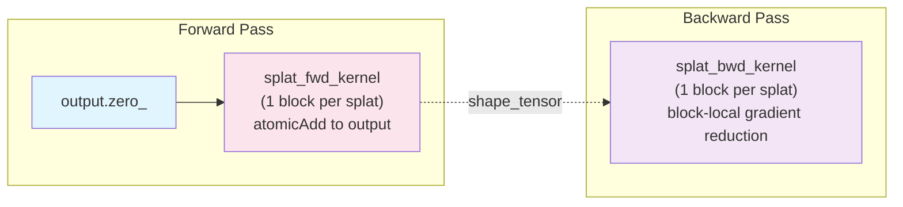

# CUDA Backend Specification - Core Algorithms

**Version**: 0.1.0
**Status**: Implementation Complete
**Last Updated**: 2026-03-31

> **Note**: This is Part 1 of the CUDA Backend Specification (Core Algorithms).
> See also:
> - [Part 2: PyTorch Integration](SPECIFICATIONS_PYTORCH_INTEGRATION.md) - Integration, performance, implementation phases
> - [Part 3: Testing Strategy](SPECIFICATIONS_TESTING.md) - Comprehensive testing guide

## Table of Contents

1. [Overview](#1-overview)
2. [Design Goals](#2-design-goals)
3. [State-of-the-Art Analysis](#3-state-of-the-art-analysis)
4. [Architecture](#4-architecture)
5. [Kernel Design](#5-kernel-design)
6. [Memory Optimization](#6-memory-optimization)
7. [Gradient Computation](#7-gradient-computation)

---

## 1. Overview

The CUDA backend provides GPU-accelerated Gaussian splatting for NVIDIA GPUs using custom CUDA kernels. It replaces the PyTorch rendering path for 2D/3D/nD volumes with a splat-centric rasterization architecture (previously tile-based; see `OPTIMIZATION_REPORT.md`).

### Volumetric Gaussian Fitting vs 3D Gaussian Splatting (3DGS)

**This is NOT 3DGS.** While we share the name "Gaussian splatting", our use case is fundamentally different:

```
┌─────────────────────────────────────────────────────────────────────────────┐
│                     3DGS (Novel View Synthesis)                              │
│                                                                              │
│   Input:  Multi-view images of a 3D scene                                   │
│   Goal:   Render new 2D views from arbitrary camera positions               │
│   Method: Project 3D Gaussians → 2D, alpha-composite front-to-back          │
│   Math:   C(x) = Σ cₖαₖ ∏(1-αⱼ)  ← ORDER DEPENDENT (needs depth sorting)    │
│                       j<k                                                    │
└─────────────────────────────────────────────────────────────────────────────┘

┌─────────────────────────────────────────────────────────────────────────────┐
│                  Luxar Volumetric Gaussian Fitting                           │
│                                                                              │
│   Input:  An nD image/volume (microscopy, CT, MRI, hyperspectral, etc.)     │
│   Goal:   Approximate the volume as a sparse sum of oriented Gaussians      │
│   Method: Fit nD Gaussians directly in native space, sum contributions      │
│   Math:   I(x) = Σ aₖ G(x; μₖ, Σₖ, sₖ)  ← ORDER INDEPENDENT (commutative)   │
│                 k                                                            │
└─────────────────────────────────────────────────────────────────────────────┘
```

**Key Implications for CUDA Implementation**:

| Aspect | 3DGS | Luxar Volumetric |
|--------|------|------------------|
| **Projection** | 3D→2D (camera model) | None (native nD space) |
| **Composition** | Alpha-blending (ordered) | Intensity summation (unordered) |
| **Depth Sorting** | Required | Not needed |
| **Dimensions** | 3D scenes → 2D images | Native 2D, 3D, 4D, ... nD |
| **Output** | RGB image | Scalar intensity field |
| **Gradient Flow** | Through projection | Direct (simpler) |
| **Memory** | Sort buffers needed | No sort buffers |

**Benefits of Intensity Summation**:
1. **Simpler pipeline**: Skip entire sorting stage (~20-30% faster)
2. **Less memory**: No sort key/value buffers (~28 bytes/splat saved)
3. **Better parallelism**: No sequential dependencies between splats
4. **Exact gradients**: No approximations from sorting boundaries
5. **nD support**: Works naturally for any dimension (no projection math)

**Important Caveat - Numerical Nondeterminism**:

Floating-point summation is **not strictly associative**. Different tile processing orders
may produce slightly different results (~1e-6 relative error). This is similar to
PyTorch's CUDA reduction behavior and is documented as expected.

**Determinism**: The splat-centric architecture uses `atomicAdd` for output
accumulation, which is non-deterministic in floating-point. For debugging,
compare against the PyTorch reference implementation which uses deterministic
sequential summation.

### Key Differentiators from Metal Backend

| Aspect | Metal Backend | CUDA Backend |
|--------|--------------|--------------|
| **Target Hardware** | Apple Silicon (M1-M4) | NVIDIA GPUs (Ampere+) |
| **Dimensions** | 3D only | 2D, 3D, nD (up to 8D) |
| **Sorting** | No sorting (simple binning) | No sorting (intensity summation) |
| **Memory Model** | Unified memory | Explicit device memory |
| **Atomic Operations** | `atomic_add_float` (CAS) | Native `atomicAdd` (hardware) |
| **Warp Size** | 32 threads (SIMD groups) | 32 threads (warps) |

### Critical Distinction: Intensity Summation vs Alpha-Compositing

**Our use case (Luxar)**: Approximate nD images/volumes as a **non-negative sum of Gaussians**:
```
I(x) = Σₖ aₖ × G(x; μₖ, Σₖ, sₖ)
```

This is **fundamentally different** from 3DGS view synthesis which uses **alpha-compositing**:
```
C(x) = Σₖ cₖ × αₖ × Πⱼ₌₁ᵏ⁻¹(1 - αⱼ)  # Order-dependent!
```

**Implications**:
- **No depth sorting required**: Summation is commutative (a + b = b + a)
- **Simpler architecture**: Skip radix sort entirely
- **Better parallelism**: No sequential dependencies between splats
- **Exact gradients**: No approximations from sorting boundaries

### Known Limitations and Constraints

**Tiles in the Splat-Centric Architecture**:

Both forward and backward kernels are **splat-centric** (each CUDA block = one splat).
The splat-centric architecture does not use tiles for parallelization. The
`tile_size` parameter is retained in the Python API for cache-related metadata
but does not affect kernel behavior. Each CUDA block processes one splat's
full AABB regardless of tile boundaries.

**Sharpness Numerical Stability**:

The sharpness gradient involves `ln(D²)` which explodes as D²→0:
- Clamp `D² >= 1e-6` before log operations
- Clamp sharpness to safe range `[0.5, 8.0]` (s > 8 causes overflow)
- Document that extreme sharpness values are numerically unsafe

### Prerequisites

- CUDA 11.8+ (CUDA 12.x recommended for best performance)
- NVIDIA GPU with Compute Capability 7.5+ (Turing, Ampere, Ada, Hopper, Blackwell)
- PyTorch 2.2+ with CUDA support
- CUB library (bundled with CUDA Toolkit)

**CUDA Version Compatibility**:

| Feature | Min CUDA | Fallback for Older CUDA |
|---------|----------|-------------------------|
| CUB Prefix Sum | 11.0 | Use Thrust `exclusive_scan` |
| Async Memcpy (`cudaMemcpyAsync`) | 11.2 | Synchronous `cudaMemcpy` |
| CUB Segmented Sort (determinism) | 11.0 | Thrust `stable_sort_by_key` |
| Cooperative Groups clusters | 12.0 | Standard `__syncthreads()` |
| `__ldg()` texture cache | 3.5+ | Direct global read |
| FP16 tensor cores | 7.0+ | FP32 fallback |

**Compile Flag for Older CUDA**: Define `LUXAR_CUDA_COMPAT_MODE` to enable fallbacks:
```bash
nvcc -DLUXAR_CUDA_COMPAT_MODE=1 ...
```

---

## 2. Design Goals

### Dimension Priority (CRITICAL)

**The vast majority of use cases are 2D and 3D.** The implementation MUST prioritize these:

| Priority | Dimensions | Optimization Level | Use Case |
|----------|------------|-------------------|----------|
| **P0 (Critical)** | **2D, 3D** | Maximum - hand-tuned specialized kernels | Images, volumes, microscopy |
| P1 (Important) | 4D | High - templated with full unrolling | Time-lapse, spectral |
| P2 (Supported) | 5D-8D | Moderate - generic kernel, no unrolling | Rare edge cases |

**2D/3D Optimization Requirements**:
- **Dedicated kernel implementations** (not generic templates)
- **Fully unrolled loops** for Mahalanobis, tile iteration, gradient computation
- **Vectorized memory access** (`float2`, `float3`, `float4`)
- **Maximum occupancy** via hand-tuned `__launch_bounds__`
- **Optimal tile sizes**: 16x16 for 2D, 8x8x8 for 3D (historical reference; the splat-centric architecture replaced the tile-based approach)

**Performance Targets by Dimension**:

> Speedup ranges below are typical observed values on test workloads; actual results vary by GPU model, problem size, and dimensionality. Treat them as indicative, not guarantees.

| Dimension | Speedup vs PyTorch CPU | Target Throughput |
|-----------|------------------------|-------------------|
| **2D** | **100-200×** | >10B voxels/sec |
| **3D** | **50-100×** | >1B voxels/sec |
| 4D | 20-50× | >100M voxels/sec |
| 5D-8D | 10-20× | Best effort |

### Primary Goals

1. **Performance**: substantial speedup over CPU PyTorch — often orders of magnitude for 2D/3D, depending on GPU and problem size
2. **Memory Efficiency**: 4× less memory than naive implementations (following gsplat patterns)
3. **Numerical Accuracy**: Forward pass within **1e-5 relative error**, backward within **1e-4**
   - Note: Bit-accuracy is impractical due to floating-point atomics and thread scheduling
   - PyTorch itself isn't bit-accurate across devices; ~1e-6 variance is normal
   - Forward: `torch.allclose(cuda_out, cpu_out, rtol=1e-5, atol=1e-7)`
   - Backward: `torch.allclose(cuda_grad, cpu_grad, rtol=1e-4, atol=1e-6)` (looser due to atomics)
4. **Flexibility**: Support 2D images, 3D volumes, and nD hypercubes (with priority on 2D/3D)

### Secondary Goals

1. **Ease of Integration**: Drop-in replacement for `GaussianSplatModel`
2. **Debugging Support**: Optional CPU fallback for debugging
3. **Profiling Support**: NVTX markers for Nsight Systems analysis
4. **Multi-GPU Ready**: Architecture compatible with future distributed training

### Non-Goals (Out of Scope for v1.0)

1. Hardware raytracing (RT cores) - complex, limited benefit for dense grids
2. Multi-GPU - focus on single-GPU first (architecture is DDP-compatible)

### Optional: Mixed-Precision (FP16) Support

**Reconsidered for Phase 5**: Tensor cores can provide 2-4× speedup with acceptable accuracy
for many use cases, particularly microscopy data (typically 12-16 bit integer input).

**Mixed-Precision Strategy**:

| Component | Precision | Rationale |
|-----------|-----------|-----------|
| Input centers, conic | FP16 | Sufficient for typical coordinate ranges |
| Amplitude, sharpness | FP16 | Input data rarely exceeds FP16 dynamic range |
| Intensity computation | FP16 | Forward pass accuracy ~1e-3 is acceptable |
| Output accumulation | FP32 | Avoid precision loss in summation |
| **Gradient accumulation** | **FP32** | Critical - gradients can be 1e-4 to 1e-6 |
| Gradient storage | FP32 | Maintain precision for optimizer |

**Implementation (Phase 5)**:

```cuda
// Forward: FP16 compute, FP32 accumulation
__global__ void rasterize_fwd_fp16(
    const __half* __restrict__ centers,   // FP16 input
    const __half* __restrict__ conic,     // FP16 input
    float* __restrict__ output            // FP32 output
) {
    float accum = 0.0f;  // FP32 accumulator

    for (int i = 0; i < count; i++) {
        // Load as FP16, compute in FP16
        __half2 mu = __halves2half2(centers[...], centers[...]);

        // ... FP16 math for distance and Gaussian ...
        __half intensity = __hmul(amp, hexp(inner));

        // Accumulate in FP32 for precision
        accum += __half2float(intensity);
    }
    output[pixel_idx] = accum;
}

// Backward: ALWAYS FP32 for gradients
__global__ void rasterize_bwd_fp32(...) {
    // Gradients computed and accumulated in FP32
    // Critical for optimizer convergence
}
```

**Use Cases**:
- **Microscopy**: 12-16 bit integer input, FP16 forward is lossless, ~2× speedup
- **High dynamic range**: Keep FP32 (default)
- **Real-time preview**: FP16 acceptable, switch to FP32 for final fit

**Accuracy Testing**:
```python
def test_fp16_accuracy():
    """FP16 forward should match FP32 within 1e-3 relative error."""
    output_fp32 = model_fp32()
    output_fp16 = model_fp16()
    assert torch.allclose(output_fp32, output_fp16, rtol=1e-3, atol=1e-5)
```

---

## 3. State-of-the-Art Analysis

### Key CUDA Implementations Reviewed

#### 3.1 gsplat (Nerfstudio Project)

**Source**: [github.com/nerfstudio-project/gsplat](https://github.com/nerfstudio-project/gsplat)

**Key Features**:
- 4× less GPU memory, 15% faster training than original 3DGS
- 16×16 tile binning with depth sorting
- N-D feature rendering support
- Sparse gradient computation
- Multi-GPU distributed rasterization

**Architecture Insights**:
```
Forward: project → tile_bin → sort (CUB radix) → rasterize
Backward: rasterize_bwd (reuses sorted list from forward)
```

**What to Adopt**:
- Tile-based binning strategy (core optimization)
- Sparse gradient patterns
- Memory-efficient workspace allocation

**What We Skip**:
- CUB radix sort (not needed for intensity summation)
- Depth encoding in keys
- Alpha-compositing math

#### 3.2 diff-gaussian-rasterization (INRIA)

**Source**: [github.com/graphdeco-inria/diff-gaussian-rasterization](https://github.com/graphdeco-inria/diff-gaussian-rasterization)

**Key Features**:
- Original reference implementation for 3DGS view synthesis
- Uses depth sorting for alpha-compositing (ORDER-DEPENDENT)
- Per-pixel `n_contrib` tracking for backward pass

**Why We DON'T Need Their Sorting**:
```cpp
// 3DGS needs this because alpha-compositing is order-dependent:
// C = c₁α₁ + c₂α₂(1-α₁) + c₃α₃(1-α₁)(1-α₂) + ...

// Luxar does intensity SUMMATION which is order-independent:
// I = a₁G₁ + a₂G₂ + a₃G₃ + ...  (commutative!)
```

**What to Adopt**:
- Tile binning pattern (without sorting)
- Tile range identification
- Per-tile workload distribution

#### 3.3 FlashGS

**Source**: [arxiv.org/html/2408.07967v2](https://arxiv.org/html/2408.07967v2)

**Key Innovations**:
- **Warp Divergence Elimination**: Move opacity checks to preprocessing
- **Early Stopping Optimization**: Skip remaining splats when transmittance < threshold
- **Pipeline Restructuring**: Fuse preprocessing into single kernel

**Performance Insight**:
> "Thread divergence within a warp can cause some threads to stall... FlashGS moves the opacity check to the preprocessing stage."

**What to Adopt**:
- Preprocessing-time visibility culling
- Intensity floor filtering in AABB computation (already in our Metal impl)

#### 3.4 BalanceGS

**Source**: [arxiv.org/html/2510.14564](https://arxiv.org/html/2510.14564)

**Key Innovations**:
- **Memory Coalescing Fix**: SoA → AoS conversion for color data
- **Shared Memory Buffering**: Batch-load attributes into shared memory
- **Result**: 92% coalesced reads, 1.4× speedup

**Memory Layout Insight**:
```cpp
// BAD: SoA layout causes non-coalesced access
float* R = ...; float* G = ...; float* B = ...;
color = make_float3(R[idx], G[idx], B[idx]);  // 3 separate memory transactions

// GOOD: AoS layout with shared memory batch loading
__shared__ float3 colors_smem[BLOCK_SIZE];
colors_smem[tid] = colors_global[block_offset + tid];  // Coalesced load
__syncthreads();
color = colors_smem[local_idx];  // Fast shared memory access
```

**What to Adopt**:
- AoS memory layout for per-splat attributes
- Shared memory batch loading pattern

#### 3.5 DISTWAR / Hardware Rasterization

**Source**: [arxiv.org/html/2505.18764v1](https://arxiv.org/html/2505.18764v1)

**Key Innovation**:
- **Warp-Level Gradient Pre-Accumulation**: Reduce atomics by 32×

```cuda
// Per-thread gradient
float grad_local = compute_gradient(...);

// Warp-level reduction (32 threads → 1 value)
for (int offset = 16; offset > 0; offset /= 2) {
    grad_local += __shfl_down_sync(0xffffffff, grad_local, offset);
}

// Only lane 0 does atomic write
if (lane_id == 0) {
    atomicAdd(&grad_global[splat_id], grad_local);
}
```

**What to Adopt**:
- Warp-level reduction before atomic accumulation
- `__shfl_down_sync` for intra-warp communication

---

## 4. Architecture

### 4.1 High-Level Pipeline

> **Historical note**: The original architecture used a tile-based pipeline
> (preprocess -> prefix_sum -> bin -> rasterize). This was refactored to a
> splat-centric architecture achieving 3.16x training speedup. See
> `OPTIMIZATION_REPORT.md` for the full transition history.

```
┌─────────────────────────────────────────────────────────────────────────┐
│                         Python Layer                                     │
│   GaussianSplatModelCUDA → CUDASplatFunction (torch.autograd.Function)  │
│   torch.compile(cholesky_to_conic) fuses L→conic into 1 kernel          │
└─────────────────────────────────────────────────────────────────────────┘
                                │
                                ▼
┌─────────────────────────────────────────────────────────────────────────┐
│                    PyTorch C++ Extension                                 │
│   forward_wrapper() / backward_wrapper()  (pybind11 bindings)           │
│   See bindings.cpp for Python-facing signatures                          │
└─────────────────────────────────────────────────────────────────────────┘
                                │
                                ▼
┌─────────────────────────────────────────────────────────────────────────┐
│                     CUDA Dispatch Layer (cuda_splatting.cu)              │
│   dispatch_forward_impl<InputDType>() / dispatch_backward_impl<>()     │
│   DIM_DISPATCH macro for D=2,3,4,...,8 template instantiation           │
└─────────────────────────────────────────────────────────────────────────┘
                                │
                                ▼
┌─────────────────────────────────────────────────────────────────────────┐
│                  Splat-Centric CUDA Kernels                              │
│   Forward:  output.zero_() → splat_fwd (1 kernel, N blocks)            │
│   Backward: splat_bwd (1 kernel, N blocks)                              │
│                                                                          │
│   Each CUDA block processes ONE splat (natural parallelism).            │
│   No tile binning, no prefix sum, no sorting.                           │
└─────────────────────────────────────────────────────────────────────────┘
```

**Visual Pipeline Diagram**:



**Pipeline Comparison**:

| | Old Tile-Based (removed) | Current Splat-Centric |
|---|---|---|
| Forward kernels | preprocess + CUB prefix_sum + bin + rasterize_fwd + global_fwd | **1 kernel** (`rasterize_forward_splat_centric_kernel`) |
| Backward kernels | rasterize_bwd + global_bwd | **1 kernel** (`rasterize_backward_splat_centric_kernel`) |
| Kernel launches/iter | 20+ | **3** (L->conic fused + fwd + bwd) |
| Tensor allocs/fwd | ~13 | **1** (shape_tensor cached on device) |
| Synchronization | 1 full `cudaStreamSynchronize` | **None** |
| Tile binning | Required | **Eliminated** |
| Shared memory barriers | Multiple `__syncthreads` | None in hot path |
| Global atomics (bwd) | Per-tile atomics | **Zero** (block-local reduction) |

**Splat-Centric Design**: Each CUDA block owns exactly one splat. Threads within
the block cooperatively iterate over the splat's AABB (axis-aligned bounding box)
of affected voxels. Forward uses `atomicAdd` to scatter contributions to the output.
Backward reads `grad_output` and reduces gradients within the block, writing the
final gradient for that splat without global atomics.

### 4.2 Dimensional Generalization

Unlike 3DGS (which is 2D image-based), Luxar supports nD volumetric data:

```cpp
template<int DIM>
struct GaussianParams {
    float center[DIM];            // μ: center position
    float amplitude;              // a: intensity
    // Note: Per-splat sharpness was removed from the model.
    // The standard Gaussian (s=2) is now the only mode, using exp(-0.5 * D^2).
    // Note: L is stored separately in FULL matrix format (see below)
};
```

### 4.3 Cholesky Factor Storage Format

**IMPORTANT**: The Cholesky factor `L` is stored as a **FULL (N, DIM, DIM) matrix** in row-major order,
NOT as packed triangular storage.

**Rationale**:
1. **PyTorch compatibility**: The Python GaussianSplatModel uses `(N, d, d)` tensors
2. **Simpler indexing**: `L[idx * DIM * DIM + row * DIM + col]` vs packed triangle index math
3. **Memory alignment**: Better coalescing for consecutive reads
4. **Trade-off**: Uses ~2× memory vs packed, but simplifies kernel code significantly

**Storage Layout**:
```cpp
// L is stored as (N, DIM, DIM) in row-major order
// For splat i, element L[row, col] is at:
//   L_ptr[i * DIM * DIM + row * DIM + col]

// Example: 3D splat i=5, L matrix:
// L = [[L00,  0,   0 ]      Memory layout (row-major):
//      [L10, L11,  0 ]  →   [L00, 0, 0, L10, L11, 0, L20, L21, L22]
//      [L20, L21, L22]]     at offset 5 * 9 = 45

// The upper triangle contains zeros but is stored anyway
```

**Alternative (NOT used)**: Packed lower-triangular would store only `DIM*(DIM+1)/2` elements:
```cpp
// Packed format (for reference, NOT what we use):
// 3D: [L00, L10, L11, L20, L21, L22] - 6 elements vs 9
// Index computation: pack_idx = row*(row+1)/2 + col (for col <= row)
```

**L vs Conic Storage: Why Different Formats?**

| Storage | L (Cholesky) | Conic (Σ⁻¹) |
|---------|--------------|--------------|
| **Format** | Full (DIM, DIM) | Packed upper-tri |
| **Size** | DIM² | DIM×(DIM+1)/2 |
| **Reason** | PyTorch interop, simpler indexing | Per-pixel access, memory bandwidth |

**Rationale**:
- **L is full matrix**: Used only in preprocessing (once per iteration). The overhead of
  storing zeros is negligible, and full storage simplifies PyTorch tensor interop and
  AABB computation (L row norms need row-major access).
- **Conic is packed**: Accessed per-pixel during rasterization (millions of times per frame).
  Packed storage saves memory bandwidth and shared memory footprint. The packing overhead
  (one-time L→conic conversion per iteration) is amortized across all pixels.

**Conversion Location**: `cholesky_to_conic()` is called in Python before launching kernels:
```python
# In forward():
conic = cholesky_to_conic(self.L)  # (N, DIM*(DIM+1)/2)
# Kernels receive conic, not L (except preprocess/bin which use L for AABB)
```

**Kernel Access Pattern**:
```cuda
// Load L row norms (for AABB computation)
template<int DIM>
__device__ __forceinline__ void compute_L_row_norms(
    const float* L,       // Points to &L_all[splat_idx * DIM * DIM]
    float* L_row_norms    // Output: sqrt(Σ_dd) for each dimension
) {
    for (int d = 0; d < DIM; d++) {
        float sum_sq = 0.0f;
        for (int j = 0; j <= d; j++) {  // L is lower triangular
            float L_dj = L[d * DIM + j];  // Row-major access
            sum_sq += L_dj * L_dj;
        }
        L_row_norms[d] = sqrtf(fmaxf(sum_sq, 1e-8f));
    }
}
```

**Tile Sizes by Dimension**:

| Dimension | Tile Shape | Voxels/Tile | Typical Block Size |
|-----------|------------|-------------|-------------------|
| 2D | 16×16 | 256 | 256 threads |
| 3D | 8×8×8 | 512 | 512 threads |
| 4D | 4×4×4×4 | 256 | 256 threads |
| 5D+ | 2^(10/D) | ~256-1024 | 256 threads |

### 4.4 State Structures

The `ForwardState` struct (see `cuda_splatting.h`) stores state from the forward
pass for backward pass reuse.

```cpp
struct ForwardState {
    // Cached device tensors for backward pass reuse
    torch::Tensor shape_tensor;     // (dim,) int32 - volume shape on device
};
```

The forward pass allocates only `shape_tensor` on device (cached for backward reuse).

---

## 5. Kernel Design

> **Note**: The tile-based kernels (`preprocess_kernel`, `bin_kernel`,
> `rasterize_forward_kernel`, `rasterize_backward_kernel`) and global splat kernels
> have been removed. The pipeline uses only the splat-centric kernels described below.
> Template instantiations are in `cuda_splatting.cu`.

### 5.0 Shared Device Functions

#### AABB Computation

The AABB (Axis-Aligned Bounding Box) is computed inline in each splat-centric kernel.
Both the forward and backward splat-centric kernels compute the AABB identically using
the same `ceilf`-based formula (see `rasterize_forward_splat_centric_kernel()` and
`rasterize_backward_splat_centric_kernel()` in `kernels_core.cuh`).

**CRITICAL: Correct AABB for Anisotropic Gaussians**

For a rotated ellipse, the diagonal of Σ does **NOT** give axis-aligned bounds!

**Example**: Consider a thin ellipse rotated 45°:
- L = [[1, 0], [1, 1]], so Σ = L @ L^T = [[1, 1], [1, 2]]
- Diagonal of Σ is [1, 2], suggesting radii [1, √2]
- But the actual X-extent is larger due to the correlation term!

**Correct approach**: Use the row norms of L, which gives a **conservative bound**:
```
radius[d] = sqrt(sum_j(L[d,j]²)) × truncate = sqrt(Σ_dd) × truncate
```

This works because for any point x on the truncation ellipsoid:
```
(x-μ)^T Σ⁻¹ (x-μ) = truncate²
```
The maximum extent in axis d is bounded by `sqrt(Σ_dd) × truncate`.

**Solution**: Single shared device function for AABB:

```cuda
template<int DIM>
struct AABB {
    int lo[DIM];
    int hi[DIM];
};

// Shared device function - SINGLE SOURCE OF TRUTH for AABB computation
template<int DIM>
__device__ __forceinline__ AABB<DIM> compute_splat_aabb(
    const float* mu,           // Splat center (DIM elements)
    const float* L_row_norms,  // sqrt(Σ_dd) for each dimension (DIM elements)
    float sharpness,
    float amplitude,
    float truncate,
    float intensity_floor,
    const int* tile_size,
    const int* tile_dims,
    const int* shape
) {
    AABB<DIM> aabb;

    // INTENSITY FLOOR CONSISTENCY:
    // The intensity_floor parameter has two roles:
    // 1. AABB: Skip splats whose max contribution < floor (return empty AABB)
    // 2. AABB: Shrink bounds to where contribution >= floor
    // 3. Rasterize: Skip contributions < floor (same threshold!)
    //
    // This ensures a splat that passes AABB check will have pixels >= floor.

    // Skip splats that can never contribute >= floor
    // Max contribution is amplitude (at center, D²=0)
    if (intensity_floor > 0.0f && amplitude < intensity_floor) {
        // Return empty AABB - this splat contributes nothing
        for (int d = 0; d < DIM; d++) {
            aabb.lo[d] = 1;
            aabb.hi[d] = 0;
        }
        return aabb;
    }

    // Sharpness-adjusted truncation radius
    // For generalized Gaussian exp(-0.5 * D^s), the effective truncation scales
    float effective_truncate = powf(truncate, 2.0f / fmaxf(sharpness, 0.5f));

    // Amplitude-aware shrinking (shifted formula for C⁰ continuity):
    // Solve: a × scale × (exp(-0.5 × r^s) - C) = floor
    //   →  r = (-2 × ln(floor/(a×scale) + C))^(1/s)
    // where C = exp(-0.5 × T²), scale = 1/(1-C)
    float C_boundary = expf(-0.5f * truncate * truncate);
    float scale = 1.0f / (1.0f - C_boundary);
    if (intensity_floor > 0.0f) {
        float inner = intensity_floor / (amplitude * scale) + C_boundary;
        if (inner > 0.0f && inner < 1.0f) {
            float t_max = powf(-2.0f * logf(inner), 1.0f / fmaxf(sharpness, 0.5f));
            effective_truncate = fminf(effective_truncate, t_max);
        }
    }

    // Compute tile range using CORRECT axis-aligned bounds
    for (int d = 0; d < DIM; d++) {
        // L_row_norms[d] = sqrt(Σ_dd) = sqrt(sum_j L[d,j]²)
        // This gives the maximum extent in axis d for ANY rotation
        float r = effective_truncate * fmaxf(L_row_norms[d], 1e-4f);

        // Convert to tile coordinates (clamped to grid bounds)
        float lo_coord = mu[d] - r;
        float hi_coord = mu[d] + r;

        aabb.lo[d] = max(0, (int)floorf(lo_coord / (float)tile_size[d]));
        aabb.hi[d] = min(tile_dims[d] - 1, (int)floorf(hi_coord / (float)tile_size[d]));

        // Clamp to shape bounds as well
        if (hi_coord < 0.0f || lo_coord >= (float)shape[d]) {
            // Splat is entirely outside the volume in this dimension
            aabb.lo[d] = 1;
            aabb.hi[d] = 0;  // Empty range
        }
    }

    return aabb;
}

// Helper: Compute L row norms (= sqrt of Σ diagonal) from Cholesky factor
// This gives CORRECT axis-aligned bounds for anisotropic Gaussians
template<int DIM>
__device__ __forceinline__ void compute_L_row_norms(
    const float* L,       // (DIM, DIM) lower triangular, row-major
    float* L_row_norms    // Output: sqrt(Σ_dd) for each dimension
) {
    // Σ = L × Lᵀ, so Σ_dd = sum_j(L[d,j]²) (row norm squared of L)
    // For AABB we need sqrt(Σ_dd) = row norm of L
    for (int d = 0; d < DIM; d++) {
        float sum_sq = 0.0f;
        for (int j = 0; j <= d; j++) {  // L is lower triangular: L[d,j] = 0 for j > d
            float L_dj = L[d * DIM + j];
            sum_sq += L_dj * L_dj;
        }
        L_row_norms[d] = sqrtf(fmaxf(sum_sq, 1e-8f));
    }
}

// Check if AABB is empty (lo > hi in any dimension)
template<int DIM>
__device__ __forceinline__ bool aabb_is_empty(const AABB<DIM>& aabb) {
    for (int d = 0; d < DIM; d++) {
        if (aabb.lo[d] > aabb.hi[d]) return true;
    }
    return false;
}
```

#### Mahalanobis Distance Computation

Computes `d^T × Σ⁻¹ × d` where `Σ⁻¹` is stored as packed upper-triangular (conic).

```cuda
// Compute Mahalanobis distance squared: d^T × Σ⁻¹ × d
// Uses packed upper-triangular storage for conic (inverse covariance)
//
// For 3D (DIM=3), conic layout is [c_00, c_01, c_02, c_11, c_12, c_22]
// General: index(i,j) where i <= j is at position i*DIM - i*(i-1)/2 + (j-i)
template<int DIM>
__device__ __forceinline__ float mahalanobis_distance(
    const float* d,    // Displacement vector (DIM elements)
    const float* C     // Packed upper-tri conic (DIM*(DIM+1)/2 elements)
) {
    constexpr int CONIC_SIZE = (DIM * (DIM + 1)) / 2;

    // Expand symmetric matrix multiply: sum_ij d[i] * C[i,j] * d[j]
    // For packed upper-tri, each off-diagonal appears once so multiply by 2
    float result = 0.0f;
    int idx = 0;

    #pragma unroll
    for (int i = 0; i < DIM; i++) {
        // Diagonal term: d[i]^2 * C[i,i]
        result += d[i] * d[i] * C[idx];
        idx++;

        // Off-diagonal terms: 2 * d[i] * d[j] * C[i,j] for j > i
        #pragma unroll
        for (int j = i + 1; j < DIM; j++) {
            result += 2.0f * d[i] * d[j] * C[idx];
            idx++;
        }
    }

    return result;
}

// Alternative: dimension-specialized versions for better register usage
template<>
__device__ __forceinline__ float mahalanobis_distance<2>(
    const float* d, const float* C
) {
    // C = [c_00, c_01, c_11]
    return d[0]*d[0]*C[0] + 2.0f*d[0]*d[1]*C[1] + d[1]*d[1]*C[2];
}

template<>
__device__ __forceinline__ float mahalanobis_distance<3>(
    const float* d, const float* C
) {
    // C = [c_00, c_01, c_02, c_11, c_12, c_22]
    return d[0]*d[0]*C[0] + 2.0f*d[0]*d[1]*C[1] + 2.0f*d[0]*d[2]*C[2]
                         +     d[1]*d[1]*C[3] + 2.0f*d[1]*d[2]*C[4]
                                             +     d[2]*d[2]*C[5];
}
```

#### Cholesky to Conic Conversion

Converts Cholesky factor `L` (full matrix storage) to packed inverse covariance `Σ⁻¹`.

```cuda
// Convert Cholesky factor L to packed conic (Σ⁻¹)
// L is stored as FULL (DIM, DIM) matrix, output is packed upper-triangular
//
// Method: Σ = L @ L^T, then Σ⁻¹ = (L^T)⁻¹ @ L⁻¹
// For lower triangular L, L⁻¹ is computed via forward substitution
//
// This is a HOST/Python function - called once per iteration, not per-pixel
// The per-pixel kernel receives pre-computed conic, not L
void cholesky_to_conic(
    const torch::Tensor& L,      // (N, DIM, DIM) lower triangular
    torch::Tensor& conic          // (N, DIM*(DIM+1)/2) packed output
);

// For small DIM, explicit formulas are faster than inversion:
// 2D: L = [[l00, 0], [l10, l11]]
//     Σ = [[l00², l00*l10], [l00*l10, l10²+l11²]]
//     Σ⁻¹ via 2x2 inverse formula

// PyTorch implementation (used in forward):
torch::Tensor cholesky_to_conic_torch(const torch::Tensor& L) {
    // L: (N, DIM, DIM) lower triangular
    auto Sigma = torch::bmm(L, L.transpose(-1, -2));  // (N, DIM, DIM)
    auto Sigma_inv = torch::linalg::inv(Sigma);        // (N, DIM, DIM)

    // Extract upper triangular and pack
    int N = L.size(0);
    int DIM = L.size(1);
    int conic_size = (DIM * (DIM + 1)) / 2;

    auto conic = torch::empty({N, conic_size}, L.options());

    // Pack upper triangle row by row
    int idx = 0;
    for (int i = 0; i < DIM; i++) {
        for (int j = i; j < DIM; j++) {
            conic.index({torch::indexing::Slice(), idx}) =
                Sigma_inv.index({torch::indexing::Slice(), i, j});
            idx++;
        }
    }

    return conic;
}
```

#### Pixel Index Computation

```cuda
// Convert thread/block indices to linear pixel index
// Returns -1 if pixel is outside volume bounds
template<int DIM>
__device__ __forceinline__ int compute_pixel_index(
    const dim3& blockIdx,
    const dim3& threadIdx,
    const int* tile_size,
    const int* tile_dims,
    const int* shape
) {
    int px[DIM];

    // Compute pixel coordinates from block (tile) and thread within tile
    // For DIM <= 3, use built-in 3D indexing
    if constexpr (DIM == 2) {
        int tile_x = blockIdx.x;
        int tile_y = blockIdx.y;
        int local_x = threadIdx.x % tile_size[0];
        int local_y = threadIdx.x / tile_size[0];
        px[0] = tile_x * tile_size[0] + local_x;
        px[1] = tile_y * tile_size[1] + local_y;
    } else if constexpr (DIM == 3) {
        int tile_x = blockIdx.x;
        int tile_y = blockIdx.y;
        int tile_z = blockIdx.z;
        int local_idx = threadIdx.x;
        int local_x = local_idx % tile_size[0];
        int local_y = (local_idx / tile_size[0]) % tile_size[1];
        int local_z = local_idx / (tile_size[0] * tile_size[1]);
        px[0] = tile_x * tile_size[0] + local_x;
        px[1] = tile_y * tile_size[1] + local_y;
        px[2] = tile_z * tile_size[2] + local_z;
    } else {
        // Generic nD: linear block index, linear thread index
        int tile_idx = blockIdx.x;
        int local_idx = threadIdx.x;

        // Unravel tile index to tile coordinates
        int tile_coords[DIM];
        int remaining = tile_idx;
        for (int d = DIM - 1; d >= 0; d--) {
            tile_coords[d] = remaining % tile_dims[d];
            remaining /= tile_dims[d];
        }

        // Unravel local index to local coordinates within tile
        remaining = local_idx;
        for (int d = DIM - 1; d >= 0; d--) {
            int local_d = remaining % tile_size[d];
            remaining /= tile_size[d];
            px[d] = tile_coords[d] * tile_size[d] + local_d;
        }
    }

    // Bounds check
    for (int d = 0; d < DIM; d++) {
        if (px[d] < 0 || px[d] >= shape[d]) {
            return -1;  // Out of bounds
        }
    }

    // Compute linear index (row-major)
    int linear_idx = 0;
    int stride = 1;
    for (int d = DIM - 1; d >= 0; d--) {
        linear_idx += px[d] * stride;
        stride *= shape[d];
    }

    return linear_idx;
}

// Compute linear tile index from block indices
template<int DIM>
__device__ __forceinline__ int compute_tile_index(
    const dim3& blockIdx,
    const int* tile_dims
) {
    if constexpr (DIM == 2) {
        // Grid: dim3(tile_dims[1], tile_dims[0], 1), so blockIdx.x -> dim1, blockIdx.y -> dim0
        return blockIdx.y * tile_dims[1] + blockIdx.x;
    } else if constexpr (DIM == 3) {
        // Grid: dim3(tile_dims[2], tile_dims[1], tile_dims[0])
        return (blockIdx.z * tile_dims[1] + blockIdx.y) * tile_dims[2] + blockIdx.x;
    } else {
        return blockIdx.x;  // Generic: linear block index
    }
}

// Unravel linear index to nD coordinates
template<int DIM>
__device__ __forceinline__ void unravel_index(
    int linear_idx,
    const int* shape,
    float* coords  // Output: float coords for distance computation
) {
    #pragma unroll
    for (int d = DIM - 1; d >= 0; d--) {
        coords[d] = static_cast<float>(linear_idx % shape[d]);
        linear_idx /= shape[d];
    }
}
```

**Usage Pattern** (in splat-centric kernels, the AABB is computed inline):
```cuda
// In rasterize_forward_splat_centric_kernel and rasterize_backward_splat_centric_kernel:
// Thread 0 computes voxel AABB inline from the conic (inverse covariance) diagonal.
// For 2D/3D: exact cofactor/determinant sigma extraction.
// For higher DIM: diagonal approximation with 1.5x safety factor.
// See kernels_core.cuh for the actual inline computation.
```

#### Large Splat Handling

The splat-centric architecture handles all splats uniformly regardless of size.
Each CUDA block processes one splat's full AABB, so large splats simply result
in more voxel iterations per block — no special detection or separate kernel path
is needed.

**Alternative Strategies (NOT recommended as primary, but useful as fallbacks)**:

1. **Covariance Clamping**: In Python layer, optionally clamp maximum covariance:
   ```python
   # Clamp L diagonal to prevent splats larger than volume/4
   max_sigma = np.array(shape) / 4.0
   L_clamped = np.clip(L, -max_sigma, max_sigma)
   ```
   Use as user-facing option, not as the default safeguard.

2. **Adaptive Truncation**: Reduce truncation radius for large splats:
   ```cuda
   // Scale down to touch at most `threshold` tiles
   float scale = powf((float)threshold / tiles_touched, 1.0f / DIM);
   adaptive_truncate *= scale;
   ```
   Changes the mathematical model—use only if user explicitly opts in.

### 5.1 Splat-Centric Forward Kernel

#### Primary: `rasterize_forward_splat_centric_kernel()` (kernels_core.cuh)

This is the main forward kernel. It replaces the entire tile-based pipeline
(preprocess + prefix_sum + bin + rasterize_fwd + global_fwd).

**Grid**: `N` blocks (one per splat), 256 threads per block.

**Algorithm**:
1. Thread 0 loads splat data (center, conic, amplitude) into shared memory
2. Thread 0 computes the AABB using `ceilf`-based radius from conic diagonal,
   with `effective_truncate_sq()` for amplitude-aware tightening
3. All threads cooperatively iterate over voxels in the AABB
4. For each voxel: compute Mahalanobis distance, shifted Gaussian intensity,
   and `atomicAdd` the contribution to the output volume

**Signature** (see `kernels_core.cuh`):
```cuda
template <int DIM, typename InputDType = float>
__global__ void rasterize_forward_splat_centric_kernel(
    const InputDType* __restrict__ centers,   // (N, DIM)
    const InputDType* __restrict__ conic,     // (N, DIM*(DIM+1)/2)
    const InputDType* __restrict__ amps,      // (N,)
    int N,
    const int* __restrict__ shape,            // (DIM,)
    float truncate,
    float intensity_floor,
    float* __restrict__ output               // (prod(shape),) - must be pre-zeroed
);
```

**Shared memory usage**: `DIM + CONIC_SIZE + 1` floats for splat data broadcast,
plus `DIM` ints each for AABB lo/hi, extent, and total voxel count. No batch loading,
no `__syncthreads` barriers in the hot loop.

**Key optimizations**:
- **No tile binning**: Each block computes its own AABB directly from the conic
- **`atomicAdd` scatter**: Contributions written directly to global output
- **`__expf` fast math**: ~2 ULP error for ~15% speedup

#### Dispatch: `dispatch_forward_impl<InputDType>()` (cuda_splatting.cu)

The host-side entry point validates inputs, allocates the output buffer, caches
`shape_tensor` on device for backward reuse, and calls
`launch_rasterize_forward_splat_centric()` via the `DIM_DISPATCH` macro.

**Output buffer reuse**: If an `output_buffer` tensor is provided (pre-zeroed from
a previous backward pass), it is reused to avoid the `output.zero_()` overhead.

### 5.2 Splat-Centric Backward Kernel

#### Primary: `rasterize_backward_splat_centric_kernel()` (kernels_core.cuh)

**Grid**: `N` blocks (one per splat), 256 threads per block.

**Algorithm**:
1. Thread 0 loads splat data into shared memory, computes AABB (identical to forward)
2. All threads cooperatively iterate over voxels in the AABB
3. For each voxel: read `grad_output`, recompute Mahalanobis distance and intensity,
   compute per-voxel gradient contributions for centers, conic, and amplitude
4. Per-thread gradients are accumulated in registers, then reduced within the block
   using `warp_reduce_sum()` (see `reduction_utils.cuh`) and a final cross-warp
   shared memory reduction
5. Thread 0 writes the final gradient for this splat to global memory (single write,
   no atomics needed since each block exclusively owns its splat)
6. **Optional**: If `output_to_zero` is non-null, threads zero the forward output
   tensor as a side effect, eliminating the next iteration's `output.zero_()` call

**Signature** (see `kernels_core.cuh`):
```cuda
template <int DIM, typename InputDType = float>
__global__ void rasterize_backward_splat_centric_kernel(
    const float* __restrict__ grad_output,    // (prod(shape),) always FP32
    const InputDType* __restrict__ centers,   // (N, DIM)
    const InputDType* __restrict__ conic,     // (N, DIM*(DIM+1)/2)
    const InputDType* __restrict__ amps,      // (N,)
    int N,
    const int* __restrict__ shape,            // (DIM,)
    float truncate,
    float intensity_floor,
    float* __restrict__ d_centers,            // (N, DIM) output gradients (FP32)
    float* __restrict__ d_conic,              // (N, CONIC_SIZE) output gradients (FP32)
    float* __restrict__ d_amps,               // (N,) output gradients (FP32)
    float* __restrict__ output_to_zero        // optional: zero forward output as side effect
);
```

**Key design properties**:
- **Zero global atomics**: Each block owns its splat exclusively, so the final
  gradient write is a direct store (no `atomicAdd` contention)
- **Handles all splats uniformly**: Large splats are processed the same way as
  small ones — more voxels per block, but no special kernel path
- **Block-local reduction**: Gradients accumulated in registers, reduced via
  warp shuffles (`warp_reduce_sum()` in `reduction_utils.cuh`), then cross-warp
  reduction in shared memory

**Gradient dispatch helpers**: The `compute_pixel_gradients<DIM>()` template in
`kernels_core.cuh` computes per-voxel gradient contributions. Specialized 2D and
3D versions (`backward_pixel_splat_2d()`, `backward_pixel_splat_3d()` in
`reduction_utils.cuh`) provide 25-35% speedup via explicit formula expansion.

#### Dispatch: `dispatch_backward_impl<InputDType>()` (cuda_splatting.cu)

The host-side entry point allocates gradient buffers (always FP32), then calls
`launch_rasterize_backward_splat_centric()` via the `DIM_DISPATCH` macro.
The cached `shape_tensor` from the forward pass is reused to avoid a redundant
host-to-device copy.

### 5.3 FP16 (Half Precision) Support

All kernels are templated on `InputDType` (either `float` or `__half`). The
dispatch layer in `cuda_splatting.cu` provides non-templated wrapper functions:
- `forward()` / `backward()` for FP32
- `forward_fp16()` / `backward_fp16()` for FP16

**How FP16 works**:
1. FP16 tensors are loaded from global memory (2x bandwidth)
2. `DTypeTraits<__half>::load()` (in `dtype_traits.cuh`) converts to FP32 during load
3. All computation is FP32
4. Output and gradients are always FP32

The Python `forward_wrapper()` in `bindings.cpp` accepts a `use_fp16` flag and
handles the FP32-to-FP16 conversion of input tensors before calling the
appropriate dispatch function.

### 5.4 Template Instantiation

Template instantiations for all DIM x InputDType combinations are in
`cuda_splatting.cu`. The splat-centric kernels have no `BATCH_SIZE` template
parameter (they process one splat per block, 256 threads).

Each kernel is instantiated for DIM=2..8 and InputDType={float, __half},
giving 28 total instantiations (14 forward + 14 backward).

### 5.5 Shared Device Utility Functions

The kernels rely on utility functions organized into four headers:

| Header | Functions | Purpose |
|--------|-----------|---------|
| `math_utils.cuh` | `conic_size<DIM>()`, `tri_index<DIM>()`, `mahalanobis_distance_sq<DIM>()`, `gaussian_intensity()`, `effective_truncate_sq()`, `compute_shift_params()` | Triangular indexing, distance, intensity |
| `voxel_utils.cuh` | `voxel_to_linear<DIM>()` | Voxel coordinate conversion |
| `reduction_utils.cuh` | `warp_reduce_sum()`, `warp_aggregated_atomic_add()`, `grad_intensity_wrt_dist_sq()`, `backward_pixel_splat_2d()`, `backward_pixel_splat_3d()` | Warp reduction, gradient helpers |
| `dtype_traits.cuh` | `DTypeTraits<float>`, `DTypeTraits<__half>` | FP16 load/convert, vectorized access |

**Shifted Gaussian with C0 continuity**: The intensity function uses:
```
C     = exp(-0.5 * T^2)          // boundary value at truncation
scale = 1 / (1 - C)              // peak-preserving rescale
I(x)  = a * scale * max(0, exp(-0.5 * D^2) - C)
```

This is computed by `gaussian_intensity()` and `compute_shift_params()` in
`math_utils.cuh`. The `GaussianShiftParams` struct holds precomputed `shift_C`
and `inv_one_minus_C` values.

**Performance comparison**:

| Metric | Tile-Based (old) | Splat-Centric (current) | Speedup |
|--------|-----------------|------------------------|---------|
| 3D 512^3 50K FP32 Train | 13.92ms | 4.41ms | 3.16x |
| 3D 512^3 50K FP32 Backward | 9.52ms | 2.33ms | 4.08x |
| 3D 512^3 50K FP32 Forward | 4.42ms | 2.07ms | 2.13x |

See `OPTIMIZATION_REPORT.md` for full benchmark results across all configurations.

---

_The old tile-based kernel descriptions (preprocess_nd, bin_nd, rasterize_fwd_nd,
rasterize_bwd_nd, global splat kernels, etc.) have been removed from this spec
and from the codebase. See git history for the original Section 5 content._


## 6. Memory Model

### 6.1 Splat-Centric Memory Profile

The splat-centric architecture has a simple memory profile:

**Forward pass allocations:**
- `output`: `prod(shape)` float32 — the rendered volume (pre-zeroed)
- `shape_tensor`: `dim` int32 — cached on device for backward reuse

No per-tile or per-splat intermediate buffers are allocated. The kernel
writes directly to the output via `atomicAdd`.

**Backward pass allocations:**
- `d_centers`: `(N, dim)` float32
- `d_conic`: `(N, conic_size)` float32
- `d_amps`: `(N,)` float32

Each block writes its single splat's gradients directly to global memory
(no atomics needed — each block exclusively owns its splat index).

### 6.2 Shared Memory Usage

**Forward kernel** per block:
- `DIM` floats — splat center
- `CONIC_SIZE` floats — packed conic (upper triangle of inverse covariance)
- 1 float — amplitude
- 1 float — truncation threshold squared
- `3 * DIM` ints — AABB lo, hi, extent
- 1 int — total voxels in AABB

Total: `(DIM + CONIC_SIZE + 2)` floats + `(3*DIM + 1)` ints, loaded by thread 0
and broadcast via `__syncthreads()`.

**Backward kernel** per block:
Same splat data as forward, plus per-thread register accumulators for gradients
(reduced within the block via warp shuffle and shared memory cross-warp reduction).

### 6.3 Fast Math

The kernels use `--use_fast_math` (compiler flag) and `__expf()` intrinsics
for the Gaussian intensity computation. This provides ~15% speedup with ~2 ULP
error, which is acceptable for the fitting use case.

### 6.4 Output Buffer Reuse

If an `output_buffer` tensor is provided to the forward pass (pre-zeroed from
a previous backward pass), it is reused to skip the `output.zero_()` overhead.
This saves ~0.5ms for large volumes (768³+).

_The original Section 6 contained extensive memory optimization strategies for
the tile-centric architecture (AoS layout, batch loading, persistent workspaces,
CUB prefix sums). These have been removed along with the tile-centric kernels.
See git history for the original content._

---

## 7. Gradient Computation

### 7.1 Mathematical Formulation

The shifted Gaussian intensity (C⁰ continuous at truncation boundary) is:

```
C     = exp(-0.5 × T²)              // boundary value (T=truncate, T=3 → 0.01111)
scale = 1 / (1 - C)                 // peak-preserving rescale (T=3 → 1.01123)
I(x)  = a × scale × max(0, exp(-0.5 × D^s) - C)
```

where:
- `D² = (x - μ)ᵀ × Σ⁻¹ × (x - μ)` (Mahalanobis distance squared)
- `s` is the sharpness parameter
- `a` is the amplitude
- The shift by C ensures the intensity is exactly zero at the truncation boundary, eliminating the discontinuity from hard truncation.

### 7.2 Gradient Derivations

**Let** `G = exp(-0.5 × D^s)`, `d = x - μ`, and `I = a × scale × max(0, G - C)`

Within the truncation boundary (where G > C):

1. **Amplitude gradient**:
   ```
   ∂I/∂a = I / a = scale × (G - C)
   ```

2. **Sharpness gradient** (VERIFIED DERIVATION):
   ```
   ∂I/∂s = a × scale × ∂G/∂s = a × scale × G × (-0.25) × D^s × ln(D²)
   ```

   **Derivation**:
   ```
   G = exp(-0.5 × (D²)^(s/2))

   Let f(s) = (D²)^(s/2)
   df/ds = (D²)^(s/2) × ln(D²) × 0.5     [derivative of a^x is a^x × ln(a)]

   ∂G/∂s = G × (-0.5) × df/ds = G × (-0.25) × (D²)^(s/2) × ln(D²)

   ∂I/∂s = a × scale × ∂G/∂s   (C is constant w.r.t. s per splat)
   ```

   **In kernel code**:
   ```cuda
   float dist_pow_s = powf(dist_sq, s * 0.5f);  // = (D²)^(s/2)
   float g_sharpness = dL_dI * a * scale * exp_term * (-0.25f) * dist_pow_s * log_dist_sq;
   ```

3. **Distance gradient**:
   ```
   ∂I/∂D² = -0.5 × a × scale × G × (s/2) × D^(s-2)
          = -0.5 × (I + a × scale × C)   [for s=2 case]
   ```

4. **Center gradient** (CRITICAL: all components negative):
   ```
   ∂D²/∂d = 2 × Σ⁻¹ × d
   ∂d/∂μ = -I (identity matrix, negative)

   ∂I/∂μ = (∂I/∂D²) × (∂D²/∂d) × (∂d/∂μ)
         = grad_dist × 2 × Σ⁻¹ × d × (-1)
   ```

**Effective truncation (amplitude-aware tightening)**:
- Old: `D² = 2 × ln(a / floor)`
- New: `D² = -2 × ln(floor / (a × scale) + C)`

5. **Conic (Σ⁻¹) gradient**:
   ```
   For symmetric matrix with upper triangle [c₀₀, c₀₁, c₀₂, c₁₁, c₁₂, c₂₂]:

   ∂D²/∂c_ii = d_i²                    (diagonal)
   ∂D²/∂c_ij = 2 × d_i × d_j           (off-diagonal, i < j)
   ```

   **CRITICAL: Off-Diagonal Scaling Convention**

   The Mahalanobis distance expands as:
   ```
   D² = Σᵢⱼ c_ij × d_i × d_j
      = Σᵢ c_ii × d_i² + 2 × Σᵢ<ⱼ c_ij × d_i × d_j
   ```

   Because we store only the **upper triangle**, each off-diagonal element `c_ij`
   (i < j) appears **once in storage** but contributes **twice** to D² (via symmetry).

   Therefore:
   - **Diagonal gradient**: `∂D²/∂c_ii = d_i²` (no scaling)
   - **Off-diagonal gradient**: `∂D²/∂c_ij = 2 × d_i × d_j` (2× factor!)

   In kernel code:
   ```cuda
   // CORRECT: Apply 2× factor for off-diagonal
   for (int i = 0; i < DIM; i++) {
       for (int j = i; j < DIM; j++) {
           int idx = tri_index(i, j);
           float grad = d[i] * d[j];
           if (i != j) grad *= 2.0f;  // Off-diagonal scaling
           d_conic[idx] = grad_dist * grad * dL_dI;
       }
   }
   ```

   **Failure to apply this 2× factor will cause incorrect L gradients** (the
   chain rule through `cholesky_to_conic` will propagate the error).

### 7.3 Chain Rule for L Gradients

The conic `Σ⁻¹` is computed from Cholesky factor `L` via:
```
Σ = L × Lᵀ
Σ⁻¹ = (L × Lᵀ)⁻¹ = L⁻ᵀ × L⁻¹
```

**In CUDA kernel**: Compute `∂I/∂Σ⁻¹` (conic gradient).

**In PyTorch**: Chain rule `∂Σ⁻¹/∂L` via autograd:
```python
# Forward: L → Σ⁻¹ (in PyTorch, tracked by autograd)
L_for_conic = Ls.detach().clone().requires_grad_(True)
conic = cholesky_to_conic(L_for_conic)

# Backward: d_conic → d_Ls
d_Ls, = torch.autograd.grad(
    outputs=conic,
    inputs=L_for_conic,
    grad_outputs=d_conic,
)
```

---
